# Creative CoWork — 设计方案

> 设计源文件：`/Users/dongzhe/Downloads/untitled.pen`

---

## 产品定义

**Creative CoWork = Sandbox + Agent + GENUI**

类比理解：程序员有 VS Code + Claude Code，创作者需要一个同级别的东西 —— 一个能管理创作上下文、能调用各种生成能力、能动态渲染界面的创意工作台。

| 概念 | 是什么 | 类比 |
|------|--------|------|
| **Sandbox** | 项目级的隔离执行环境。管理文件、素材、配置、生成结果。所有上下文在这里积累。 | VS Code 的 Workspace |
| **Agent** | 编排+执行的智能核心。理解用户意图，调用 Skills，维护项目上下文。 | Claude Code 的 Agent |
| **GENUI** | 动态生成的界面。Agent 根据当前任务和上下文，渲染合适的 UI 组件。 | Claude Artifacts |

### Sandbox：创作项目的上下文容器

每个项目是一个独立的 Sandbox，包含这个项目的全部上下文：

```
伊利牛奶广告/
├── .cowork/
│   ├── focus.yaml        # /init 配置 —— Agent 当前聚焦的能力
│   └── config.yaml       # 项目配置（API keys、偏好等）
├── .skills/              # 项目级 Skills（可自定义）
├── assets/               # 原始素材（Brief PDF、参考图、品牌素材）
├── scripts/              # 脚本文稿
│   └── 回家的路.md        # 广告脚本（4 个场景）
├── storyboard/           # 分镜
│   ├── scene_01_牧场.png
│   ├── scene_02_工厂.png
│   └── ...
├── audio/                # 音频素材
│   ├── voiceover.mp3
│   └── bgm.mp3
├── outputs/              # 最终产物
│   ├── 伊利牛奶_final.mp4
│   └── MV_春节营销_v2.mp4
└── README.md
```

**Sandbox 的价值**：上下文在这里积累。用户不需要在 10 个工具之间来回切换 —— 素材、脚本、分镜、生成结果、对话历史全在一个地方。迁移成本随时间增长，这就是护城河。

### Agent：理解意图 → 调用能力 → 操作 Sandbox

Agent 不创造能力，而是**编排**能力。它通过 Skills 系统调用外部工具，通过 Sandbox 文件系统管理项目上下文。

```
用户说话 → Agent 理解意图 → 选择 Skill → 执行 → 结果写入 Sandbox → GENUI 渲染结果
```

Agent 的智能层次：

| 层次 | 描述 | 示例 |
|------|------|------|
| Level 1 | 指令执行 | "生成一张牧场图" → 调用 generate_image |
| Level 2 | 意图理解 | "这张分镜感觉不太对" → 理解为需要重新生成 |
| Level 3 | 上下文利用 | "用之前那个风格" → 从 Sandbox 找到风格配置 |
| Level 4 | 多步编排 | "把所有场景合成视频" → 排序+配音+合成+导出 |

Agent 通过 `/init` 机制聚焦注意力：项目初始化时，Agent 根据场景（如"广告视频制作"）激活相关 Skills（脚本生成、视频生成、FFmpeg 等），其余 Skills 降为后备模式，按需发现。

---

## V6 — 绿色创意工作台

以 **绿色主题** 为核心视觉语言，通过顶部 Tab 栏组织完整的创作流程。以下通过一个真实案例 —— 伊利牛奶「回家的路」30秒广告 —— 展示完整用户旅程。

---

### 用户故事 1：创建脚本与分镜

> 作为一个广告创意人，我希望在一个界面里同时看到脚本文案和对应的分镜画面，这样我可以直观地检查文字和画面是否匹配。

用户在「脚本」Tab 下工作。左侧是分场景的完整脚本（Scene 1~4），每个场景包含标题、时长和画面描述文案。右侧紧挨着对应场景的 **AI 生成分镜图**，每个场景 2 张参考图。

右侧面板是 **Story Agent**，用户可以针对具体场景对话修改 —— 比如"帮我把 Scene 2 '工厂内部' 的画面改一下，加入流水线特写"。Agent 理解上下文，直接定位到对应场景。


**Sandbox + Agent 协作流程**：

```
用户："帮我写一个伊利牛奶春节广告脚本，30秒，4个场景"
  │
  ▼
Agent 理解意图 → 调用 storyboard Skill
  │
  ├─ 生成脚本 → 写入 Sandbox: scripts/回家的路.md
  ├─ 拆分场景 → Scene 1~4，每个场景有标题、时长、画面描述
  └─ 为每个场景调用 generate_image → 写入 Sandbox: storyboard/scene_01.png ...
  │
  ▼
GENUI 渲染「脚本」Tab：左脚本右分镜图，数据全部来自 Sandbox 文件
```

用户修改场景时：

```
用户："Scene 2 工厂内部，加入流水线特写"
  │
  ▼
Agent 读取 Sandbox 中 scripts/回家的路.md，定位到 Scene 2
  → 更新脚本描述
  → 重新调用 generate_image（prompt 包含"流水线特写"）
  → 新图片覆盖写入 Sandbox: storyboard/scene_02.png
  → GENUI 实时刷新
```

---

### 用户故事 2：管理分镜进度

> 作为一个项目负责人，我希望一眼看到所有场景的视觉生成进度，快速找到还没完成的场景并触发生成。

切换到「分镜」Tab，所有场景以网格形式平铺展示。已生成的场景显示 AI 图片缩略图，未完成的显示占位符和「生成视觉」按钮。顶部有进度统计（如 6 scenes, 4 已完成），一目了然。

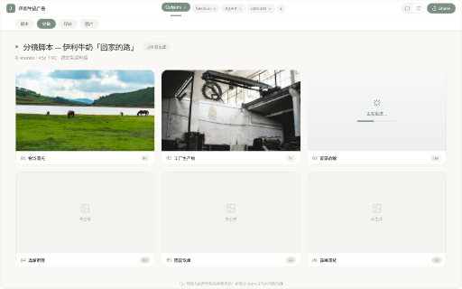

**Sandbox + Agent 协作流程**：

```
GENUI 渲染「分镜」Tab 时：
  │
  ├─ 扫描 Sandbox: storyboard/ 目录
  ├─ 读取 scripts/回家的路.md 获取场景列表
  ├─ 对比：哪些场景有图片文件 → 已完成 ✅
  │         哪些场景缺图片 → 待生成（显示占位符）
  └─ 渲染网格 + 进度统计
```

用户点击「生成视觉」按钮时：

```
用户点击 Scene 5 的「生成视觉」按钮
  │
  ▼
GENUI 通过 postMessage 通知 Agent
  → Agent 读取 Scene 5 的脚本描述
  → 调用 generate_image Skill
  → 结果写入 Sandbox: storyboard/scene_05.png
  → GENUI 网格刷新，Scene 5 从占位符变为缩略图
```

---

### 用户故事 3：输出与交付

> 作为一个广告创意人，我完成了所有场景的制作，现在需要预览最终合成的视频并分享给客户审阅。

切换到「Outputs」Tab，展示最终合成的视频文件。每个视频有缩略图、播放按钮和文件信息（时长、分辨率、大小）。右侧 Agent 面板提供本次 Session 的总结 —— 包括制作了什么、文件已保存的路径、后续可以做的操作建议。右上角 Share 按钮一键分享。


**Sandbox + Agent 协作流程**：

```
用户："帮我把所有场景合成最终视频"
  │
  ▼
Agent 编排多步任务（Level 4 能力）：
  │
  ├─ 1. 扫描 Sandbox: storyboard/ → 确认所有场景图片就绪
  ├─ 2. 读取 Sandbox: audio/voiceover.mp3 → 配音文件
  ├─ 3. 读取 Sandbox: audio/bgm.mp3 → 背景音乐
  ├─ 4. 调用 generate_video Skill → 每个场景的图片 → 视频片段
  ├─ 5. 调用 ffmpeg Skill → 合成所有片段 + 配音 + 音乐
  └─ 6. 写入 Sandbox: outputs/伊利牛奶_final.mp4
  │
  ▼
GENUI 渲染「Outputs」Tab：
  ├─ 扫描 Sandbox: outputs/ 目录
  ├─ 显示视频缩略图 + 元信息
  └─ Agent 面板显示 Session 总结
```

---

## Sandbox 与 Agent 的整体架构

```
┌────────────────────────────────────────────────────────────────────┐
│                          前端 (GENUI)                               │
│                                                                    │
│   ┌─────────────┐  ┌─────────────────────┐  ┌──────────────────┐  │
│   │   Tab 导航    │  │      内容区          │  │   Agent 面板     │  │
│   │  脚本/分镜/   │  │  脚本编辑器          │  │   Story Agent   │  │
│   │  输出/...    │  │  分镜网格            │  │   对话 + 状态    │  │
│   │             │  │  视频预览            │  │                 │  │
│   └─────────────┘  └─────────────────────┘  └──────────────────┘  │
└────────────────────────────────────┬───────────────────────────────┘
                                     │
                          ┌──────────┴──────────┐
                          │     Agent Core      │
                          │                     │
                          │  Main Agent (编排)   │
                          │    ├─ Explore (搜索) │
                          │    └─ Execute (执行) │
                          └──────────┬──────────┘
                                     │
                 ┌───────────────────┼───────────────────┐
                 │                   │                   │
          ┌──────┴──────┐    ┌──────┴──────┐    ┌──────┴──────┐
          │   Skills    │    │   Sandbox   │    │   GENUI     │
          │             │    │             │    │             │
          │ generate_   │    │  项目文件    │    │ Tab 渲染     │
          │   image     │    │  上下文积累  │    │ HTML 容器    │
          │ generate_   │    │  配置管理    │    │ postMessage  │
          │   video     │    │  版本追踪    │    │ 通信         │
          │ ffmpeg      │    │             │    │             │
          │ tts         │    │             │    │             │
          │ storyboard  │    │             │    │             │
          └─────────────┘    └─────────────┘    └─────────────┘
```

**三者的分工**：
- **Sandbox** 管数据 —— 文件在哪、什么状态、什么版本
- **Agent** 管决策 —— 用户要什么、用什么工具、按什么顺序
- **GENUI** 管展示 —— 根据 Sandbox 状态和 Agent 输出，动态渲染界面

**核心循环**：

```
用户说话 → Agent 理解 → Agent 调 Skill → Skill 操作 Sandbox → GENUI 读 Sandbox 渲染
    ▲                                                              │
    └──────────────── 用户在 GENUI 上点击/修改 ───────────────────────┘
```

---

## 附录：历史版本

<details>
<summary>V4 — 自适应协作布局</summary>

V4 采用 VS Code 风格的 file tree 侧边栏（180px），后被 Tab 切换 + 增强型 File Tree 替代。

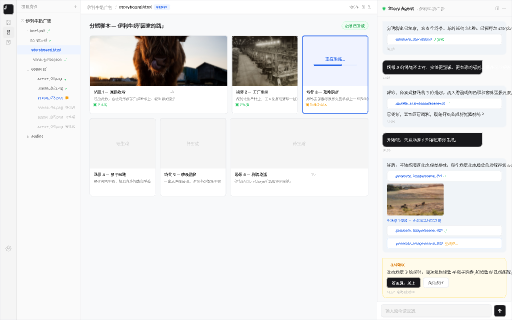

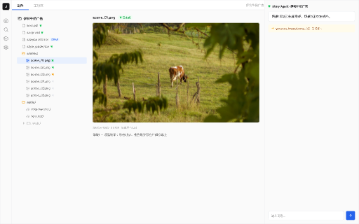

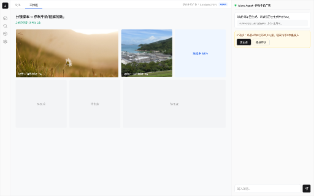

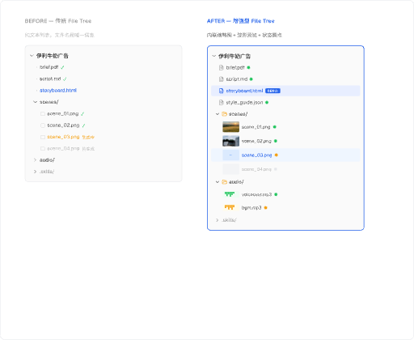

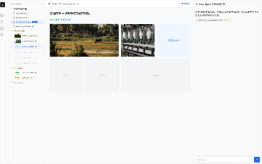

V4 用户故事：

| 阶段 | 截图 |
|------|------|
| S1 分析 Brief |  |
| S2 脚本创作 | 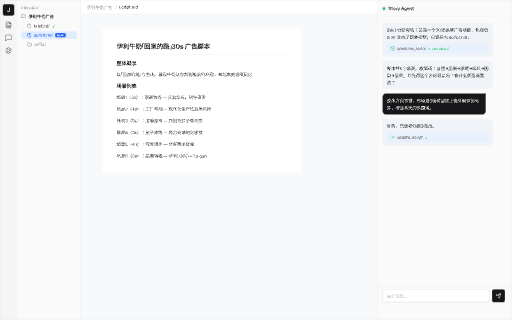 |
| S3 分镜设计 |  |
| S4 视觉生成 | 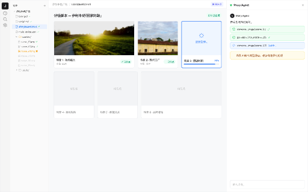 |
| S5 音频制作 | 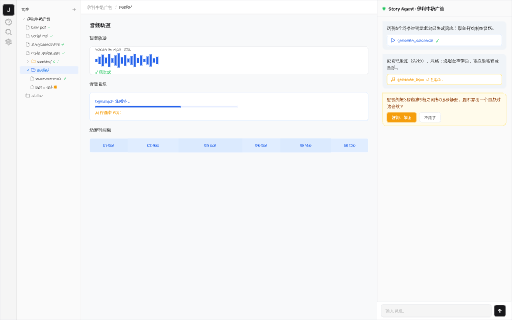 |
| S6 合成交付 |  |

| 帧名 | Node ID |
|------|---------|
| V4 主布局 | `f6xsO` |
| S1~S6 | `5HFNY` `unxMx` `bxgZK` `sk6Oa` `bcMj4` `lKdEy` |
| FileTree 对比 | `ZKnkx` |
| Tab·文件/工作区 | `taW8v` `BWMeD` |
| 增强型 File Tree | `ELBVL` |

</details>

<details>
<summary>V5 — 进度状态探索</summary>

浅色进度流程 + 蓝白分镜布局：

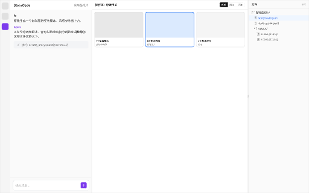


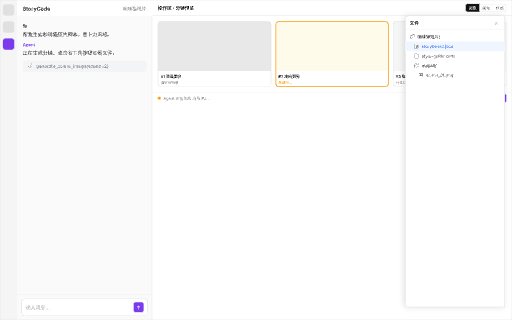


| 帧名 | Node ID |
|------|---------|
| 项目初始化 | `oV2bI` |
| 脚本与分镜 | `XGC4T` |
| 视觉生成高亮 | `locj7` |
| 蓝白分镜 | `wDAag` |

</details>
