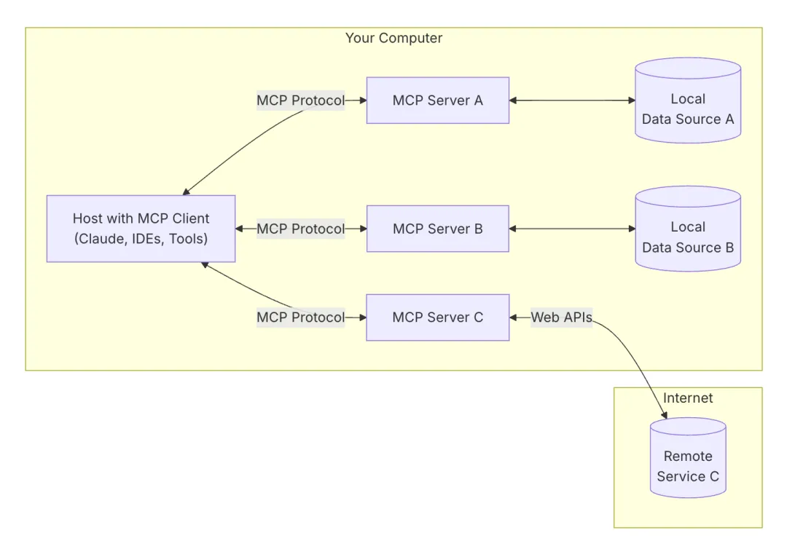
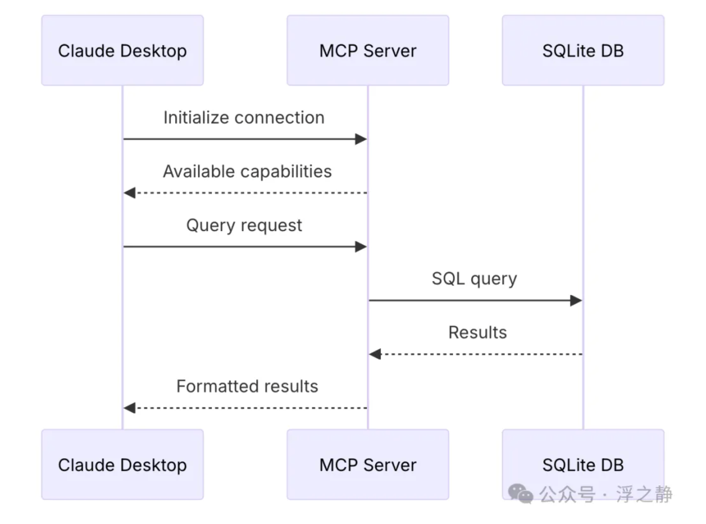
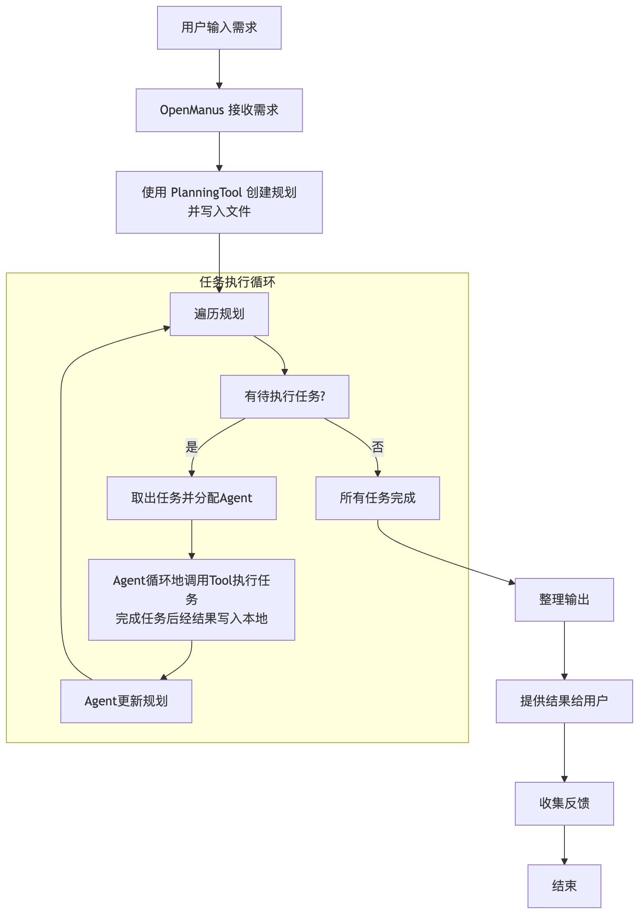
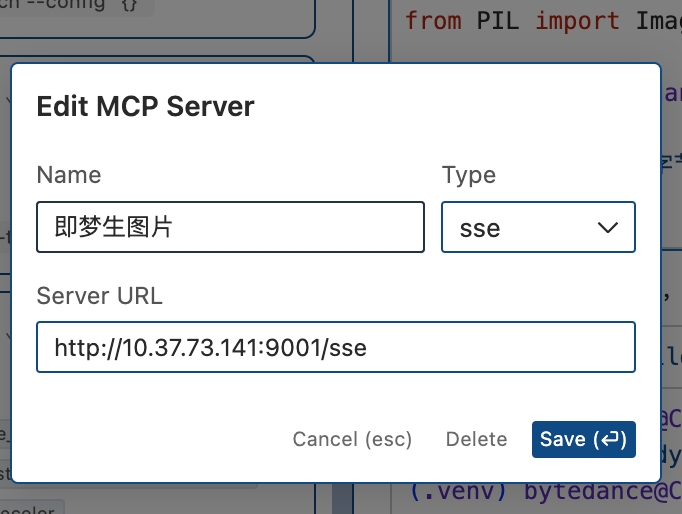
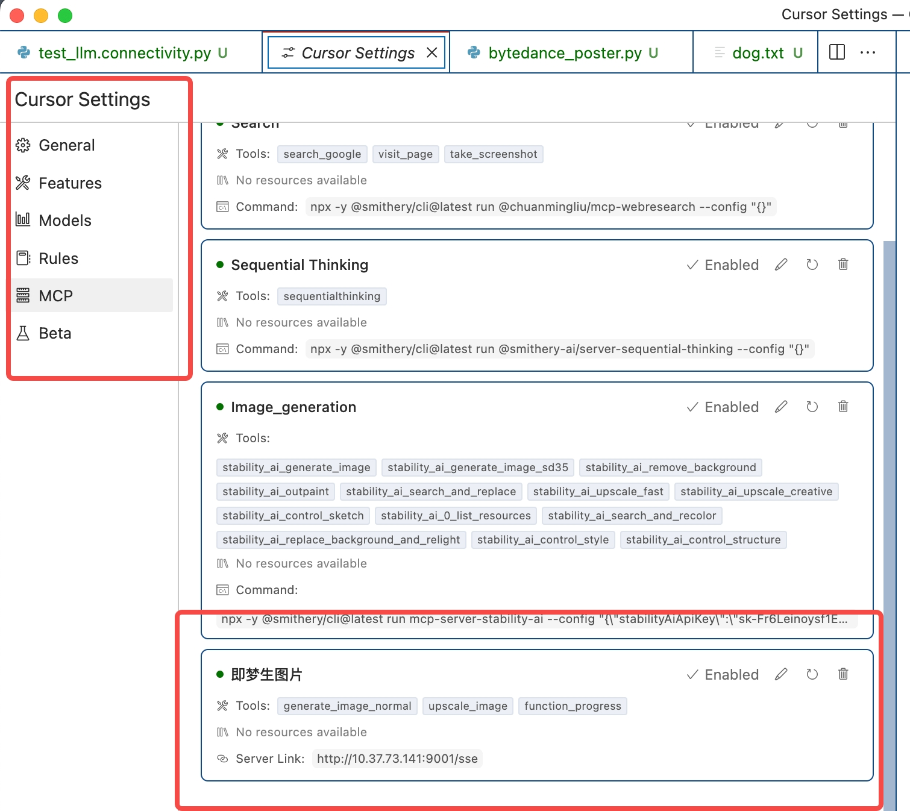
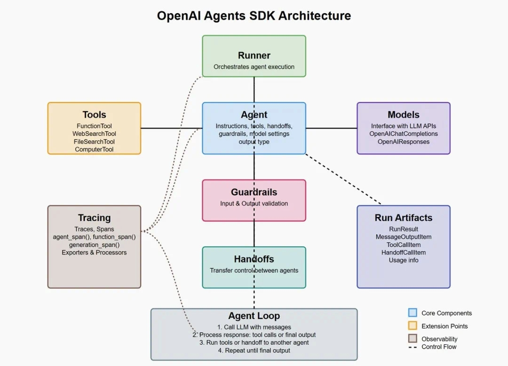
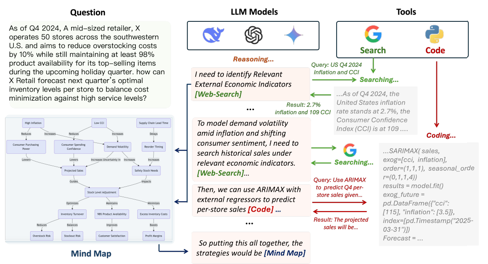
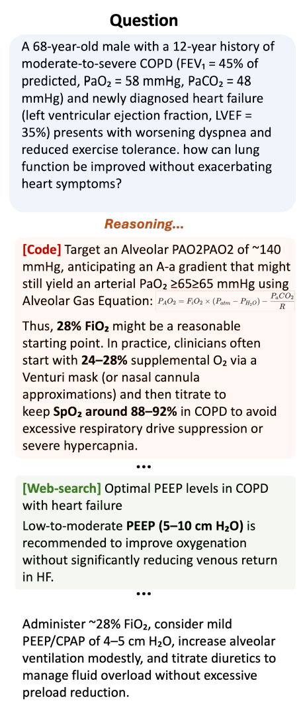
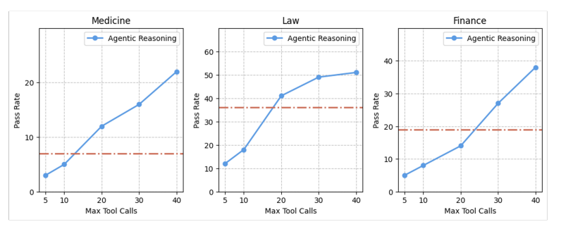

# 0310 - 【学习】AGENT 实现里的知识点补充

<quote-container>
<mention-doc token="Ds0LdBES6ofKhGxHaOGcVCjInIR" type="docx">OWL机制调研</mention-doc> 感谢刑政的调研文档
</quote-container>

## MCP
<mention-doc token="O1BGd6OgDoroK6xLJuUcCeoXnfc" type="docx">设计师用Cursor做"奇怪的东西"</mention-doc>
<callout emoji="books" background-color="light-orange" border-color="light-orange">
MCP 的核心目的：LLM 上下文的无缝衔接
[MCP 协议深度解析](https%3A%2F%2Fmp.weixin.qq.com%2Fs%2FASmcjW53HKokdYt1m-xyXA)
https://modelcontextprotocol.io/docs/concepts/architecture
https://mp.weixin.qq.com/s/etvDsU422z8uiknCn6fw4A
</callout>

### 架构和理解
<grid cols="2">
  <column width="50">
    

  </column>
  <column width="50">
    

  </column>
</grid>

- **Host**：LLM 或者一个 AI 工具（比如 Cursor）
- **MCP client** 充当 LLM（Host） 和 MCP server 之间的桥梁，MCP client 的工作流程如下：
  - MCP client 首先从 MCP server **获取可用的工具列表**。
  - 将用户的查询连同工具描述通过 function calling 一起发送给 LLM。
  - LLM 决定是否需要使用工具以及使用哪些工具。
  - 如果需要使用工具，MCP client 会通过 MCP server 执行相应的工具调用。
  - 工具调用的结果会被发送回 LLM。
  - LLM 基于所有信息生成自然语言响应。
  - 最后将响应展示给用户。
- **MCP Server，**提供 3 种主要类型的功能：
  - 资源（Resources）：类似文件的数据，可以被客户端读取，如 API 响应或文件内容。
  - 工具（Tools）：可以被 LLM 调用的函数（需要用户批准）。
  - 提示（Prompts）：预先编写的模板，帮助用户完成特定任务。
### 执行路线
<grid cols="2">
  <column width="50">
    

  </column>
  <column width="50">

    


  </column>
</grid>

### Cursor 里的 MCP 体验
- **Claude Desktop 真的卡的爆炸，搞飞连 VPN 的IT 你真的损失了我 30% 的工作效率**
- Cursor的AGENT 组织&使用方法：
  - https://smithery.ai/ - MCP Server 网站
  - https://www.bilibili.com/video/BV18qRbYkECy/ - 教程&一个中文环境下的常见 bug 解决方案
- Cursor 我的体验：
  <grid cols="2">
    <column width="50">
      

    </column>
    <column width="50">
      

    </column>
  </grid>


- Cursor 里的 AGENT 智能程度比较弱，感觉像个小学生
  - 缺少 Plan 和 Re-Act 的 Server
  - 缺少创意垂类下的搜索信息源
## OPENAI 的 AGENT 框架和思路
<quote-container>
https://openai.com/index/new-tools-for-building-agents/
<!-- Unsupported block type: 999 -->
</quote-container>

### 主要流程：


这张图展示的是OpenAI Agents SDK（软件开发工具包）的架构，各部分介绍如下：
- **核心组件**
  - **Runner**：负责协调代理（Agent）的执行，如同总指挥，把控整体运行流程。
  - **Agent**：包含指令、工具、交接机制、安全防护措施（guardrails）、模型设置和输出类型，是整个架构的核心执行单元。
  - **Guardrails**：进行输入和输出的验证，确保数据的有效性和安全性，防止异常数据导致错误。
  - **Handoffs**：在不同代理之间进行控制权的转移，实现多个代理协作。
  - **Agent Loop**：描述了代理运行的循环过程，包括调用大语言模型（LLM）、处理响应、决定是运行工具还是交接给其他代理，直到产生最终输出。
- **扩展点（Tools）**：提供了不同功能的工具，如FunctionTool（函数工具）、WebSearchTool（网页搜索工具）、FileSearchTool（文件搜索工具）和ComputerTool（计算工具） ，可根据需求扩展代理的能力。
- **与模型交互（Models）**：作为OpenAI Agents SDK与大语言模型API交互的接口，处理模型相关的响应。
- **可观察性（Tracing）** ：用于跟踪代理的运行过程，包括跟踪（Traces）、跨度（Spans），并包含导出器（Exporters）和处理器（Processors），方便开发人员监控和调试。
- **运行工件（Run Artifacts）** ：记录运行结果（RunResult）、消息输出项（MessageOutputItem）、工具调用项（ToolCallItem）等运行时信息，以及使用情况（Usage info），用于后续分析和记录。
<callout emoji="gift" background-color="light-orange" border-color="light-orange">
核心区别：OPENAI 更封闭，MCP 更开放，OPENAI 的 responseAPI 根本不知道里面内部的消息传递是怎么处理的，开源的 AGENT SDK 也是就是一个壳子，OPENAI 真的不 OPEN
</callout>

### AGENT SDK
- 交互循环流程：
```markdown
graph TD
    A[用户输入] --> B{Agent决策}
    B -->|需工具| C[调用Web/File工具]
    B -->|需协作| D[Handoff至其他Agent]
    C --> E[工具执行]
    E --> F[结果格式化]
    F --> G[LLM结果整合]
    G --> H{任务完成?}
    H -->|否| B
    H -->|是| I[输出响应]
```

## 几个 AGENT 的关键工具 - AI 操作面向人的工具 & AI 使用面向 AI 的工具
### Browser For AI
<quote-container>
https://github.com/browser-use/browser-use
https://docs.browserbase.com/introduction/what-is-browserbase
[核心理解项目请阅读这篇文章](https%3A%2F%2Fmp.weixin.qq.com%2Fs%3F__biz%3DMzU4MTc3Mjk4NQ%253D%253D%26mid%3D2247484454%26idx%3D1%26sn%3D6a20f40afb358b59cef936e7f7eb2d6c%26chksm%3Dfc23e05de6a614bcb732cfa57cdb0fa219070e2eea00d86df70d8e150d7a75e73fc679fa7e83%23rd)
</quote-container>

**通用 AI AGENT 的最重要的基础设施。**
<callout emoji="trophy" background-color="light-orange" border-color="light-orange">
Browser for AI 和 BrowserUse是不太一样的，前者是把传统浏览器的信息，转换成对 AI 更友好的格式，
</callout>

#### 我的体验
本地部署了一下 browser_use，稍微操作了一下，能够感受到两个点
- 基于浏览器截图的 4o 步骤推理，还是挺不错的，能够比较有脑子的操作浏览器
-  Playwright这个库，还是有点问题，比如 hover，下载等深层人类操作无法实现，也会导致信息折损
<view type="2">

  <file token="WhUPbwwK5oqG7BxEXV7cJkvHnGh" name="20250313-145257.mp4"/>

</view>


###  Search For AI
https://jina.ai/
<callout emoji="heart" background-color="light-orange" border-color="light-orange">
**没啥感觉，核心想法就是基于现在搜索引擎结果，看怎么样转成更好的语义表达结构体**
但是，这其实和 code base 的信息传递有冲突，可能不如 browser 直接读 html 来的直接
</callout>

### Computer User
<callout emoji="heart" background-color="light-orange" border-color="light-orange">
又是这种怪东西，不接入项目实操根本不知道有啥坑，工程能力不够预设不出来坑在哪儿，但是做 AGENT 还是要谨慎
</callout>

https://github.com/anthropics/anthropic-quickstarts/tree/main/computer-use-demo
```markdown
<system>
你是一个计算机操作助手，可用工具：{TOOL_LIST}
安全规则：
1. 禁止访问非白名单域名
2. 文件操作需确认路径在/safe_workspace
3. 遇到表单提交需暂停等待人工确认
</system>
```

```plaintext
sequenceDiagram
    participant User as 用户
    participant UI as Streamlit界面
    participant Agent as LLM Agent
    participant Tools as 工具执行器
    participant Claude as 模型

    User->>UI: 输入指令
    UI->>Agent: 封装请求
    loop 思考-行动循环
        Agent->>Claude: 发送当前状态+历史
        Claude-->>Agent: 返回JSON动作指令
        Agent->>Tools: 执行动作
        Tools-->>Agent: 返回执行结果
        Agent->>Agent: 更新上下文历史
    end
    Agent-->>UI: 返回最终响应
    UI-->>User: 显示结果

[工具执行结果]
搜索"Anthropic最新技术白皮书"获得3个结果：
1. www.anthropic.com/whitepaper-2024
2. blog.anthropic.com/update
3. research.anthropic.com/papers

下一步建议：访问哪个链接？
```

## AGENT 场景下的 RFT
RFT = Reinforced Learning Fine-Tune （AI 领域这些人是真的爱造名词）
### Search with RL
<callout emoji="musical_keyboard" background-color="light-orange" border-color="light-orange">
[GitHub - Agent-RL/ReSearch: ReSearch: Learning to Reason with Search for LLMs via Reinforcement Learning](https%3A%2F%2Fgithub.com%2FAgent-RL%2FReSearch)
[https://arxiv.org/abs/2502.04644](https%3A%2F%2Farxiv.org%2Fabs%2F2502.04644)
</callout>

- **核心思路**还挺有趣的，就是用RL 的方式来进行格式约束，让模型知道什么时候应该使用搜索工具
- **训练思路：**
  - 用一个多跳数据集（存在必须使用搜索才能找到正确答案的情况）
  - 让模型能够使用搜索工具
  - 基于GRPO，不用标注数据的方式来完成任务
- **训练过程**
  1. **初始化**：基于预训练模型Qwen2.5-7B，而非完全从头训练。
  1. **交互式训练**：
    - 模型接收问题->决定是否调用搜索工具->生成答案->根据答案质量获得奖励->通过GRPO更新策略。
  1. **关键挑战**：
    - **稀疏奖励问题**：仅依赖最终答案的精确匹配作为奖励，模型需在大量试错中探索有效策略。
    - **搜索成本平衡**：避免过度调用搜索工具（增加延迟）或未能调用（导致错误答案）。
<grid cols="2">
  <column width="80">
    

  </column>
  <column width="19">
    

  </column>
</grid>




<mention-doc token="IKALdLXrYoTPaPxiq6mcZ10CnZe" type="docx">创作AGENT 案例收集（Benchmark）</mention-doc>
