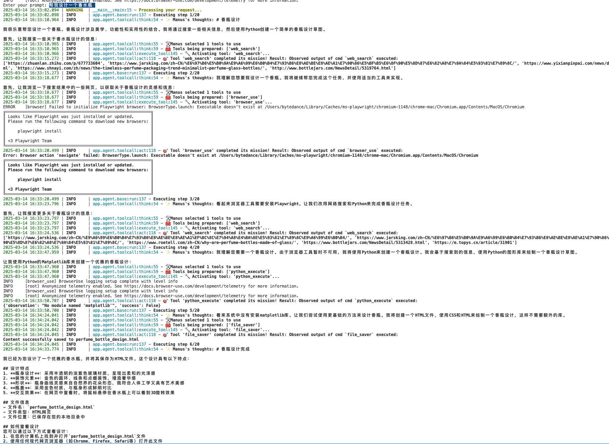
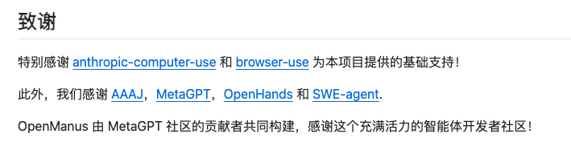

# 0314 - 【学习】OPEN MANUS 项目学习

<callout emoji="musical_score" background-color="light-orange" border-color="light-orange">
学习一下<text bgcolor="light-yellow">**（感觉不如只看作者的**</text>[知乎文章](https%3A%2F%2Fzhuanlan.zhihu.com%2Fp%2F29330461895)<text bgcolor="light-yellow">**，看完项目代码感觉时间被偷走了两个小时）**</text>
- 项目思路和使用的核心工具
- OPENMANUS RL
</callout>

## 项目学习
<quote-container>
https://www.zhihu.com/question/14321968965
</quote-container>

### 本地使用 （基于 Claude 3.7）

<lark-table rows="3" cols="5" column-widths="100,100,100,378,100">

  <lark-tr>
    <lark-td>
      Prompt
    </lark-td>
    <lark-td>
      截图
    </lark-td>
    <lark-td>
      视频
    </lark-td>
    <lark-td>
      产物
    </lark-td>
    <lark-td>
      评价
    </lark-td>
  </lark-tr>
  <lark-tr>
    <lark-td>
      帮我设计一个香水瓶
    </lark-td>
    <lark-td>
      
    </lark-td>
    <lark-td>
      <view type="2">
        <file token="SSojbQHTZoayG5xxskncrj5pnHd" name="20250314-163444.mp4"/>
      </view>
    </lark-td>
    <lark-td>
      <view type="2">
        <file token="WPr2bNEj1omey7xZjGkcX7YCn9d" name="perfume_bottle_design.html"/>
      </view>
    </lark-td>
    <lark-td>
      笨比一个
    </lark-td>
  </lark-tr>
  <lark-tr>
    <lark-td>
    </lark-td>
    <lark-td>
    </lark-td>
    <lark-td>
    </lark-td>
    <lark-td>
    </lark-td>
    <lark-td>
    </lark-td>
  </lark-tr>
</lark-table>

### 项目思路和核心循环
<quote-container>
内心OS：是不是有点太粗糙了
</quote-container>

```plaintext {wrap}
SYSTEM_PROMPT = "You are OpenManus, an all-capable AI assistant, aimed at solving any task presented by the user. You have various tools at your disposal that you can call upon to efficiently complete complex requests. Whether it's programming, information retrieval, file processing, or web browsing, you can handle it all."

NEXT_STEP_PROMPT = """You can interact with the computer using PythonExecute, save important content and information files through FileSaver, open browsers with BrowserUseTool, and retrieve information using GoogleSearch.

PythonExecute: Execute Python code to interact with the computer system, data processing, automation tasks, etc.

FileSaver: Save files locally, such as txt, py, html, etc.

BrowserUseTool: Open, browse, and use web browsers.If you open a local HTML file, you must provide the absolute path to the file.

WebSearch: Perform web information retrieval

Terminate: End the current interaction when the task is complete or when you need additional information from the user. Use this tool to signal that you've finished addressing the user's request or need clarification before proceeding further.

Based on user needs, proactively select the most appropriate tool or combination of tools. For complex tasks, you can break down the problem and use different tools step by step to solve it. After using each tool, clearly explain the execution results and suggest the next steps.

Always maintain a helpful, informative tone throughout the interaction. If you encounter any limitations or need more details, clearly communicate this to the user before terminating.
"""
```

```plaintext {wrap}
# OpenManus 执行任务的过程

根据目录结构和文件组织，我可以推断 OpenManus 执行任务的过程如下：

## 执行流程概述

1. **任务接收与初始化**
2. **任务规划与分解**
3. **工具选择与执行**
4. **结果整合与反馈**
5. **任务完成与总结**

## 详细执行过程

### 1. 任务接收与初始化

- 用户通过主程序（可能是 `main.py`）提交任务请求
- 系统初始化 `ManusAgent`（位于 `app/agent/manus.py`）
- `logger.py` 开始记录任务执行日志
- 系统加载配置（`config.py`）和初始化 LLM 连接（`llm.py`）

### 2. 任务规划与分解

- `ManusAgent` 使用提示词模板（`app/prompt/manus.py`）分析用户输入
- 系统根据任务类型选择合适的工作流（通过 `app/flow/flow_factory.py`）
- 工作流调用规划代理（`app/agent/planning.py`）和规划工具（`app/tool/planning.py`）
- 规划代理使用 LLM 将复杂任务分解成较小的子任务，生成任务计划
- 每个子任务被标记上优先级、依赖关系和所需工具

### 3. 工具选择与执行

对于每个子任务，系统会进入以下循环：

#### a. 工具选择阶段
- 系统通过 `toolcall.py` 代理决定使用哪个工具
- `tool_collection.py` 维护和提供所有可用工具
- 基于任务需求，系统可能选择：
  - `browser_use_tool.py`：浏览网页、填写表单
  - `web_search.py`：搜索信息（可能进一步调用 Google/Baidu/DuckDuckGo 搜索）
  - `bash.py` 或 `python_execute.py`：执行代码
  - `file_saver.py`：保存生成的内容
  - 其他专用工具

#### b. 工具执行阶段
- 系统通过 `run.py` 执行选定的工具
- 工具执行过程中可能会：
  - 访问外部资源（网页、搜索引擎）
  - 执行代码（Python、Bash）
  - 处理文件（读取、写入）
- 执行结果被记录并返回给代理

#### c. 执行评估阶段
- 代理（通常是 `react.py` 基于 ReAct 模式）评估工具执行结果
- 如果结果不理想，可能会：
  - 修改参数并重试
  - 选择替代工具
  - 请求 LLM 提供新的思路

### 4. 结果整合与反馈

- 随着子任务的完成，`ManusAgent` 收集并整合各个子任务的结果
- 系统可能使用 `create_chat_completion.py` 生成人类可读的摘要
- 对于需要保存的结果，使用 `file_saver.py` 存储为 Markdown 或其他格式
- 对于多阶段任务，`flow/planning.py` 决定是否需要新一轮的规划

### 5. 任务完成与总结

- 所有子任务完成后，系统生成最终报告
- 报告可能包括：
  - 任务执行摘要
  - 完成的子任务清单
  - 生成的资源（文件、代码等）
  - 遇到的问题和解决方案
- 系统可能使用 `str_replace_editor.py` 格式化最终输出
- 最终结果返回给用户，并通过 `logger.py` 记录完整执行历史

## 特殊场景处理

### 错误处理
- `exceptions.py` 定义了各种可能的错误类型
- 当工具执行失败时，系统可能会尝试替代方案或请求更多信息
- 严重错误可能触发 `terminate.py` 安全终止执行

### 长时间任务
- 复杂任务可能会分多个会话执行
- 系统可能会保存中间状态，允许稍后恢复

### 并行执行
- 独立的子任务可能会并行执行以提高效率
- 结果会在稍后阶段合并

## 代理协作模式

OpenManus 似乎使用了多种代理协作的模式：

1. **ManusAgent** (`manus.py`) - 主协调者，管理整个任务执行
2. **PlanningAgent** (`planning.py`) - 负责任务分解和计划
3. **ReActAgent** (`react.py`) - 使用推理-行动循环处理任务
4. **SWEAgent** (`swe.py`) - 专注于软件工程任务
5. **ToolCallAgent** (`toolcall.py`) - 专门负责工具调用

这些代理可能在不同阶段相互协作，形成一个完整的任务执行链条。

## 总结

OpenManus 的任务执行是一个复杂但结构化的过程，结合了 AI 规划、工具自动化和反馈循环。系统通过模块化的设计，能够灵活处理各种任务，从简单的信息检索到复杂的多步骤自动化流程。

核心是 LLM 驱动的代理系统，这些代理通过对话理解任务，规划步骤，并动态选择和执行适当的工具，最终整合结果返回给用户。
```


### 核心工具
#### 项目工具汇总
```plaintext {wrap}
app/
├── __init__.py                  # 包初始化文件
├── config.py                    # 配置文件
├── exceptions.py                # 自定义异常定义
├── llm.py                       # LLM 服务接口
├── logger.py                    # 日志系统
├── schema.py                    # 数据模式/结构定义
│
├── agent/                       # 代理系统目录
│   ├── __init__.py
│   ├── base.py                  # 基础代理类
│   ├── manus.py                 # 主要 Manus 代理
│   ├── planning.py              # 规划代理
│   ├── react.py                 # ReAct 代理
│   ├── swe.py                   # 软件工程代理
│   └── toolcall.py              # 工具调用代理
│
├── flow/                        # 工作流目录
│   ├── __init__.py
│   ├── base.py                  # 基础工作流
│   ├── flow_factory.py          # 工作流工厂
│   └── planning.py              # 规划工作流
│
├── prompt/                      # 提示词模板目录
│   ├── __init__.py
│   ├── manus.py                 # Manus 代理提示词
│   ├── planning.py              # 规划提示词
│   ├── swe.py                   # 软件工程提示词
│   └── toolcall.py              # 工具调用提示词
│
└── tool/                        # 工具函数目录
    ├── __init__.py
    ├── base.py                  # 基础工具类
    ├── bash.py                  # Bash 命令执行工具
    ├── browser_use_tool.py      # 浏览器自动化工具
    ├── create_chat_completion.py # 聊天完成工具
    ├── file_saver.py            # 文件保存工具
    ├── planning.py              # 规划工具
    ├── python_execute.py        # Python 代码执行工具
    ├── run.py                   # 运行工具
    ├── str_replace_editor.py    # 字符串替换编辑器
    ├── terminal.py              # 终端工具
    ├── terminate.py             # 终止工具
    ├── tool_collection.py       # 工具集合
    ├── web_search.py            # 网页搜索工具
    │
    └── search/                  # 搜索工具子目录
        ├── __init__.py
        ├── base.py              # 基础搜索工具
        ├── baidu_search.py      # 百度搜索
        ├── duckduckgo_search.py # DuckDuckGo 搜索
        └── google_search.py     # Google 搜索
```



https://docs.anthropic.com/en/docs/agents-and-tools/computer-use

## 后训练这个项目咋搞的
https://github.com/OpenManus/OpenManus-RL
### SFT阶段
- 目的：让模型学习一下ReACT风格的推理结果，做做结构化<text underline="true">* 思考（Think）-> 行动（Act）-> 观察结果（Observe）-> 思考（Think）-> ...*</text>
- 大概的数据样例是：
```plaintext {wrap}
{
  "id": "os_0",
  "conversations": [
    {"role": "user", "content": "计算/etc目录中的文件数量"},
    {"role": "assistant", "content": "Think: 需要可靠的计数方法\nAct: bash\n```bash\nls -1 /etc | wc -l\n```"},
    {"role": "user", "content": "OS Output: 220"},
    {"role": "assistant", "content": "Think: 通过执行验证\nAct: answer(220)"}
  ]
}
```

### RL阶段
<quote-container>
输入 -> 模型生成 -> 奖励评估 -> 梯度计算 -> 模型更新
</quote-container>

奖励类型有这么多：
```plaintext {wrap}
REWARD_FUNCS_REGISTRY = {
    "accuracy": accuracy_reward, 对不对
    "format": format_reward, 格式遵循
    "reasoning_steps": reasoning_steps_reward, 明确步骤&鼓励至少三步
    "cosine": get_cosine_scaled_reward(...), 根据回答长度调整奖励分值
    "repetition_penalty": get_repetition_penalty_reward(...), 重复惩罚
    "length": len_reward, 长度奖励
    "trajectories_format": get_trajectories_format_reward(), 验证智能体轨迹
    "tag_count": tag_count_reward, 标签数量是否正确
}
reward_funcs = [REWARD_FUNCS_REGISTRY[func] for func in script_args.reward_funcs]
```

我感觉花里胡哨这么多，和就约束前两差距不大

#### 单独说一下轨迹，这个概念之前接触的比较少：
trajectories_format 是 OpenManus-RL 项目中一个特殊的奖励函数，专门用于评估和优化智能体轨迹（trajectories）的格式规范性。这个奖励函数主要关注智能体在复杂交互任务中产生的一系列动作和推理步骤是否遵循预定义的格式规范。
在 OpenManus-RL 中，"轨迹"（trajectory）指的是智能体与环境交互的完整序列，包括：
1. 智能体收到的任务或问题
1. 智能体的思考过程（Think）
1. 智能体采取的行动（Act）
1. 环境的反馈或观察结果（Observe）
1. 基于反馈的进一步思考和行动
1. 最终解决方案或答案
**trajectories_format 评估的关键点：**
1. 结构完整性：检查轨迹是否包含必要的思考、行动和答案组件
1. 顺序正确性：确保组件按照"思考->行动->思考->行动->...->答案"的正确顺序排列
1. 格式一致性：验证是否使用了一致的格式（无论是标签格式还是前缀格式）
1. 比例平衡：检查思考和行动的数量是否合理平衡（通常思考数量应等于或比行动数量多1）
1. 闭环完整性：确保轨迹以明确的答案或结论结束
**trajectories_format 与其他奖励函数的区别**
与其他奖励函数相比，trajectories_format 有几个独特之处：
1. 关注整体而非局部：不只关注单个标签或格式，而是评估整个交互轨迹
1. 支持多轮交互：专门设计用于处理复杂的多轮交互场景
1. 处理不同格式风格：同时支持标签式（<think>/</think>）和前缀式（Think:）格式
1. 注重逻辑连贯性：评估思考和行动之间的逻辑连接
**在 OpenManus-RL 中的应用场景**
trajectories_format 奖励函数主要应用于：
1. 多轮工具使用任务：如 WebShop 购物任务，需要多次使用搜索、浏览、选择等工具
1. 复杂推理任务：需要分步骤推理和验证的数学或逻辑问题
1. 操作系统交互任务：如 OSWorld 中需要多个命令序列完成的任务
1. 长期规划任务：需要制定并执行多步骤计划的任务
