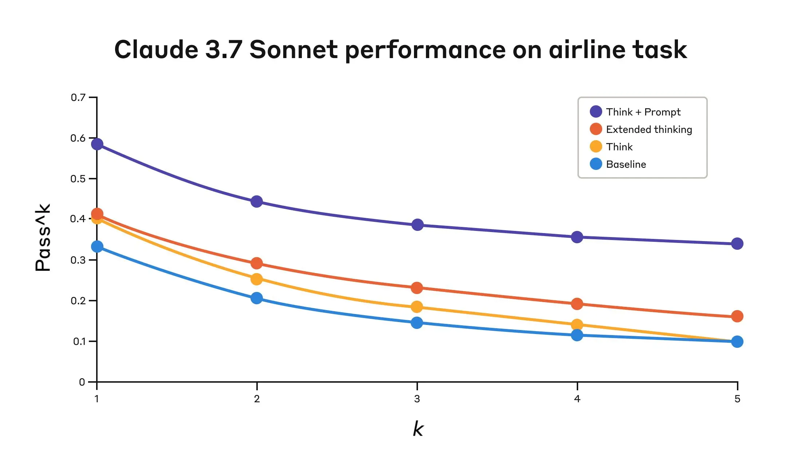
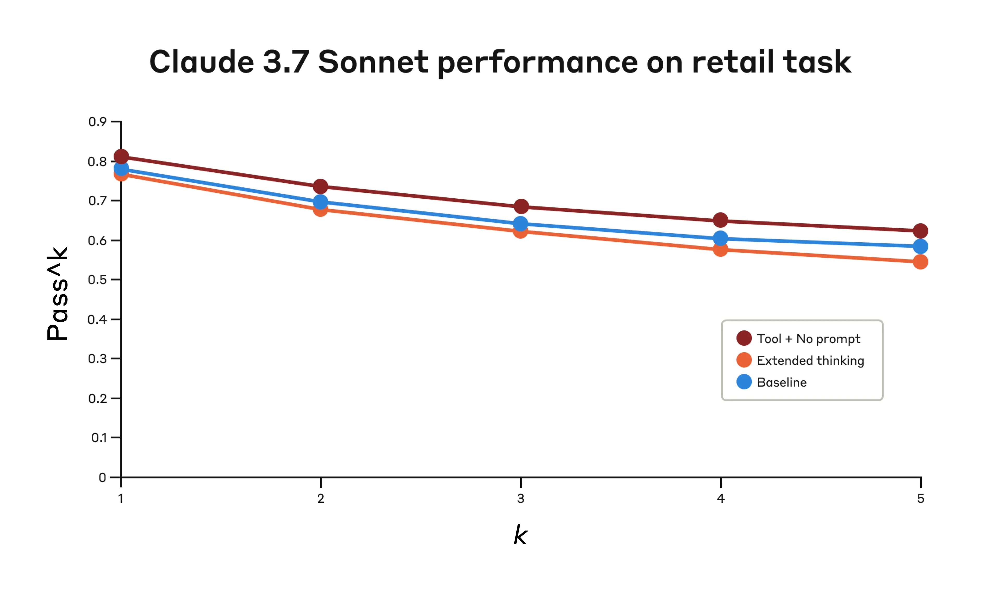

# 0324 - 【学习】Claude Think Tool & Extended Thinking

<quote-container>
Claude 和 Cursor 的内容还是很值得认真看看的，全是小的推理 trick。
</quote-container>

## 原文链接
https://www.anthropic.com/research/visible-extended-thinking
https://www.anthropic.com/engineering/claude-think-tool
## 概念区别
扩展思考就是 Claude 在开始产生响应之前做什么。Claude 通过扩展思考，在采取行动之前深入考虑和迭代其计划。"思考"工具是让 Claude 在开始产生响应后，**增加一个步骤来停下来思考它是否拥有前进所需的所有信息。**
<whiteboard token="R6aowcYo4hkzv5bORmocop3WnWc"/>

## Think Tool 使用
### **Think 工具两个合适场景**
- Claude 获取的信息不够
- 获取了额外信息之后，想一想模型再操作
### **Think Tool 可以这么用：**
```plaintext {wrap}
## Using the think tool

Before taking any action or responding to the user after receiving tool results, use the think tool as a scratchpad to:
- List the specific rules that apply to the current request
- Check if all required information is collected
- Verify that the planned action complies with all policies
- Iterate over tool results for correctness

Here are some examples of what to iterate over inside the think tool:
<think_tool_example_1>
User wants to cancel flight ABC123
- Need to verify: user ID, reservation ID, reason
- Check cancellation rules:
  * Is it within 24h of booking?
  * If not, check ticket class and insurance
- Verify no segments flown or are in the past
- Plan: collect missing info, verify rules, get confirmation
</think_tool_example_1>

<think_tool_example_2>
User wants to book 3 tickets to NYC with 2 checked bags each
- Need user ID to check:
  * Membership tier for baggage allowance
  * Which payments methods exist in profile
- Baggage calculation:
  * Economy class x 3 passengers
  * If regular member: 1 free bag each -> 3 extra bags = $150
  * If silver member: 2 free bags each -> 0 extra bags = $0
  * If gold member: 3 free bags each -> 0 extra bags = $0
- Payment rules to verify:
  * Max 1 travel certificate, 1 credit card, 3 gift cards
  * All payment methods must be in profile
  * Travel certificate remainder goes to waste
- Plan:
1. Get user ID
2. Verify membership level for bag fees
3. Check which payment methods in profile and if their combination is allowed
4. Calculate total: ticket price + any bag fees
5. Get explicit confirmation for booking
</think_tool_example_2>
```

```plaintext {wrap}
{
  "name": "think",
  "description": "Use the tool to think about something. It will not obtain new information or make any changes to the repository, but just log the thought. Use it when complex reasoning or brainstorming is needed. For example, if you explore the repo and discover the source of a bug, call this tool to brainstorm several unique ways of fixing the bug, and assess which change(s) are likely to be simplest and most effective. Alternatively, if you receive some test results, call this tool to brainstorm ways to fix the failing tests.",
  "input_schema": {
    "type": "object",
    "properties": {
      "thought": {
        "type": "string",
        "description": "Your thoughts."
      }
    },
    "required": ["thought"]
  }
}
```

### **大概结果**
<grid cols="2">
  <column width="50">
    

  </column>
  <column width="50">
    

  </column>
</grid>

### 使用建议（原文）
Based on these evaluation results, we've identified specific scenarios where Claude benefits most from the "think" tool:
1. Tool output analysis. When Claude needs to carefully process the output of previous tool calls before acting and might need to backtrack in its approach;
1. Policy-heavy environments. When Claude needs to follow detailed guidelines and verify compliance; and
1. Sequential decision making. When each action builds on previous ones and mistakes are costly (often found in multi-step domains).
- **Prompting matters significantly on difficult domains.（得写 Prompt）** Simply making the "think" tool available might improve performance somewhat, but pairing it with optimized prompting yielded dramatically better results for difficult domains. However, easier domains may benefit from simply having access to "think."
- **Improved consistency across trials.（可以提升任务一致性）** The improvements from using "think" were maintained for pass^k up to k=5, indicating that the tool helped Claude handle edge cases and unusual scenarios more effectively.
### 最佳实践
1. 最重要的是提供when and how to use "think" tool 的 instruction，提供样例也会显著提升 "think" tool 的效果，最好包括下面四个方面：
  - The level of detail expected in the reasoning process;
  - How to break down complex instructions into actionable steps;
  - Decision trees for handling common scenarios; and
  - How to check if all necessary information has been collected.
1. 当 System Prompt 比较复杂的时候，把think tool 放进去会更好用
<quote-container>
We found that, when they were long and/or complex, including instructions about the "think" tool in the system prompt was more effective than placing them in the tool description itself. This approach provides broader context and helps the model better integrate the thinking process into its overall behavior.
</quote-container>
