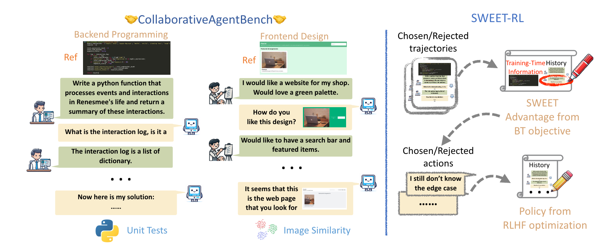
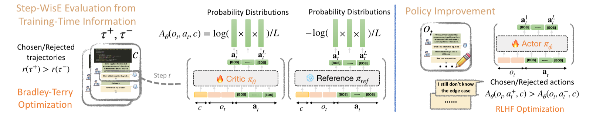
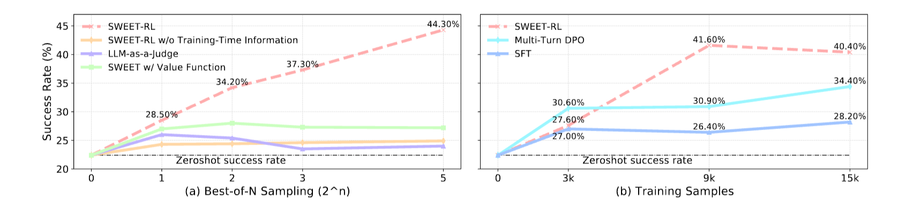
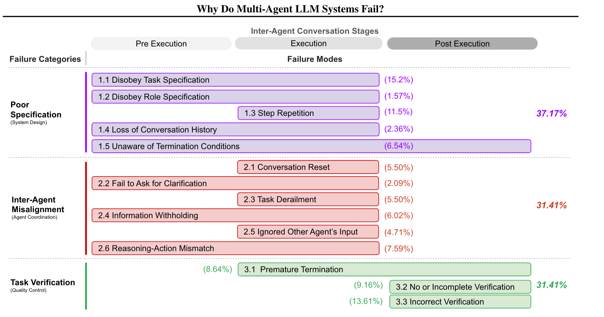
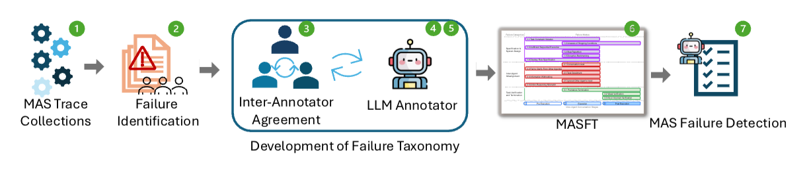

# 0325 - 【看两篇论文】多轮训练让智能体学会协作推理 & 多AGENT 的问题归因

<callout emoji="soccer" background-color="light-orange" border-color="light-orange">
写文档麻了，换换心态
- [田渊栋和Sergey Levine参与开发新型RL算法，能通过多轮训练让智能体学会协作推理](https%3A%2F%2Fmp.weixin.qq.com%2Fs%3F__biz%3DMzA3MzI4MjgzMw%253D%253D%26mid%3D2650961378%26idx%3D2%26sn%3De4a394d64d77c7bcbed8bcebb7a1a7a3%26chksm%3D85358b8aa70695cfb8af4cd9b7f2cca3b03fec603336d98a41acf2b1005d179b1a33920fa688%26mpshare%3D1%26scene%3D1%26sharer_shareinfo%3D053ef988e4378f9e335140bd3fc37728%26sharer_shareinfo_first%3D053ef988e4378f9e335140bd3fc37728)
- [SWEET-RL: Training Multi-Turn LLM Agents on Collaborative Reasoning Tasks](https%3A%2F%2Farxiv.org%2Fabs%2F2503.15478)
- [Why Do Multi-Agent LLM Systems Fail?](https%3A%2F%2Farxiv.org%2Fabs%2F2503.13657)
</callout>

# 多轮训练让 AGENT 学会协作推理的方法
<callout emoji="+1" background-color="light-orange" border-color="light-orange">
核心问题：多轮任务无法正确/高效地设置credit 和 reward
</callout>

三个训练原则
1. 足够的任务多样性进行 RL 训练而不会过度拟合**（我们也需要，但是我们能达到吗？）**
1. 足够的任务复杂性来挑战代理的推理和泛化能力**（我们也需要）**
1. 快速研究原型的最小工程开销。**（无所谓）**

## 重要图一
<grid cols="2">
  <column width="50">
    <text underline="true">***任务设定：***</text>
    - 和"模拟人"一起写后端：AGENT 获得高级描述和函数描述，但是没有细节
      - 通过单元测试来获得reward
    - 和"模拟人"一起写前端
      - 通过页面的余弦相似度来获得 reward
    - 核心就是构造一系列任务，任务隐藏了关键信息，然后让 AGENT 和模拟人（模拟人可以看到信息）一起完成任务
  </column>
  <column width="50">

  </column>
</grid>

## 重要图二

两阶段训练：
- 阶段一，**训练逐步骤评判模型：**
  - Bradley - Terry 优化是一种用于处理选择数据的统计模型和优化方法。在多选项选择场景中，比如在多个对象中选择一个更优的，它假设每个对象都有一个潜在的 "效用" 或 "优势" 值。通过观察一系列的选择结果，来估计每个对象的相对优势。
  - 以图中的 SWEET - RL 算法相关内容为例，它可以用来分析在多轮交互过程中，智能体在不同步骤（Step t）做出的选择（Chosen trajectories）和拒绝（Rejected trajectories）情况。**通过比较不同动作（actions）被选择的概率分布，来优化智能体的策略**，让智能体逐渐学会做出更优的选择 ，以提高在实际任务中的成功率和胜率。 本质上是利用 Bradley - Terry 模型的原理，对智能体的决策过程进行评估和改进。
- 阶段二，**利用每步奖励模型训练行动者**
  - 交互流程：在第*t*轮时，智能体的观察值*ot*包含了所有的交互历史。智能体需要从行动集合*A*中选择一个行动*at*，具体做法是输出由多个标记组成的响应*at*1:*L* 。智能体采取行动后，用户会做出回应，智能体的新状态（由转移函数*T*表示）是通过将最新的交互添加到交互历史中得到的。
  - 奖励机制：在每一步，智能体都有机会获得一个标量奖励*r*(*ot*,*at*,*c*) ，其中*c*可能代表某些特定条件或上下文。这个奖励值是实数，用于衡量智能体在该步行动的表现。
  - 交互结束条件：一轮交互（episode）会在两种情况下结束。一是智能体输出了终止标记，二是达到了最大交互轮数*N* 。
  - 强化学习目标：强化学习的目标是训练一个策略，该策略能生成标记序列，使得在整个滚动（rollout）过程中累计奖励∑*t*=1*Nr*(*ot*,*at*,*c*)最大化。为简化分析，这里假设奖励不会随时间衰减。
  - 学习场景设定：研究采用离线学习的方式，即从过去的交互数据集中进行学习。因为与人类进行在线交互获取数据的成本可能较高。

**有个问题，概念上怎么理解 阶段一训练的那个step-wise 的 model 是可靠的呢？ 问问建州**
## 重要图三

- 图 a 感觉这个算法很好地做到了概率分布里的抉择
- 图 b 说明这个算法需要冷启动？**数据多了为啥拉了呢？**
别的内容没了
# Why Do Multi-Agent LLM Systems Fail？
<quote-container>
别的不说，这个标题就有那味了
</quote-container>

## **失败模式分类**
- 规格和系统设计失败（37.2%）：比如系统架构设计有缺陷、对话管理差、任务说明不清楚、不遵守角色规范等。像 ChatDev 在开发国际象棋游戏时，使用的输入格式不符合要求，且存在角色越权问题。
- 智能体间不一致（31.4%）：表现为沟通无效、协作不佳、行为冲突、偏离任务等。例如在开发类似 Wordle 的游戏时，程序员与其他角色多次交互却未更新代码，还有信息不共享、忽视其他智能体输入等情况。
- 任务验证和终止（31.4%）：包括过早终止任务，以及缺乏保证交互、决策和结果准确完整的机制。比如在国际象棋游戏开发中，验证器仅检查代码是否编译，未运行程序或检查是否符合规则

## 重要图一

1. Trace 记录
1. 错误识别
1. 多 LLM 进行错误分类
1. 统计和回归

1. 模型规划能力不足，应该源自于模型没有进行针对性的训练，类似于调用工具的能力，生成代码的能力，规划能力也属于一项特殊的能力，基础大模型可以进行代码编写，也能理解工具是什么，但和经过专门训练的模型在调用工具和生成代码能力上还是有差距的，模型规划能力也一样，基础模型可以实现，但还是需要有针对性的训练提高。
1. 模型间执行效率不足，速度慢，微小误差对整体影响大；原因是目前这类系统的解决思路还是基于普通程序开发或人的角度去解决问题，而不是模型角度出发，例如让模型直接操作人类电脑，访问正常网页，由于运行环境差异，模型很容易出错，而manus有自己独立的执行环境，因此效果也大幅提升。而访问那些为满足人类视觉需求而设计的网页也会对模型造成不少困扰，解决类似browser use 技术的出现将大大缓解这一问题，MCP技术也类似，进一步优化执行效率。
1. 结果缺乏有效的验证方式，个人认为第三个原因在较长时间内还需要依靠用户参与进行解决，因为多智能体面临的问题通常不像逻辑、算数类问题通常有标准答案可作为验证，多agent系统面临的问题往往是类似于软件开发中的一句话需求，即使是专业的开发团队，面临这类问题时如果不进行多轮沟通和详细分析，也很难直接做出符合客户需求的结果。

<text underline="true">*这篇论文别的内容都是废话&无意义的 case（特指对我们的场景）*</text>
