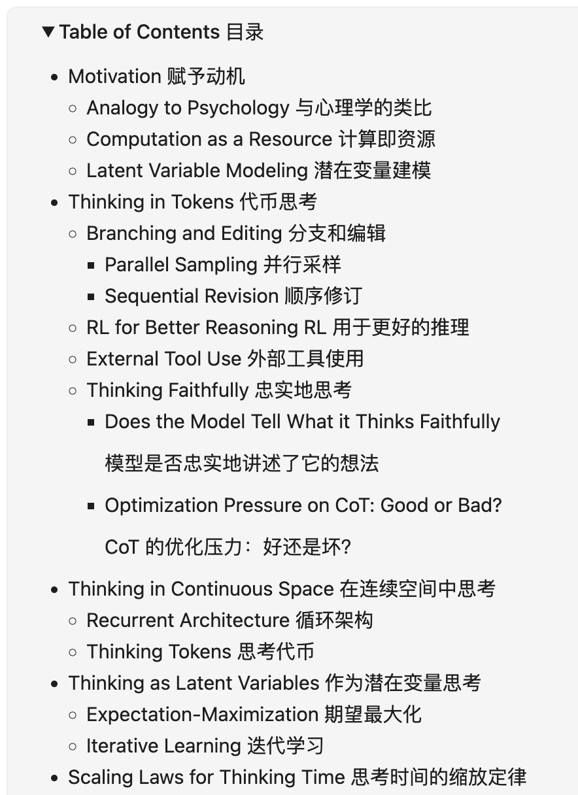
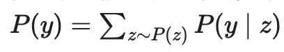
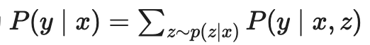
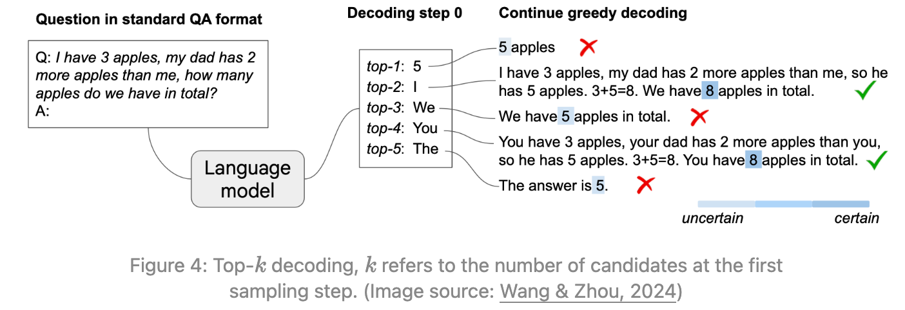
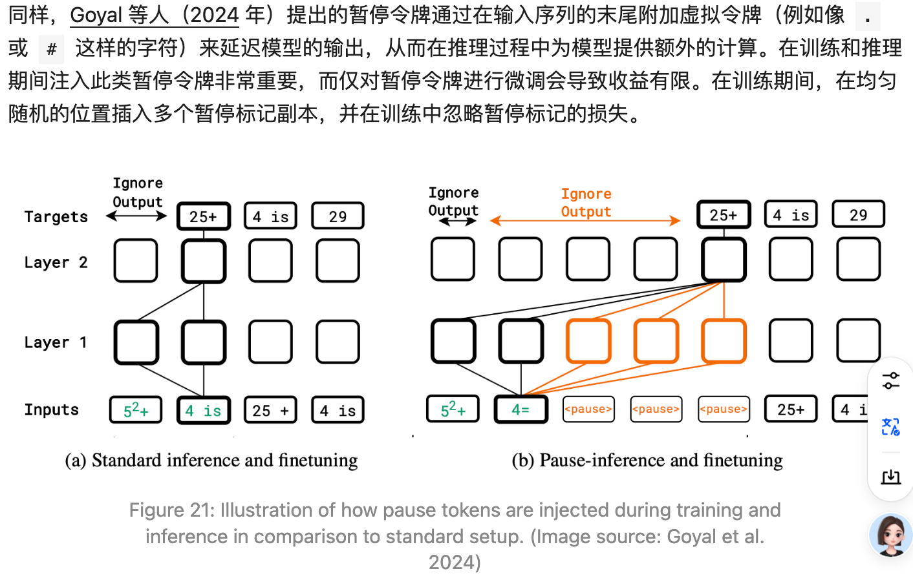
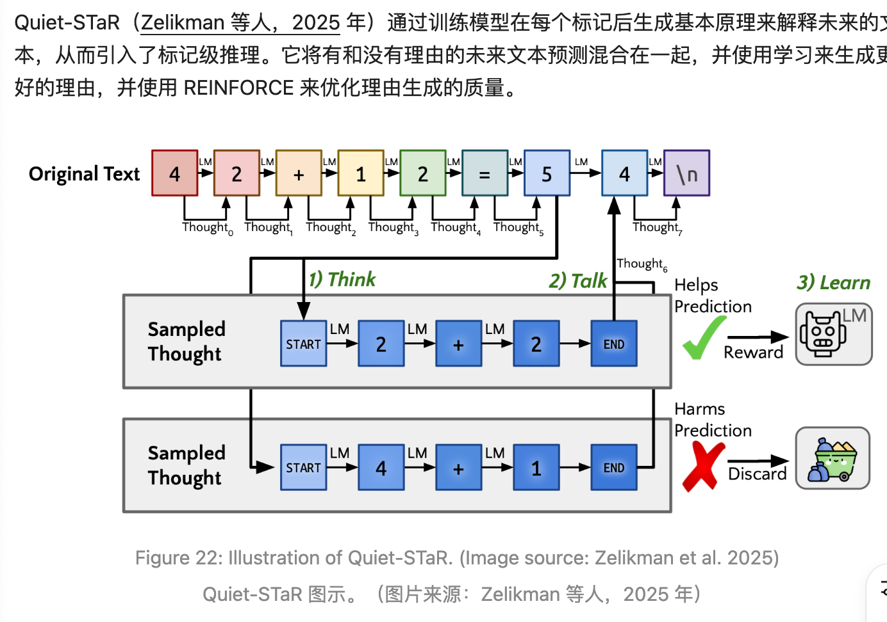

# 0521 - 【学习】Why We Think长文阅读

<callout emoji="glass_of_milk" background-color="light-orange" border-color="light-orange">
https://lilianweng.github.io/posts/2025-05-01-thinking/
一篇很好的从THINK角度展开的综述
</callout>

（我只记录我看文章自己不知道的内容）
## 潜在变量视角
在X上的求解Y，实际上是在X上求解潜在变量的表示Z，再求解Y

这么理解有什么好处呢？
- COT 或者 类似多答案+召回，可以被理解成，从后验 P(z|x,y) 采样
- 同时理解了为啥是对数损失函数 - <text bgcolor="light-yellow">想了想还是没懂，等等问问其他算法家人们</text>
## COT 可能的底层原理

图里展示的过程是，通过固定前第K个 token 进行后续的推理，能够发现：
- 开头的 token 往往决定了后续的变化，尤其是是否会进行推理（<text bgcolor="light-yellow">**早期分支显著增强了潜在路径的多样性**</text>）
- 有COT的答案更容易对
## Thinking Tokens
Thinking tokens refer to a set of implicit tokens introduced during training or inference that do not carry direct linguistic meaning.

