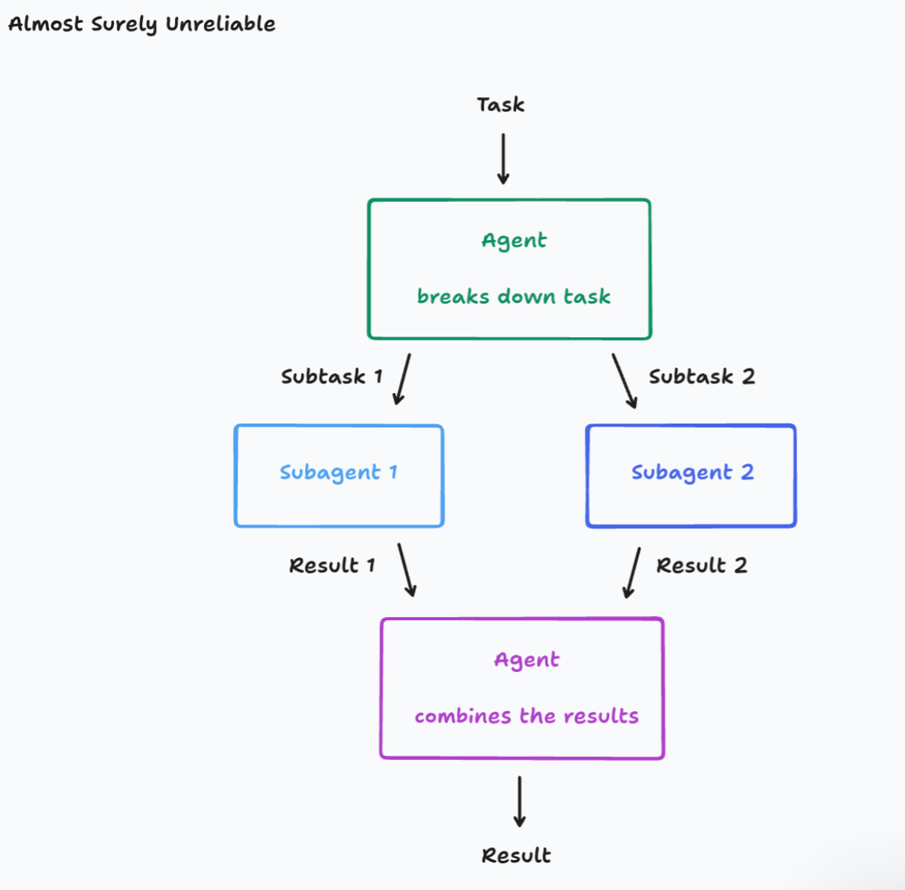
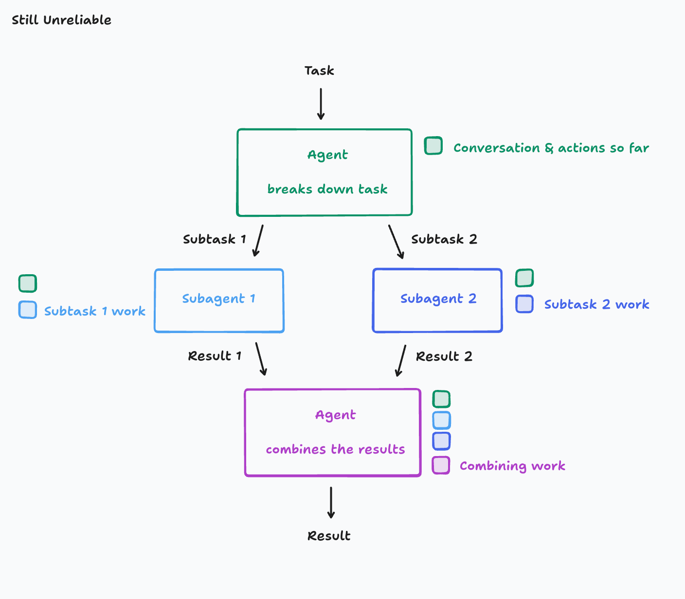
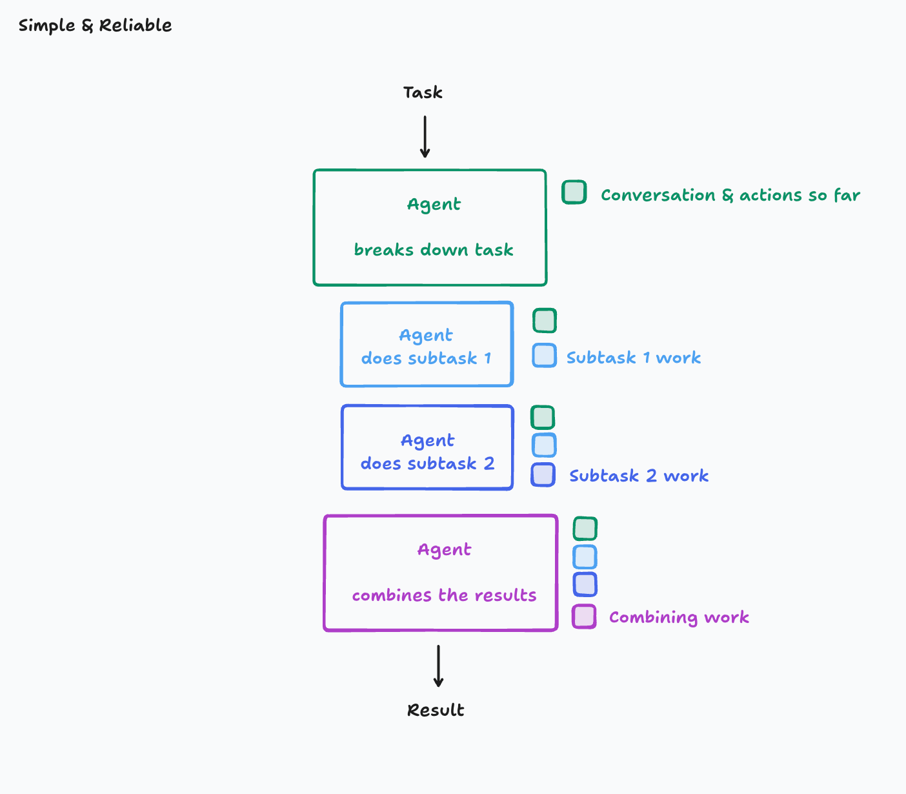
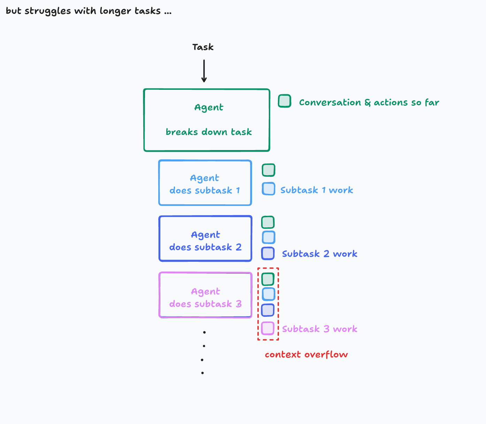
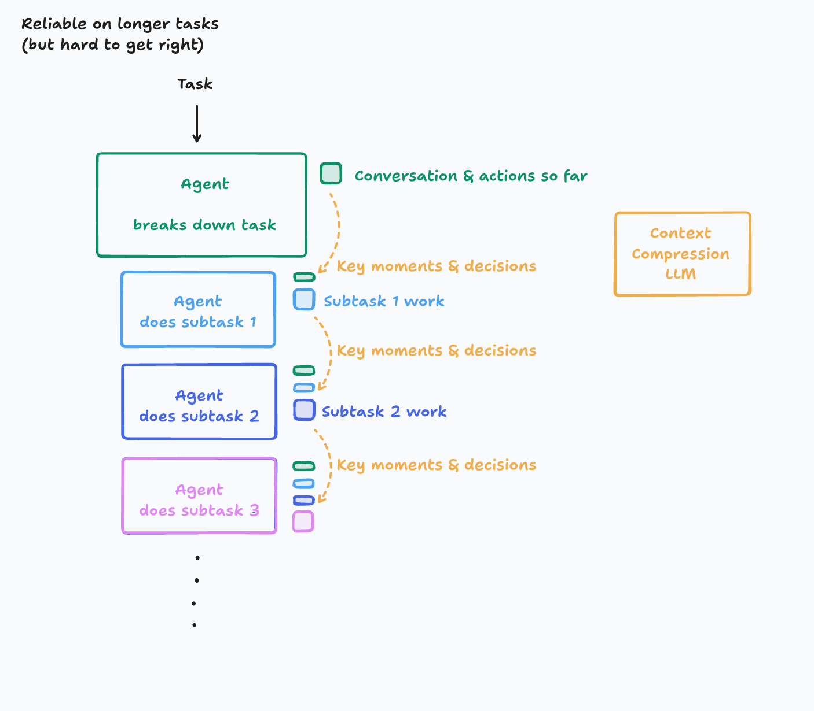
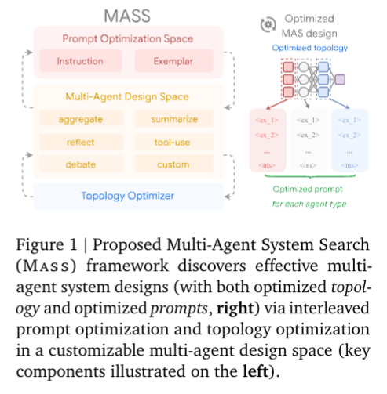
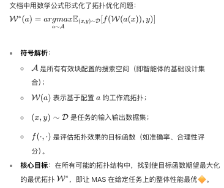
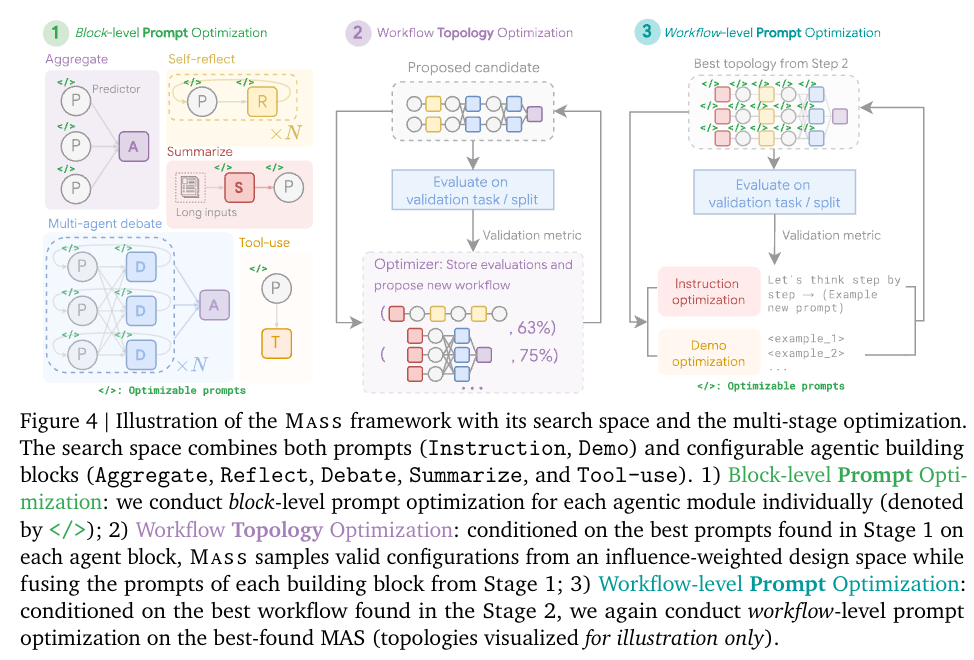

# 0615 - 【学习】多种 AGENT 架构 Devin、Anth、Google

<callout emoji="bullettrain_front" background-color="light-orange" border-color="light-orange">
对 Agent 架构的不同实践和讨论：
- **Devin: Don't Build Multi-Agents **[**Cognition | Don't Build Multi-Agents**](https%3A%2F%2Fcognition.ai%2Fblog%2Fdont-build-multi-agents)
- **Anthropic: How we built our multi-agent research system **[How we built our multi-agent research system](https%3A%2F%2Fwww.anthropic.com%2Fengineering%2Fbuilt-multi-agent-research-system)
- **Google：****https://arxiv.org/abs/2502.02533**
</callout>

# Devin ："Don't Build Multi-Agents"
<callout emoji="star2" background-color="light-orange" border-color="light-orange">
从我自己的实践和学习来看，Mutil-Agents 在除了红蓝对抗之外，并没有体现出显著区别于单 AGENT 的差距。
</callout>

<quote-container>
We'll work our way up to the following principles:我们将逐步推导出以下原则：
1. Share context 分享上下文
1. Actions carry implicit decisions 行动承载着隐含的决策
</quote-container>

- 观点一：AGENT 系统的可靠性在于上下文工程
<quote-container>

</quote-container>

- 观点二：Actions carry implicit decisions, and conflicting decisions carry bad results
<quote-container>

</quote-container>

基本没啥信息增量
# Anthropic： How we built our multi-agent research system
多 AGENT 的优势：
- 动态路径的可实现性，线性路径对某些任务不成立（这里的 MAS 约等于单 AGENT + Decision Tree）
- 多个 AGENT 对问题不同方向、不同角度的探索，全面、独立、高并发

比如：在广度优先搜索占优势

为什么多 AGENT 系统有优势呢？ - 消耗的 token 多、工具使用次数多、模型可以多样化选择

<quote-container>

</quote-container>

这两图也没啥信息增量，妈的这几个大哥真是一点秘密不往外发呀/

## 咋调 PE
- Think like your agents.
  - 避坑：智能体在已经得到足够结果时仍继续工作、使用过于冗长的搜索查询，或者选择了错误的工具。有效的提示词依赖于建立一个关于智能体的准确心理模型，这能让最有影响力的改变一目了然。
- Teach the orchestrator how to delegate.
  - 主导智能体将查询分解为子任务，并向子智能体描述这些任务。每个子智能体都需要一个目标、一种输出格式、关于使用哪些工具和信息源的指导，以及明确的任务边界。如果没有详细的任务描述，智能体就会重复工作、留下空白，或者无法找到必要的信息。
  - 任务指令要明确
- Scale effort to query complexity.（主要是为了节约资源）
- Tool design and selection are critical.
  - 我们为智能体提供了明确的启发式方法：比如，先查看所有可用工具，将工具的使用与用户意图相匹配，在网络上进行广泛的外部探索，或者优先选择专用工具而非通用工具。糟糕的工具描述可能会使智能体完全误入歧途，因此每个工具都需要有明确的用途和清晰的描述。
- Let agents improve themselves.  - AGENT 自己可以调试
- Start wide, then narrow down.  先广度优先，在深度优先
- Guide the thinking process. - 让 AGENT 思考会更有效
- Parallel tool calling transforms speed and performance.  并行提效
## 怎么评估 - 怎么样既判断智能体是否取得了正确的结果，同时也要判断它们是否遵循了合理的过程？
- 先小规模进行评测，20 个就够了
- LLM-as-judge evaluation scales when done well. - LLM 来评估
  - 我们尝试让多个评判者评估每个部分，但发现使用单个提示进行一次大语言模型调用，输出0.0到1.0的分数以及通过或不通过的等级，这种方式最为一致，且与人类评判结果相符。当评估测试用例有明确答案时，这种方法尤为有效，我们可以使用大语言模型评判者简单检查答案是否正确（例如，它是否准确列出了研发预算排名前三的制药公司？）。使用大语言模型作为评判者，使我们能够大规模地评估数百个成果。
  - 创作怎么这么评估呢 - sad
- Human evaluation catches what automation misses.
https://github.com/anthropics/anthropic-cookbook/tree/main/patterns/agents/prompts
- End-state evaluation of agents that mutate state over many turns.
  - 关注最终状态比关注过程要有效
- 压缩+检索来维护长上下文
- Sub-agent 可以直接给文件，不用所有东西都被主 AGENT 路由
## 工程化经验
- 当错误发生时，我们不能只是从头开始重启：重启成本高昂，且会让用户感到沮丧。相反，我们构建了能够从错误发生时智能体所在位置恢复的系统。我们还利用模型的智能来妥善处理问题：例如，当某个工具出现故障时告知智能体，并让它进行自适应调整，效果出奇地好。我们将基于Claude构建的人工智能智能体的适应性与重试逻辑和定期检查点等确定性保障措施相结合。

# Google - Multi-Agent Design: Optimizing Agents with Better Prompts and Topologies
**摘要：**

1. 对每个拓扑模块进行块级（局部）提示词 "预热"；
1. 在剪枝后的拓扑空间集合中进行工作流拓扑优化；
1. 基于找到的最优拓扑结构，进行工作流级（全局）提示词优化

**多 Agent 系统设计：**
- Block level：单个 AGENT 的 better Prompt
- Workflow level：从拓扑学的角度来优化整体 AGENT 调用的效率

