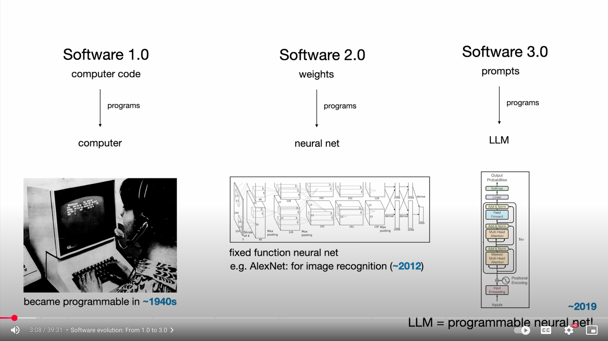
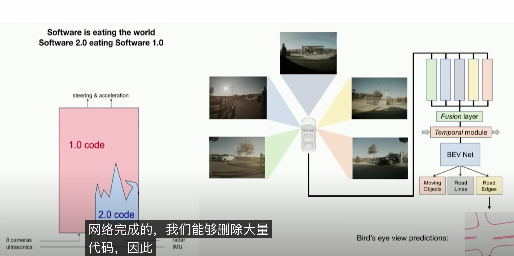
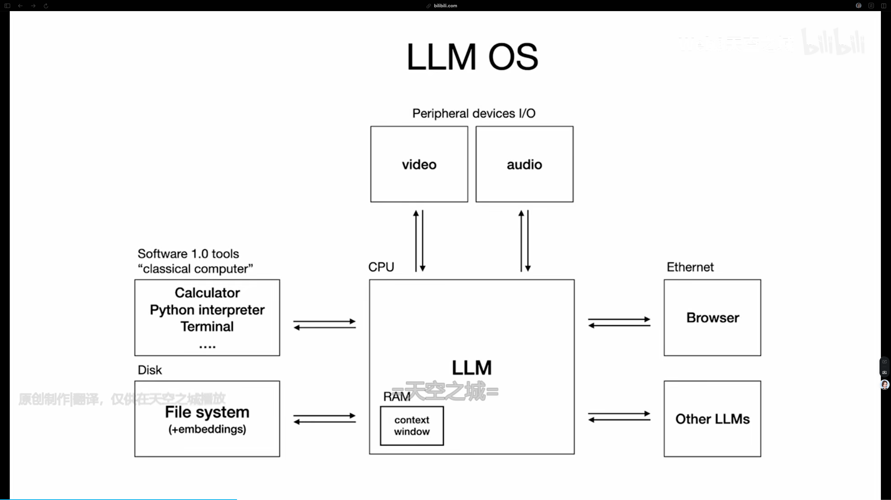
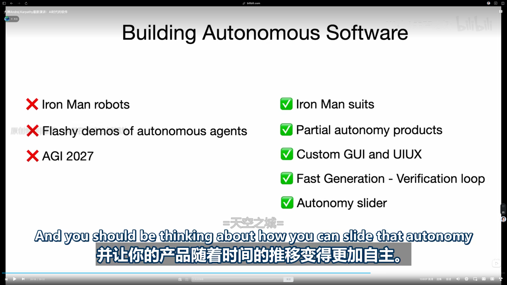
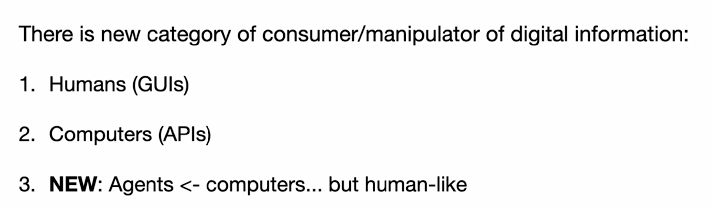

# 0621 - 【学习】 AK 的演讲 software is changing again

<text bgcolor="light-gray">**根据任务的复杂度，人为调控 AGENT 的自主性**</text>
软件变得更自主，我们应该如何处理？
- AGENT 应该看到所有和人一致的信息吗？
- AGENT 应该自行处理吗？
- 怎么评估自己的独特性服务

怎么让 AI 更可控

