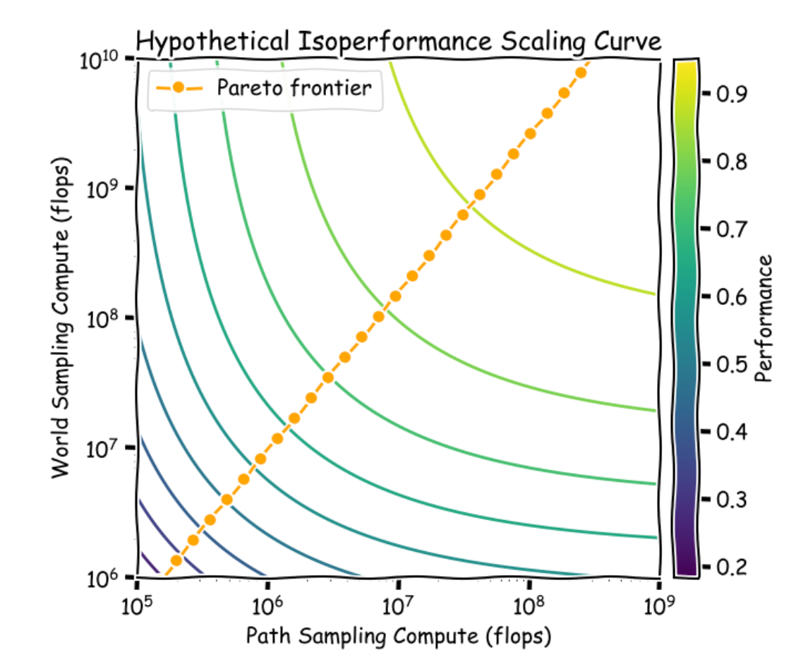

# 0701 - 【阅读】The Era of Exploration

<callout emoji="unicorn_face" background-color="light-orange" border-color="light-orange">
https://yidingjiang.github.io/blog/post/exploration/
</callout>

https://storage.googleapis.com/deepmind-media/Era-of-Experience%20/The%20Era%20of%20Experience%20Paper.pdf

- bottleneck is not having just *any* experience but collecting the *right* kind of experience that benefits learning.
- **pretraining has accomplished something that is difficult for *****tabula rasa***** RL**
  - 为什么小模型可以用大模型的 COT 数据来增强推理能力呢？
    - 大规模尺寸并非推理的必要条件 - **思考不透彻**
    - 应该思考：如果模型能力不是推理的必要条件，那为什么需要小模型蒸馏大模型的知识呢？
  - 笔者认为：
    - 模型的推理，有类似"探索税"的存在。 Pretraining 实际上是通过对极度 diverse 的数据进行学习和计算来支付这笔税。
    - 蒸馏是小模型在继承大模型的exploration 遗产
  - 为了说明这个观点，笔者的论据是：
    - 只能通过随机采样偶尔发现优质 RL trace 的模型毫无 RL 的潜力 - 因为它没有可用于 RL 的内容
    - 并借用 RL 的公式来说明这一问题：
    ```latex {wrap}
    1. 公式含义与背景
    公式来源：该公式 \( \Omega\left(\frac{S A H^2}{\epsilon^2}\right) \) 是表格型强化学习（tabular RL）中情节数量（episodes）的**样本复杂度下限**，由Dann & Brunskill（2015年）提出。
    它描述了在理想情况下，学习到接近最优解的策略所需的**最小训练次数**。
    Ω符号表示"下界"，即学习难度的理论最小值，实际所需次数通常更高。
    参数含义：
    \( S \)：状态空间大小（如环境中可能的状态数量）。
    \( A \)：动作空间大小（如每个状态下可执行的动作数量）。
    \( H \)：时间范围（Horizon，即每个情节的最大步数）。
    \( \epsilon \)：与最佳解的"距离"（误差容忍度，值越小表示要求越精确）。
    2. 公式的物理意义
    线性增长项：最小情节数与 状态-动作对数量（\( S \times A \)） 成**线性关系**。
    这意味着，当环境的状态或动作空间扩大时，学习成本会**直接线性增加**。例如，若状态空间翻倍，训练次数也需翻倍。
    二次增长项：最小情节数与 时间范围的平方（\( H^2 \)） 成**二次关系**。
    情节越长（\( H \) 越大），学习成本会**指数级增长**。例如，若每个情节的步数从 \( H \) 增加到 \( 2H \)，训练次数需增加到原来的4倍。
    误差敏感项：误差容忍度 \( \epsilon \) 越小（要求越精确），训练次数需**成平方反比增加**。例如，若 \( \epsilon \) 减半，训练次数需增加到原来的4倍。
    3. 对大语言模型（LLMs）的启示
    LLMs的状态与动作空间：
    状态空间：包含"所有可能的文本前缀"（如用户输入的任意句子开头），规模趋近于无穷大（因文本组合无限）。
    动作空间：包含"下一个可能的标记"（如英语中约5万种token），规模极大。
    因此，\( S \times A \) 的乘积远超过传统RL问题（如游戏或机器人控制）。
    无先验信息的困境：
    根据公式，若LLMs直接使用"从零开始的RL"（无预训练先验），其样本复杂度会因 \( S \) 和 \( A \) 的巨大规模而**变得不可行**。
    例如，假设每个文本前缀对应1个状态，每次生成1个token对应1个动作，即使 \( H \) 和 \( \epsilon \) 取较小值，所需训练次数也会远超现有计算资源。
    预训练的必要性：
    公式间接解释了为何LLMs需要**预训练阶段**（如GPT系列）：预训练通过学习海量文本的"先验分布"（如语言规律），大幅缩小了有效状态-动作空间，降低了RL的探索成本。
    若无预训练，RL难以在LLMs的超大规模空间中有效探索，这与"小模型需蒸馏大模型知识"的现象一致。
    4. 总结
    该公式揭示了强化学习的内在挑战：**状态与动作空间越大、任务越长，学习成本越高**。对于LLMs而言，其超大规模的状态和动作空间使得"无先验的RL"几乎不可行，这也凸显了预训练（提供先验分布）和蒸馏（继承大模型探索成果）的重要性。未来LLMs的发展可能需要更高效的探索策略（如主动学习、元学习），以降低样本复杂度。
    ```

    - 这意味着什么呢？ 简单来说，如果我们可以认为 分母 e 是存在通知极限的，那么 RL 可以进行的 S（状态）与 A（动作）越多，越能够有利于进行 RL。这也说明了 大尺寸的预训练的价值（基于数学的简单理解）
  - **Exploration directly controls the diversity of the data**.
    - 笔者举了自己在 Procgen 测试集上的 RL 方法，他令一个 AGENT 在游戏环境里自行收集数据，并自我强化改变探索方式来提高AGENT 的泛化能力，并以此来进行更好的强化学习。 - 论据感觉说服力一般，有点在推销自己工作的感觉
- **Two axes of scaling exploration**
  - World sampling - 可以认为是一种语义上或概念上的"领域" - where to learn
  - Path sampling - 可以认为是领域内的路径，或数据整合的方式 how to learn
    - 第二个维度中，RL 有更强的灵活性
  - 同时笔者认为，机器学习问题核心抽象是每个 flop 计算学到的最大信息量
  - 因此，where 和 how 也许都需要进行flop 的分配
  

  - 笔者提到：
    - 似乎 path sampling 是有最优解的，核心在于对环境的最优效率拟合
    - 似乎 world sampling 是没有最优解的。原因在于环境似乎是无限的，但是计算资源有限，那么我们需要对不同环境表达出不同的偏好（想象一下你在阅读这个笔记时候的注意力分配）
- 笔者的总结是：
  - 目前的 scaling law 已经非常有效，但是他认为终有一天我们需要新的 scaling，到时候的计算资源应该被投向什么地方呢？
    - 也许是exploration？ 但是我不理解这个观点与 Anthropic 或者其他大模型团队提到的"数据效率"的区别
