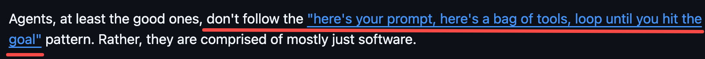
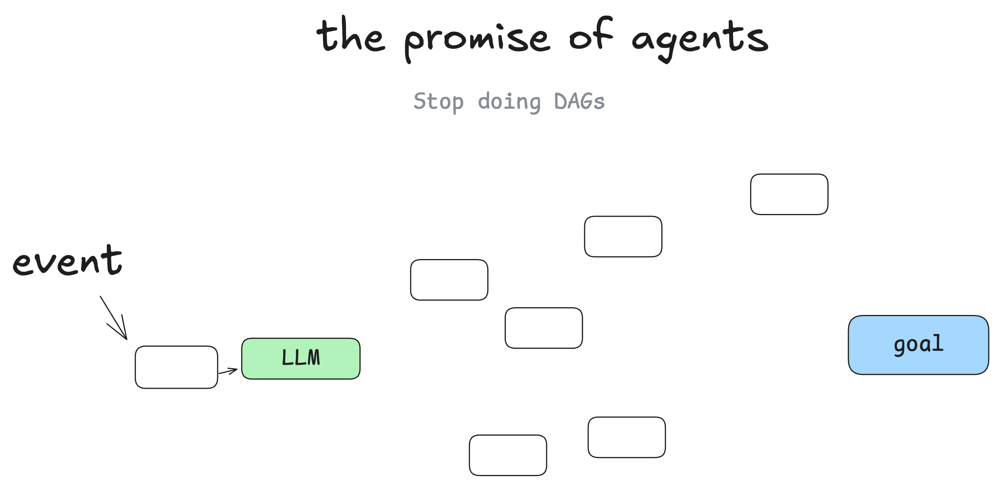
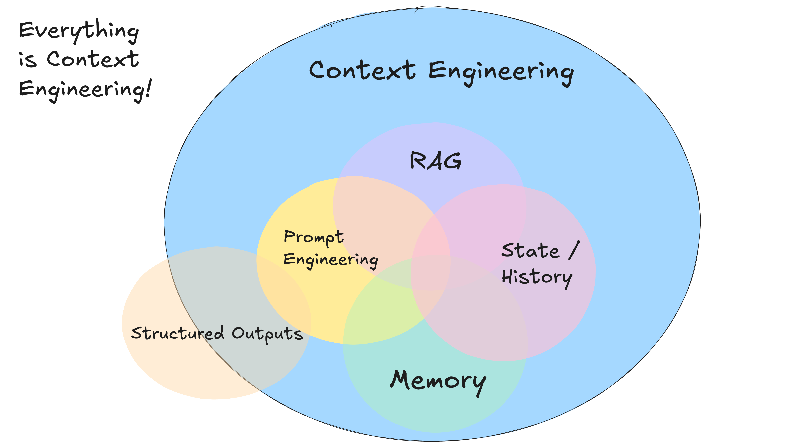

# 0707 - 【学习】 12 factor agent

<callout emoji="glass_of_milk" background-color="light-orange" border-color="light-orange">
这个项目最近挺火的，看看
https://github.com/humanlayer/12-factor-agents/tree/main

值得一读
</callout>

We need to move fast with deep control

The fastest way I've seen for builders to get good AI software in the hands of customers is to take small, modular concepts from agent building, and incorporate them into their existing product

提示词的彻底控制

Context learning 真的还挺重要的
- 上下文策略 + LLM 处理
- 结构化修改 + 与语义化

