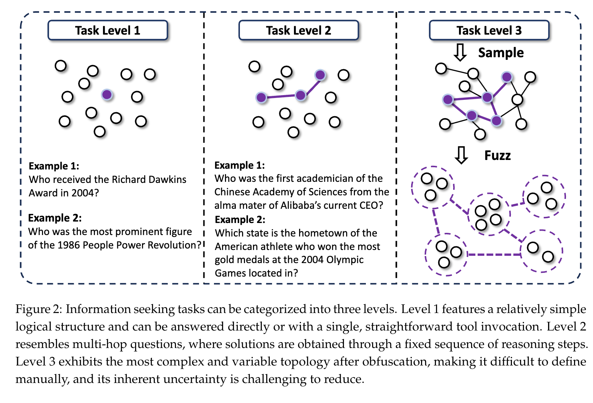
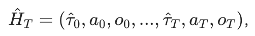
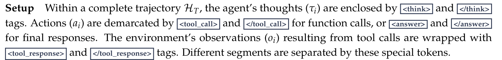
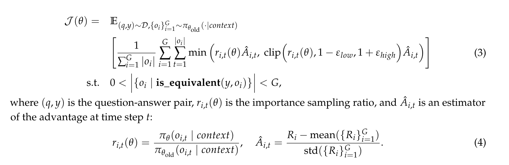
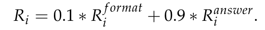

# 0709 - 【学习】WebSailor: Navigating Super-human Reasoning for Web Agent

<callout emoji="man-raising-hand" background-color="light-orange" border-color="light-orange">
alibaba 的 开源 AGENT + 训练方式

**Our approach involves generating novel, high-uncertainty tasks through structured sampling and information obfuscation, RFT cold start, and an efficient agentic RL training algorithm, Duplicating Sampling Policy Optimization (DUPO). With this integrated pipeline, WebSailor significantly outperforms all open-source agents in complex information-seeking tasks, matching proprietary agents' performance and closing the capability gap**
</callout>

# 造数据！
## 怎么构造数据 - QA 对？
解决问题的方式是什么？ 算法老哥永远都是想着训练，那么就先构造数据
他们构造 level3 的问题方式是这样：
1. 先找一个很几把抽象的 entity，比如"友商是傻逼这句话是XXX 时间雷军说的"
1. 基于这个问题的答案，模拟网页浏览的方式，疯狂积累浏览的 rawdata，比如，可能会看到很多雷军的视频、大嘴的视频，YU7、SU7 的视频，也有很多友商是傻逼的二创宣传
1. 把 raw data 抽象成 graph（语义粒度的）
1. 最终，获得了一个极具复杂度、重复语义、答案被冗余信息重复包裹的 graph结构

有了 graph 结构之后，要怎么构造QA 对呢？
1. 把这个复杂的 graph 抽出几个 sub graph，比如（我 YY 的）
  1. 五个界的相互关系
  1. 雷军和车企老板们的投资关系
1. 把信息可以模糊化
  1. 时间模糊化
  1. 所有实体信息全部模糊化，雷军变成一个曾经当过中国首富的互联网老兵，余大嘴是某知名企业不是 CEO 但是流量最大的高管
1. 基于 subgraph 提出问题
  1. 有一天中国某车企因为某个互联网企业大涨，那一天的具体日期是？

这种方式的三个好处
- 问题围绕真实世界
- 子图的结构足够多样化，从推理能力需求的角度，非常 diverse
- 可以 scale 数据

我们的人工评估证实，这些问题对人类研究者而言，在常规时间限制下（例如两小时内）是难以解决的，因为它们缺乏明确的搜索起点，并且需要进行大量的非线性探索。关于我们问答生成过程的更多细节，请参见附录 A.2。
## 怎么构造冷启动的 RFT 数据？
算法发现了两个难题：
- 风格污染，现在的 LLM 有冗长推理或者这啊那的问题，对于 RFT 来说数据的有效度不够
- 长上下文压力，长工具链的上下文基本打爆了 context windows

构造路径：
- 先用一个开源的推理模型来试着答题，并且留下回答正确的模型输出
- 把模型输出的推理部分踢掉，只保留工具调用的步骤trace
- 用另一个模型来基于 问题和调用trace来推理这一步调用工具的理由
使用这种方式构造了新的AGENT 轨迹数据（推理、行动、观察）

好处是啥呢？
- 用两个模型混合造数据，避免风格污染
- 实现了另一种 long2short，拿到了 short COT数据
# 开始训练！
## 先来一波拒绝采样 RFT
1. 先 setup 一下数据，用标签包裹一下不同部分的数据

1. 筛一下数据，保留：
  1. 做对了的
  1. 长度在 32k 以内的
  1. 工具调用超过 5 次的
1. 训练目标
  1. 训练目标是专门提升智能体的决策能力，即其生成有效想法和行动的能力。因此，在损失计算中，我们会将与环境观察结果（(*oi*)）对应的标记屏蔽掉
## D（duplicate）SPO  复制采样策略优化
首先在训练前过滤掉过于简单的案例（即 8 次推演结果均正确的案例）。训练过程中，我们不会通过填充来扩大批次规模，而是对同一批次中标准差非零的样本进行复制。与 DAPO 的动态采样相比，这种方法可实现约 2-3 倍的速度提升。

后面看完了，感觉信息量没啥
