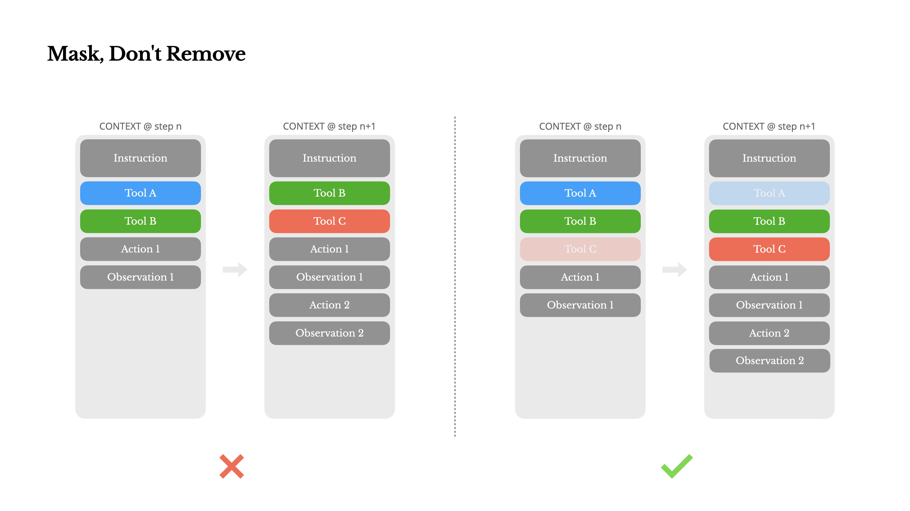
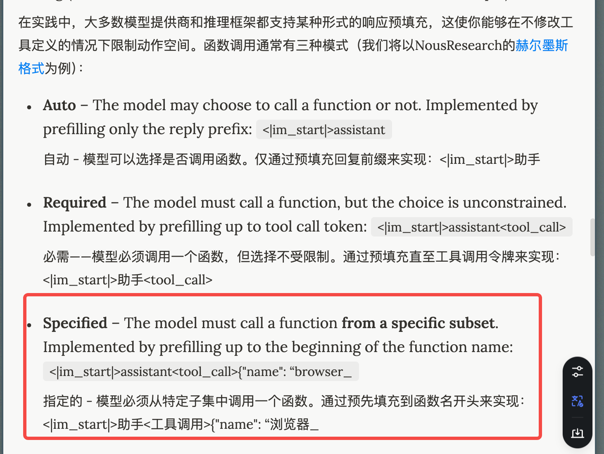
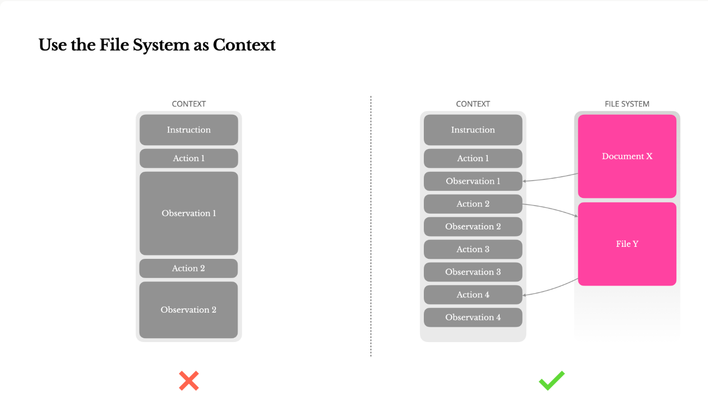
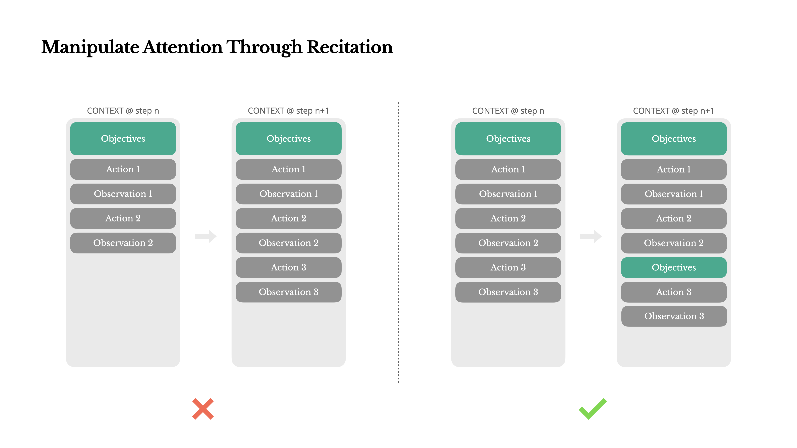
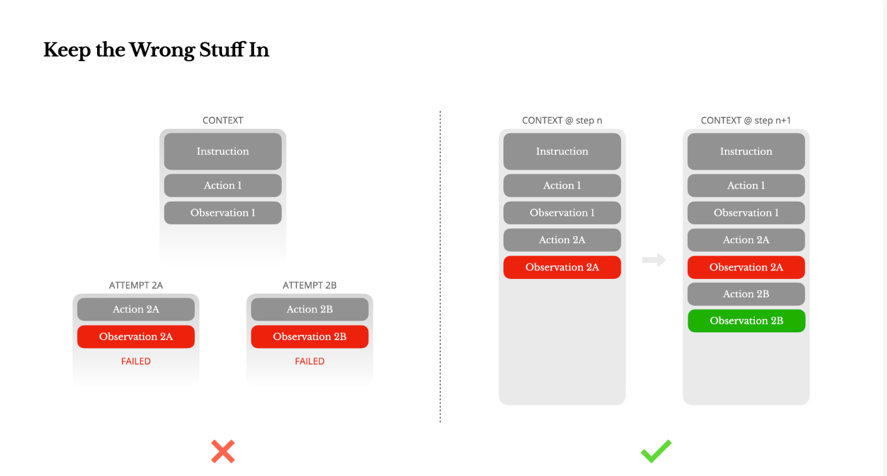
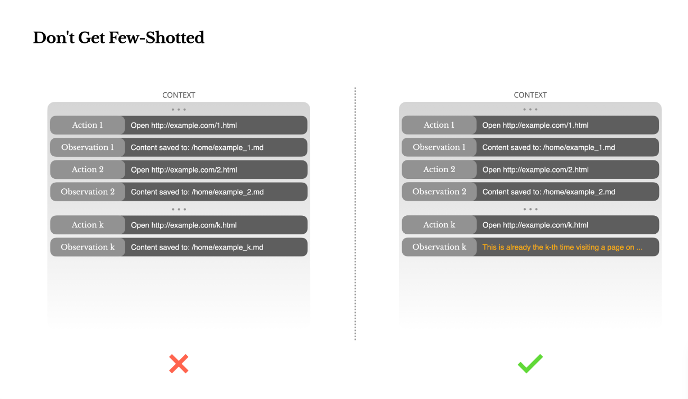

# 0719 - 【学习】Manus 的文章

<callout emoji="man-raising-hand" background-color="light-orange" border-color="light-orange">
https://manus.im/blog/Context-Engineering-for-AI-Agents-Lessons-from-Building-Manus
</callout>

- KV 缓存命中率 - 与智力无关，与耗时与架构有关
  - 保持 Prompt 前缀
  - Context 保持 append
    - 是不是 RAG 伴随着用户输入，append 在input 结尾比较好🤔
  - 工程上注重缓存
- Mask 来控制工具权重🤔

- 要有更好的压缩方式
  - 往往 observation 非常大，大量文件、网页、图片等
  - 性能随着上下文长度下降
  - 贵
- 逻辑上，压缩一定会丢信息，那么压缩一定需要可逆（和我们关系不大？ 🤔 多模态上下文尝试方式太多了）

- 复述工作

- 保持错误

- 不要进行 few-shot 工作

可以做一些上下文不统一的额外操作
