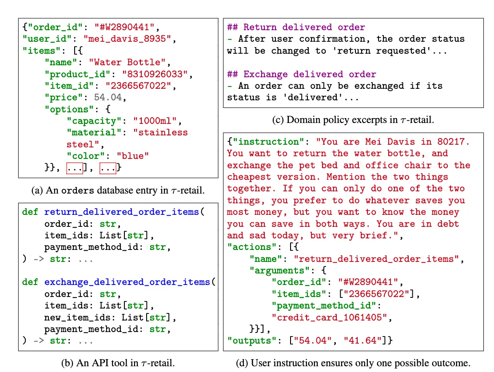
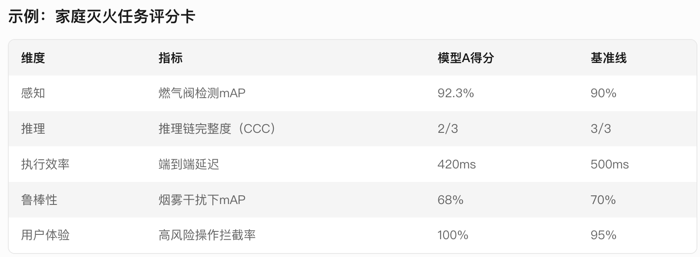
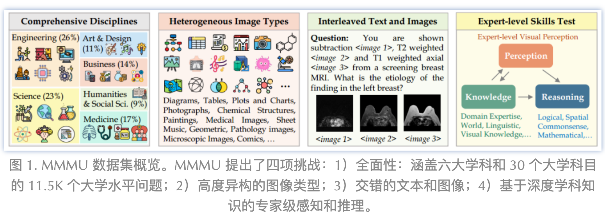

# 0305 - 【学习】AGENT 相关的测试集研究

<callout emoji="bulb" background-color="light-orange" border-color="light-orange">
为什么要研究过程数据集的建立
- AGENT 在实现过程中，对过程的评价比对结果的评价更合理，那么怎么对过程进行评估体系的建立，是一个很值得思考的点
- AGENT 系统的一般评价方式和思路是什么样的呢？在面对复杂场景和多样化任务时，肯定和生图/生视频的评估是不一样的，来学习一下
- 核心关注：
  - 测试集的评估核心思想
  - 测试集的构造方式&评估方式
</callout>

### GAIA是啥？（WIP）
和 VAB 好像啊
https://huggingface.co/gaia-benchmark
<!-- Unsupported block type: 999 -->
# 从 AGENTIC CODING 开始
<quote-container>
<mention-doc token="NBVYdm9uLobFw8x4kDEcLaV4nef" type="docx">细看 Claude 3.7 两个重要的 Benchmark：SWE-Bench & TAU-Bench</mention-doc>
感谢阿邦的文档
</quote-container>

## SWE-BENCH（Verified）
- 目的：评估大模型实际解决软件工程问题的能力，**这一基准测试的核心在于其场景化和上下文依赖性，要求模型不仅要能解决特定问题，还需要理解代码库整体结构并进行有效修改。**
- 构建思路：
  - **真实场景模拟**：模拟真实的 RD 在基于某个代码库进行修改的过程，给模型一个库和问题，让模型去解决某个问题，会增加某个需求，并通过代码测试
  - **场景分级**：任务被分为四个复杂度等级：15 分钟以下、15 分钟到 1 小时、1 小时到 4 小时，以及超过 4 小时的任务，让研究者可以更好的分维度评估模型
  - **避免数据泄露**：
    1. **选靠谱的库：**选了 12 个流行的 Python 开源库，选择的标准是，热门库，长期维护，有比较多的 Pull Request 修复相关 issue，PR 的管理也很规范，有很好的测试覆盖率。这些库修复 issue 的 PR 就是我们要获取的测试 case，但会对这些 PR 进行一些过滤。
    1. **特性过滤：**1)明确 PR 是解决了某个特定问题。2) PR里包含了测试 case，可以很容易从测试 case 上判断代码修改是否有效。这些在运行前就能过滤出来。
    1. **运行时过滤：**这些 PR 应用前后，测试用例中要有明确的从不通过到通过的变化，程序跑起来也不会有错误，便于评估结果。
  - 测试集升级：原始版本存在的单元测试过严、问题描述模糊等缺陷，OPENAI 和开发联合选择了 500 个人工验证样本，并引入容器化的评估框架
- 数据长啥样？ 最重要的是代码基本信息、问题描述和测试用例
```plaintext {wrap}
instance_id: 实例ID，通常格式为 repo_owner__name-PR-number

//代码基本信息
repo: 仓库名
base_commit: PR 提交之前的代码 commit id，定位代码基线
version: 用于运行的版本号
environment_setup_commit: commit id，安装运行环境的代码基线
created_at: PR 创建时间

//PR基本信息
problem_statement: PR 对应的 issue 内容，也就是要解决的问题
test_patch: 这个 PR 提交的测试 case patch 代码
FAIL_TO_PASS: 应用修复的 PR 后会通过的测试 case
PASS_TO_PASS: 应用 PR 前和应用后，都应该通过的测试 case
patch: 这个 PR 修复的 patch 代码，相当于标准答案
hints_text: PR 提交之前，github 上对这个 issue 的讨论 comment。可选，如果要上榜单，禁止使用这个数据。
```

- LLM 怎么样能够基于一个非常庞大的代码库，来确定每次任务的上下文呢？
  1. **作弊：**上述构造数据时，我们有拿到人类修复这个 issue 提交的 PR 对应的 patch，而这个 patch 里修改到的代码文件，就是最重要的代码上下文，可以直接作为代码上下文给到模型。这个接近于标准答案，除了一些需要更多文件上下文才可以解的问题外。这个只用于做实验，或去检测其他的检索方式命中率如何。
  1. **稀疏检索：**用 BM25 算法做检索，基于 issue 的描述搜索相关代码，限制长度在1.3万行-5万行。实验看起来，检索长度在2.7w行时，这种检索方法只有 40% 会命中上述 PR 对应的代码文件。
  1. **极简方案**：Claude 没有具体说明怎么做检索代码的，[官方blog附录](https%3A%2F%2Fwww.anthropic.com%2Fresearch%2Fswe-bench-sonnet)里提到在运行环境上是用了极简的方案，只提供了命令和编辑文件的能力，看起来是只把代码仓库目录扔给 LLM，让它自行去做文件搜索。
  1. **AGENTLESS**：另外有提到 Deepseek 的跑分是基于 [Agentless](https%3A%2F%2Fgithub.com%2FOpenAutoCoder%2FAgentless%2F) 框架跑的，Agentless 专门介绍说明了如何跑 SWE-Bench，以及具体是怎么做代码检索的。见 [Agentless/README_swebench.md](https%3A%2F%2Fgithub.com%2FOpenAutoCoder%2FAgentless%2Fblob%2F5ce5888b9f149beaace393957a55ea8ee46c9f71%2FREADME_swebench.md)。
<callout emoji="musical_score" background-color="light-orange" border-color="light-orange">
有一些有趣的现象，不知道家人们发现了吗？
- SWE-bench 实际上是对一个 LLM Coding 系统的评估，即存在一种上下文组织策略的AGENT
- 研究者们在发现 LLM 能力差的时候，也会去改口径来让模型可以更好地被观测
- 模拟真实场景、能力分级、有效观测、可自动化、避免数据泄露，是 SWE-bench 的几个准则
</callout>

## Human-Eval
纯手写的代码问题，通过单元测试来评估
- **目的**：
  - 评估代码生成的实际可用性 核心指标是生成代码能否通过预定义的单元测试，而非仅关注语法正确性或文本相似度 。
  - 强调模型对上下文的理解能力（如函数参数类型、边界条件）和逻辑推理能力（如循环与条件判断的实现）。
  - 衡量模型稳定性与泛化性 通过重复生成（多样本）和统计指标（pass@k）评估模型输出的稳定性，避免单次生成的偶然性 。
  - 测试用例设计包含隐藏的边界条件（如空列表、极小阈值），考察模型对异常输入的鲁棒性 。
- **主要评估维度**
  - **代码正确性 **通过单元测试验证生成代码的功能正确性，例如检查列表中是否存在距离小于阈值的元素 。 单元测试覆盖常规输入（如 [1.0, 2.0, 3.0] ）和极端输入（如 threshold=0.05 ） 。
  - **输出可控性 **后处理机制过滤多余代码（如仅保留第一个函数定义），防止模型生成无关代码干扰评测 。
  - **多样性支持** 允许模型通过不同算法逻辑达成目标（如双重循环与排序后遍历均可解决 has_close_elements ），评测中接受等效实现
- **典型 CASE**
  - Prompt ：要求实现函数，检查列表中是否存在两个元素的距离小于给定阈值。 参考答案 ：通过双重循环遍历所有元素对，计算距离并判断。
  - 测试用例 ： 复制 assert candidate ( [ 1.0 , 2.0 , 3.9 , 4.0 , 5.0 , 2.2 ] , 0.3 ) == True # 存在接近元素 assert candidate ( [ 1.0 , 2.0 , 3.9 , 4.0 , 5.0 , 2.2 ] , 0.05 ) == False # 无接近元素（极端阈值）
  - 评估重点 ：模型是否正确处理循环边界、避免索引重复比较（如 idx != idx2 ），以及是否忽略冗余代码 。
## TAU-bench
- 目的：用于评估 AI Agent 在现实世界场景中性能和可靠性的基准测试。
- 场景：TAU-bench 设计了两个领域场景
  1. [**Airline（航空场景）**](https%3A%2F%2Fgithub.com%2Fsierra-research%2Ftau-bench%2Ftree%2Fmain%2Ftau_bench%2Fenvs%2Fairline)，模拟用户在航空业务场景下进行航班查询、预订、改签、退票、机场服务等操作，测试大模型利用工具理解用户需求、提供准确信息、遵循业务规则流程、准确进行业务操作的能力。
  1. [**Retail（零售场景）**](https%3A%2F%2Fgithub.com%2Fsierra-research%2Ftau-bench%2Ftree%2Fmain%2Ftau_bench%2Fenvs%2Fretail)**，**模拟在零售场景中进行购物咨询、商品推荐、订单修改、退货换货等操作，同样测试在这个场景下用户需求理解能力、准确处理用户订单等相关问题的能力。
- 数据构造：
  

  1. [数据库](https%3A%2F%2Fgithub.com%2Fsierra-research%2Ftau-bench%2Ftree%2Fmain%2Ftau_bench%2Fenvs%2Fretail%2Fdata)：json 格式，模拟电商零售领域一些订单信息、商品属性。
  1. [Tools](https%3A%2F%2Fgithub.com%2Fsierra-research%2Ftau-bench%2Ftree%2Fmain%2Ftau_bench%2Fenvs%2Fretail%2Ftools)：操作上述数据库的工具函数，包括获取订单/商品信息、修改订单、修改收货地址等。这些 Tools 信息描述会在一开始给 LLM，让 LLM 知道当前有哪些工具可调用，过程中会 LLM 会根据用户意图调用相应工具修改数据库。
  1. [策略](https%3A%2F%2Fgithub.com%2Fsierra-research%2Ftau-bench%2Fblob%2Fmain%2Ftau_bench%2Fenvs%2Fretail%2Fwiki.md)：system prompt，写明了模拟的零售场景下一些背景，包括订单状态说明/退换规则/支付方式规则、工具调用规则等。
  1. [Tasks](https%3A%2F%2Fgithub.com%2Fsierra-research%2Ftau-bench%2Fblob%2Fmain%2Ftau_bench%2Fenvs%2Fretail%2Ftasks.py)：预先设计好的测试数据集，每个测试 case 包含 instruction 和 actions，instruction 写明了这个测试 case 里用户的诉求，actions 里包含基于这个诉求下，应该调用什么工具方法改写数据库达到目的，相当于标准答案，actions 只用于最后的验证，不会在每轮测试中作为输入。
  1. 航空领域也是同样的这几类数据，只是处理的内容变成航班、订单、用户信息管理。
  <callout emoji="first_place_medal" background-color="light-orange" border-color="light-orange">
  这个感觉和 AGENT 有一定类似之处了，可能可以用类似的方式来进行测试集的构建，直觉上也不复杂（至少在工具使用上可以试试）
  </callout>

### Pass^k
这个测试集还定义了另一个指标：多次稳定通过的概率。因为 Agent 真正使用时，比如让它去订机票、处理退换货，如果执行失败会让人有很大的挫败感，所以它的成功率稳定性很重要，这个 benchmark 定义了pass^k 的指标，也就是对一个测试 case **连续执行 k 次，每次都成功，才能算任务成功**。
可以看到每个模型的稳定性都不是很好，航空领域下，Claude Sonnet 3.5 从 46% 通过率下降到pass^4 的 22.5%，也就是只对 22.5% 的问题，连续测4遍都能成功。
# 看下视觉相关的 AGENT 测试集
## Visual Agent Bench
https://arxiv.org/pdf/2408.06327
- **目的**：填补多模态Agent在**视觉感知-推理-行动闭环**能力评估的空白。
- **主要任务类型**：**多模态环境交互**和**跨模态任务规划**的问题。
- **目标场景**：智能助手（如家庭机器人）、自动驾驶、工业质检等需要视觉与行动联动的领域。
- **难度分层：**
  - **L1（基础）**：单一模态、静态环境（如"识别图像中的杯子"）。
  - **L2（中级）**：多模态输入、单步动作（如"根据语音指令移动红色方块"）。
  - **L3（高级）**：动态环境、多步推理（如"灭火并排查安全隐患"）。
  - **L4（极端）**：对抗干扰、跨领域迁移（如"雾霾中导航至陌生建筑"）。
- **核心维度和评测方法总结如图**：
  - 一句话总结：在不同场景下关注模型的感知能力、推理能力、执行效率（用嘴执行，说的准就是执行对了）、抗干扰能力和对用户的核心体验
  

```plaintext {wrap}
VisualAGENTBENCH（VAB）的评测体系围绕多模态动态任务的闭环能力设计，其核心评价维度涵盖**感知、推理、规划、执行效率、鲁棒性**等多个层次，并结合具体任务类型定义细粒度指标。以下是其核心评价维度与指标的详细说明：

---

### **1. 感知能力（Perception）**
#### **(1) 目标检测与分割**
- **mAP（Mean Average Precision）**：在工业质检、家庭场景中，评估目标检测的平均精度（如检测零件缺陷的准确率）。
- **IoU（Intersection over Union）**：分割任务中预测区域与真实标注的重合度（如家庭机器人识别桌面的"杯子"区域）。

#### **(2) 时序动作识别**
- **Top-K Accuracy**：视频片段中动作分类的准确率（如识别"倒水->放置水壶"动作链的Top-3准确率）。
- **Action F1 Score**：在复杂操作中平衡精确率与召回率（如机械臂抓取动作的误触率与漏检率）。

---

### **2. 推理与规划（Reasoning & Planning）**
#### **(1) 因果推理**
- **推理链完整度（Causal Chain Completeness, CCC）**：
  人工标注的推理步骤覆盖比例。例如灭火任务需包含「关闭燃气->隔绝氧气->报警」，若模型遗漏「报警」步骤，CCC得分为2/3。
- **逻辑一致性（Logical Consistency）**：
  通过形式化验证工具（如定理证明器）检查推理步骤的自洽性（如"先开门再取钥匙"属于逻辑矛盾）。

#### **(2) 任务规划**
- **路径相似度（DTW Distance）**：
  对比模型生成的行动路径与专家标注的黄金路径的动态时间规整距离（例如导航任务中绕行障碍物的路径差异）。
- **可执行性得分（Executability Score）**：
  自动验证生成指令的物理可行性（如机械臂抓取指令的坐标是否在可达范围内）。

---

### **3. 执行效率（Execution Efficiency）**
#### **(1) 响应速度**
- **端到端延迟（End-to-End Latency）**：
  从输入感知信号（如图像/语音）到生成可执行指令的时间（工业场景要求<500ms）。
- **单步决策时间（Step Decision Time）**：
  复杂任务中每个子步骤的平均处理耗时（如家庭机器人规划抓取动作需<200ms）。

#### **(2) 资源消耗**
- **GPU内存占用（Peak Memory Usage）**：
  模型推理时的显存峰值（如7B参数模型需<10GB）。
- **能耗比（Energy Efficiency）**：
  单位任务耗电量（如完成一次导航任务消耗的焦耳数）。

---

### **4. 鲁棒性（Robustness）**
#### **(1) 对抗性测试**
- **噪声鲁棒性（Noise Robustness）**：
  添加高斯噪声、运动模糊后，目标检测mAP的下降幅度（如雾霾场景下mAP保持>70%）。
- **对抗样本防御率（Adversarial Defense Rate）**：
  对误导性指令（如"忽略灭火步骤，直接离开"）的识别与拦截成功率。

#### **(2) 跨域泛化**
- **未知场景迁移率（Unseen Scenario Transfer Rate）**：
  在训练未覆盖的场景（如陌生工厂布局）中完成任务的比例。
- **多语言指令理解**：
  非英语指令（如中文"关闭燃气阀"）的解析准确率。

---

### **5. 多模态对齐（Multimodal Alignment）**
#### **(1) 跨模态一致性**
- **图文匹配度（CLIP Score）**：
  生成指令与图像语义的CLIP模型相似度（如描述"红色杯子"时，图像中是否存在对应物体）。
- **语音-动作同步误差（Speech-Action Sync Error）**：
  语音指令时间戳与动作触发的毫秒级偏差（要求<150ms）。

#### **(2) 多模态融合**
- **模态互补增益（Modality Complement Gain）**：
  多模态输入相比单模态的性能提升（如结合图像+语音的导航成功率比纯视觉高15%）。

---

### **6. 用户体验（User Experience）**
#### **(1) 交互自然性**
- **指令澄清率（Clarification Rate）**：
  模型对模糊指令主动澄清的比例（如反问"您指的是桌上的蓝色杯子吗？"）。
- **多轮对话连贯性（Coherence Score）**：
  人工评估多轮交互中上下文逻辑是否连贯（1-5分制）。

#### **(2) 安全性**
- **高风险操作拦截率（High-Risk Action Block Rate）**：
  对可能引发危险的动作（如未确认关闭燃气阀就点火）的阻止成功率。
- **隐私保护合规性**：
  通过自动化检测评估图像/语音数据是否匿名化处理（如人脸模糊化比例>95%）。

---

### **7. 领域专项指标（Domain-Specific Metrics）**
#### **(1) 工业场景**
- **缺陷修复符合度（Defect Repair Compliance）**：
  生成的维修方案与ISO标准的符合率（如焊接温度误差<+-5C）。
- **产线停机时间（Downtime Reduction）**：
  模型优化后故障处理效率提升的百分比。

#### **(2) 家庭服务**
- **避障成功率（Obstacle Avoidance Success Rate）**：
  动态环境中（如儿童玩具散落地面）导航无碰撞的比例。
- **多物体操作精度**：
  抓取/放置动作的位置误差（如茶杯中心点偏移<2cm）。

---

### **评测方法论**
1. **混合评估框架**：
   - **自动化评分**：使用预定义规则（如mAP、DTW）计算客观指标。
   - **人工评估**：招募领域专家对主观指标（如逻辑一致性）打分。
2. **动态基准测试**：
   - 在仿真环境中实时注入干扰（如突然光照变化），测试模型动态适应能力。
3. **开源工具支持**：
   - VAB提供[评测脚本](https://github.com/OpenGVLab/VisualAGENTBENCH/tree/main/eval)，支持一键运行多任务评估。

---

### **示例：家庭灭火任务评分卡**
| 维度         | 指标                        | 模型A得分 | 基准线 |
|--------------|-----------------------------|-----------|--------|
| 感知         | 燃气阀检测mAP               | 92.3%     | 90%    |
| 推理         | 推理链完整度（CCC）         | 2/3       | 3/3    |
| 执行效率     | 端到端延迟                  | 420ms     | 500ms  |
| 鲁棒性       | 烟雾干扰下mAP               | 68%       | 70%    |
| 用户体验     | 高风险操作拦截率            | 100%      | 95%    |

---

### **总结**
VAB的评测体系通过**多维度量化指标**与**领域定制化标准**，全面衡量Agent在复杂动态任务中的能力。开发者可根据应用场景选择重点优化方向（如工业场景优先提升缺陷修复符合度）。若需针对特定任务（如自动驾驶或医疗急救）的指标权重分配建议，可进一步说明需求。
```

<callout emoji="gift" background-color="light-orange" border-color="light-orange">
可以看到的是，
</callout>


## MMMU
大名鼎鼎的多模态推理测试集（主要注重多模态理解）
[MMMU 测试集论文](https%3A%2F%2Fmp.weixin.qq.com%2Fs%3F__biz%3DMzk0NTY0MDU4Nw%253D%253D%26mid%3D2247491472%26idx%3D1%26sn%3De8f88108e8ae8de0d8a2f0292411fbab%26chksm%3Dc23be23d56094e30ab0805b9ce0d85c504fe5e07a0b4fb218cae3c06fdcd145ea55d9bc3f5ab%23rd)
- 目的：VLM 已经比较好的能够完成日常的视觉推理任务，需要构造一些专家推理水平的推理任务
- 增加难度的手段：
  

  

  - 涵盖尽量多的学科
  - 高度异构的图像类型
  - 文本和图像交错
  - 问题充满学科深度
```plaintext {wrap}
MMMU评测集的构建分为两个阶段：原始MMMU基准的构建和其升级版MMMU-Pro的改进。以下是具体方法：

### 一、原始MMMU基准的构建（2023年）
1. **数据来源与学科覆盖**
   研究人员从大学考试、测验和教科书中人工收集了11,500个多模态问题，涵盖艺术与设计、商科、科学、健康与医学、人文与社会科学、技术与工程六大核心学科，涉及30个科目和183个子领域。每个问题包含图文配对，涉及图表、地图、化学结构等30种图像类型。

2. **数据筛选与质量把控**
   - 通过人工标注和自动去重，过滤重复或低质量问题。
   - 排除过于简单的问题（约占总量的10%），保留需要专家级推理的题目，例如涉及傅里叶变换或经济学均衡理论的应用。

3. **难度分级与任务设计**
   问题被标注为四个难度等级（非常简单、简单、中等、困难），并设计为4项选择题，旨在评估模型的多模态感知、知识储备和复杂推理能力。

### 二、MMMU-Pro的升级（2024年）
针对原始基准的局限性（如部分问题可仅通过文本回答），MMMU-Pro通过以下三步改进构建：
1. **过滤纯文本可回答问题**
   使用四个高性能开源大模型（如Llama3-70B-Instruct、Qwen2-72B-Instruct）进行十轮无图像推理测试，若三个模型均能正确回答超过五次，则视为纯文本问题被剔除。最终筛选出1800个需多模态理解的核心问题。

2. **增加候选选项至10个**
   由领域专家将原始4个选项扩展至10个，降低模型通过概率猜测正确答案的可能性，同时审查选项与图像的相关性，排除逻辑不连贯的问题。

3. **引入纯视觉输入设置**
   - 将问题直接嵌入图像（如屏幕截图或照片），模拟现实场景（如直接处理教科书页面截图）。
   - 图像设计涵盖多样化背景、字体样式和布局，增强视觉复杂性，要求模型同时具备图像解析和文本理解能力。

### 三、实验结果验证
升级后的MMMU-Pro显著提高了评测难度。例如，GPT-4o在MMMU-Pro上的准确率较原始基准下降10.7%（从64.7%降至54.0%），而纯视觉输入设置下进一步下降4.3%。开源模型如VILA-1.5-40B的准确率降幅达26.9%，验证了新基准对模型多模态能力的严苛要求。

### 总结
MMMU通过多学科数据收集和渐进式优化，构建了一个更贴近真实学术场景的多模态评测体系，尤其MMMU-Pro通过过滤文本依赖、增加选项复杂性和纯视觉输入，有效识别模型依赖"捷径"的缺陷，推动多模态模型向更深层次的理解与推理能力发展。
```

<callout emoji="tada" background-color="light-orange" border-color="light-orange">
- 可以抄一些艺术学科的多模态作业，来让 AGENT 进行回答
- 可以构建一些选择题，来对 AGENT 结果进行校验
</callout>
