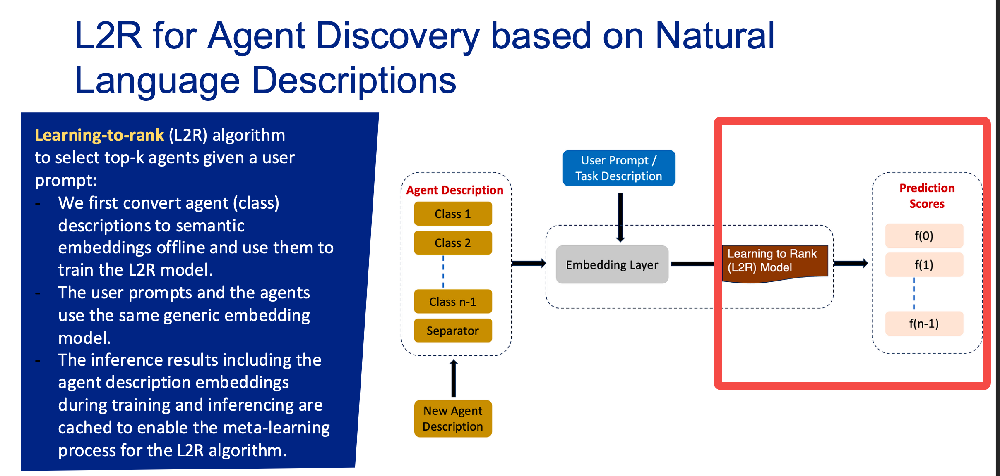
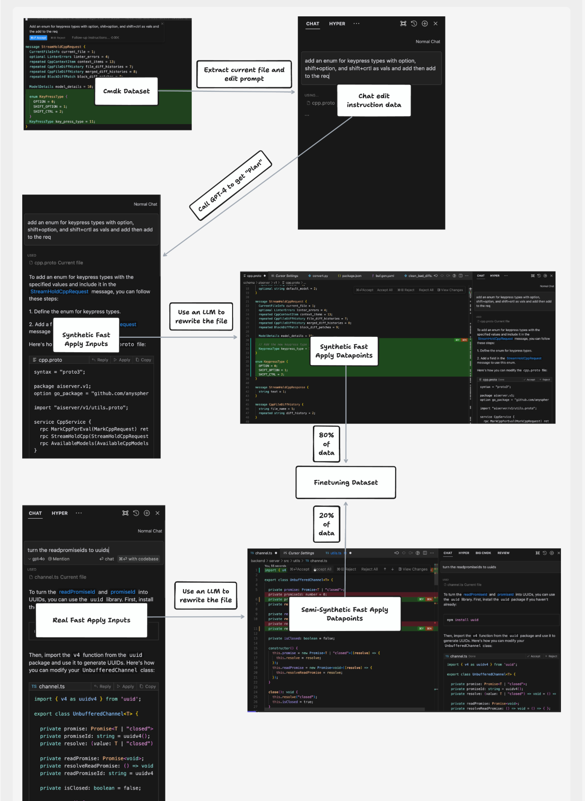
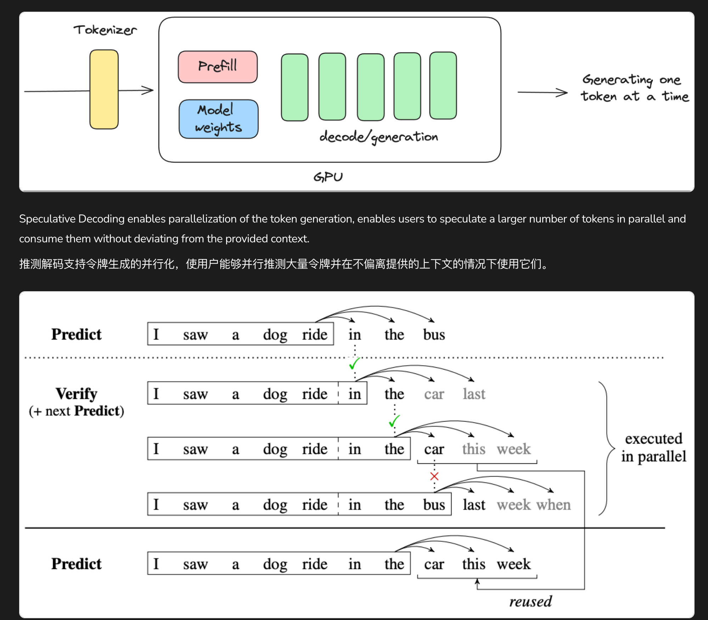

# Cursor 两篇Problem blog 定义了什么问题？

# 两篇Problems Blog里体现的Cursor最重要的是什么？

<lark-table rows="6" cols="3" column-widths="191,200,272">

  <lark-tr>
    <lark-td>
      **Cursor 认为什么最重要？**
    </lark-td>
    <lark-td>
      **描述**
    </lark-td>
    <lark-td>
      **对即梦我在想什么？ **
    </lark-td>
  </lark-tr>
  <lark-tr>
    <lark-td>
      **上下文**
    </lark-td>
    <lark-td>
      更有效的上下文使用，尽可能多地、尽可能准确地使用上下文
    </lark-td>
    <lark-td>
      创作中的上下文是什么？怎么显性体现？怎么给模型？
    </lark-td>
  </lark-tr>
  <lark-tr>
    <lark-td>
      **预测**
    </lark-td>
    <lark-td>
      更快、更小范围的预测，预测用户下一个最小行为，预测用户需要展示的内容
    </lark-td>
    <lark-td>
      用户每个操作都在想什么？
    </lark-td>
  </lark-tr>
  <lark-tr>
    <lark-td>
      **Edits**
    </lark-td>
    <lark-td>
      更多的推理让每一个 edit unit 更置信
    </lark-td>
    <lark-td>
      我们要给用户什么？ 更美的？ 更一致性的？ 更遵循指令的？
    </lark-td>
  </lark-tr>
  <lark-tr>
    <lark-td>
      **UX**
    </lark-td>
    <lark-td>
      UX 实验，更好兼容"预测-行动-修改-展示"链路的 UX
    </lark-td>
    <lark-td>
      有一个很简单的原型想法，在一张画布上，用户从prompt或者一张图展开，然后每次模型给用户上下左右四个中间产物，然后用户只需要按方向键，就可以走向下一个中间产物。
    </lark-td>
  </lark-tr>
  <lark-tr>
    <lark-td>
      **Scale and data work**
    </lark-td>
    <lark-td>
      模型和数据，Cursor 用一个巧妙的方式来构造数据和加速推理
    </lark-td>
    <lark-td>
    </lark-td>
  </lark-tr>
</lark-table>

想的还有很多，可以就着评论食用两篇文章，全是干货很有诚意。
# 2023 年 Cursor 的 Problems
## Better context - 基本解决，还有提升空间
<quote-container>
**Better context:** There are a lot of sources of information in a code editor: open files, semantically similar code chunks, symbolically connected classes, lint outputs, execution traces, git history, typing history, external documentation, and more. We want the model to instantly understand what is most relevant to the user's question, and are currently training a custom and fast reranker model to solve this problem. For each request, we will gather 500k tokens from all different sources, and use our reranker to filter them down to the most relevant 8k tokens. This is both a model problem and, increasingly so, an infrastructure problem.
**更好的上下文：** 在代码编辑器中有很多信息源：打开的文件、语义相似的代码块、符号连接的类、代码检查输出、执行跟踪、Git 历史记录、输入历史、外部文档等等。我们希望模型能够立即理解与用户问题最相关的内容，目前正在训练一个自定义的快速重排模型来解决这个问题。对于每个请求，我们将从所有不同的来源收集 50 万个令牌，并使用我们的重排器将它们过滤到最相关的 8 万个令牌。这既是一个模型问题，也是一个日益严重的基础设施问题。
</quote-container>

给模型更好的上下文，是一个很直接的想法，例如[cohere](https%3A%2F%2Fcohere.com%2Frerank)在创立最初就是通过更好的 RAG 排序作为卖点。但是不同垂类需要的 reranker 肯定是不一样，因此cursor觉得context reranker是一个非常重要的基础设施，我也非常认这一点。那么创作领域有没有人来完成 better context 呢？ 直觉上这是一件很难的事情，让我们来搜搜看有什么东西：
<quote-container>
- [Exploring Effective Factors for Improving Visual In-Context Learning](https%3A%2F%2Fwww.doubao.com%2Fpdf%2F658759568675586%2Fhttps%253A%252F%252Farxiv.org%252Fpdf%252F2304.04748%3Ffrom_source%3Dfrom_extention_read_pdf_arxiv%26pdf_reading%3D1) - 讲述在 ICL 里的高效视觉输入方案
- [VID- ICL](https%3A%2F%2Fwww.microsoft.com%2Fen-us%2Fresearch%2Fproject%2Fvideo-in-context-learning%2F)
- <mention-doc token="Syrsw7DJxiaExSkoSiXcTF1inBg" type="wiki">Refly 产品快速上手指南</mention-doc> - 一个存在context概念的文案创作工具，内测中，看产品展示有点意思，基于无限画布和资料库，AI写文档
- https://llava-vl.github.io/llava-interactive/
</quote-container>

初步搜索的结论是，没有谁在视觉创作领域很深入的探讨过better context的问题。 在coding上，better context的定义是，"对于完成本次代码任务最重要的辅助信息"。
在创作上，这个概念还挺难定义的，MJ的个性化和patchwork算是一些尝试，前者试图找到一种方式理解用户的美学偏好，后者在于构建一个控制环境，用整个创作"环境"当作上下文，影响下一次生成结果。
Better Context这个问题会在我们怎么理解用户，已经帮助用户执行下一个步骤上不停遇到
## A copilot for edits - 已解决
<quote-container>
**A "copilot for edits":** While Github Copilot is tremendously helpful for eliminating low-entropy keystrokes while writing new code, it does not help you save low-entropy keystrokes when you need to make small, simple changes to existing code blocks. Think the navigation, deletion and input keystrokes you need to do for a rename that's just slightly more complicated than a symbolic F2-rename can do. We will need innovation in both UX (unobtrusive diffs that are shown to you while you're coding) and on the model-side (prompting doesn't cut it, because of cost, latency, and intelligence problems).
**A "copilot for edits"**：**虽然 GitHub Copilot 在编写新代码时对于消除低熵击键非常有帮助，但当您需要对现有代码块进行小而简单的更改时，它并不能帮助您节省低熵击键。想想您为一个比符号 F2 重命名稍微复杂一点的重命名所需进行的导航、删除和输入击键。我们将需要在用户体验（在您编码时向您显示不显眼的差异）和模型方面（提示不起作用，因为存在成本、延迟和智能问题）进行创新。
</quote-container>

当你需要修改一个函数或者对象名字的时候，cursor会自动帮你同步在项目中所有要改的地方一起改掉。实现上似乎不难，只要存一个index索引库或者一张对象命名定义表就可以？
又想了一下，确实在代码容器里不难实现，但是这个功能一下就让cursor更显得智能了。
后编辑用户点一下就能解决，但是如果用户不需要点这一下，那用户就会一下子觉得这产品真牛逼。
又或者是 A copilot for regenerate
## Bug-finding - 基本解决
<quote-container>
Bug-finding: There are two modes here: (1) in the background, Cursor will always be passively scanning your files to find potential bugs for you, and (2) when you are deep in a debugging session, Cursor will actively look for the bug with your help. **There's a lot of interesting data collection to be done here.**
查找错误：这里有两种模式：（1）在后台，Cursor 将始终被动地扫描您的文件，为您查找潜在的错误，（2）当您深入调试会话时，Cursor 将在您的帮助下主动查找错误。**这里有很多有趣的数据收集工作要做。**
</quote-container>

创作流程不会有bug这样的显性提示，可能创作中隐形bug的寻找是一个关键点
## Larger edits - 已解决
<quote-container>
**Larger edits:** Cursor should be able to modify entire files, and even entire directories, for you. This is a challenge of both capabilities and UX. For speed, the model needs to be smart enough to pick out the parts to modify without rewriting everything. For making the experience good, the changes need to be shown in a parsable, real-time form.
**较大的编辑**：光标应该能够为您修改整个文件，甚至整个目录。这是能力和用户体验方面的挑战。为了提高速度，模型需要足够智能，能够挑出要修改的部分，而无需重写所有内容。为了使体验良好，更改需要以可解析的实时形式显示。
</quote-container>

## Scale - 不知道 cursor 现状
<quote-container>
**Scale:** We have 1.4 billion vectors and 150 thousand codebases indexed, as of October 12, 2023. This will probably grow by 10x by the end of the year. We have already built a really fast Merkle-tree-based codebase syncing engine in Rust, and will probably need to build a custom indexing system soon.
</quote-container>

## Future ideas
<quote-container>
- **Time warp**: Predict and display the cross-file code changes you'll make in the next 15 minutes. One key command to accept all insertions/deletions.**时间扭曲**：预测并显示你在接下来的 15 分钟内将对跨文件代码进行的更改。一个关键命令用于接受所有插入/删除操作。
- **Understanding**: Our models should deeply understand all the concepts in any codebase, in the weights.**理解**：我们的模型应该深入理解任何代码库以及权重中的所有概念。
- **Reader mode**: Make code understanding effortless with docs at any level of specificity and a bot that guides you through the relevant code paths, explaining as-needed.**阅读模式**：通过具有任何特定级别的文档以及一个在需要时引导您了解相关代码路径并进行解释的机器人，使代码理解毫不费力。
- **Pseudo-code mode**: Edit an "outline" representation of your code and have the changes automatically applied at the source level.**伪代码模式**：编辑代码的"大纲"表示形式，并使更改自动应用于源代码级别。
- **Never worry about stack traces again**: The IDE should just get it, and auto-fix the code for you.**再也不用担心堆栈跟踪了**：集成开发环境应该能够理解并自动为你修复代码。
</quote-container>

# 2024 年 Cursor 的 More Problems
2024年的问题，比23年的感觉精彩一些
## Next Action Prediction 下一个行动预测
<quote-container>
Cursor comes with [Copilot++](https%3A%2F%2Fwww.cursor.com%2Ffeatures%23cpp), a more intelligent version of copilot that predicts your next edit. Can we take this idea to its natural limit?
When coding, you don't just make low-entropy *edits*. Across the entire editor, you take low-entropy keystrokes, clicks, *actions*. Can we build a model to predict each with low-latency?
Cursor 带有[Copilot++](https%3A%2F%2Fwww.cursor.com%2Ffeatures%23cpp)，这是一个更智能的 Copilot 版本，可以预测您的下一次编辑。我们能否将这个想法发挥到极致呢？
在编码时，您不仅仅进行低熵*编辑*。在整个编辑器中，您会进行低熵按键、点击、*操作*。我们能否构建一个模型以低延迟预测每个操作？
<view type="2">

  <file token="RhkPbRXpqo5BV4xZjAOcj366nXU" name="More Problems Cursor.mp4"/>

</view>

To start, we've extended Copilot++ to predict your next location. Combine this with next edit prediction, and the model can play through a sequence of low-entropy changes:
We're working on predicting the next file you will move to. The next terminal command you will run. The next edit, conditioned on your previous terminal commands! A next action prediction model.
Furthermore, the model should surface information the moment you need it. Whether it be the right piece of code or documentation.
Cursor should *feel* like an extension of your will. The moment you think of a change, the language model requires minimal intent to execute it instantly.
首先，我们已经扩展了 Copilot++ 以预测您的下一个位置。将此与下一个编辑预测相结合，模型可以通过一系列低熵更改进行播放：
我们正在努力预测您将移动到的下一个文件。您将运行的下一个终端命令。根据您之前的终端命令进行的下一个编辑！一个下一个动作预测模型。
此外，模型应该在您需要的时刻提供信息。无论是正确的代码片段还是文档。
光标应该*感觉*像是您意志的延伸。当您想到一个更改时，语言模型只需要最小的意图即可立即执行。
</quote-container>

Next action是对于2023年 A copilot for edit的回应。Copilot需要干什么？或者他的一个重要任务、一个亮点是什么呢？ 是预测用户的下一个行为。
Next action prediction几乎是AGENT最重要的思想，比如


但是，预测下一个动作之后，怎么和用户的行为耦合起来，或者说"优雅地让用户感知，并获取用户同意"，这个问题的回答，就是cursor的"low-entropy action"。
而且预测一定要快，但是对我们来说可能不太能做到，那是不是可以用无限的后台离线任务来堆积出一个实时任务 （你看到的所有东西都是我30秒之前预测你想看的、并在这30秒内完成生成的）
<quote-container>
### Promising Directions
- Fundamental research on *action prediction* across a codebase.对代码库中*动作预测*的基础研究。
- Continued pre-training and post-training on ~5-13B active parameter code-models (for prefill-bound low-latency predictions).在约 50 亿至 130 亿个活跃参数的代码模型上进行持续的预训练和后训练（用于预填充限制的低延迟预测）。
- Additional inference tricks similar to [Speculative Edits](https%3A%2F%2Fwww.cursor.com%2Fblog%2Finstant-apply) 与[推测性编辑](https%3A%2F%2Fwww.cursor.com%2Fblog%2Finstant-apply)类似的其他推理技巧。
- Clever UX for surfacing "actions" in a non-obtrusive way. (how do you propose the next file a user should move to? or the next location outside the current viewport?)巧妙的用户体验，以一种不引人注目的方式呈现"操作"。（你如何提议用户应该移动到的下一个文件？或者当前视口之外的下一个位置？）
</quote-container>

## Perfect Edits
<quote-container>
Can we scale up inference time compute to produce higher-quality, larger edits? How do we compensate for the increased latency?我们能否扩大推理时间计算以产生更高质量、更大的编辑？我们如何补偿增加的延迟？
It may be necessary to perform the edit *in the background*. Spawning off a unit of work that you can trust to intelligent models.可能需要在后台执行编辑。生成一个可以信任的工作结果集合。
We'll need models with strong editor-specific tool-use abilities, smarter codebase-wide context, and improved long-term reasoning.我们需要具有强大的特定编辑器工具使用能力、更智能的代码库范围上下文以及改进的长期推理能力的模型。
And how can we make async code-generation *flow-preserving*. This sounds like an oxymoron, but we believe clever research in model capabilities and UX may make this possible.那么我们如何使异步代码生成具有"流程连贯性"呢？这听起来似乎自相矛盾，但我们相信，在模型功能和用户体验方面进行巧妙的研究可能会使其成为可能。
</quote-container>

## Hallucinated Pseudocode 幻觉伪代码
<quote-container>
<view type="2">

  <file token="K4sRb9x5Nom7QBxYApWcnVupnFd" name="HFSpeedup (1).mov"/>

</view>

Users will write pseudocode that describes the desired change. Then we can trust Cursor to compile the pseudocode into the full change in the background.
用户将编写描述所需更改的伪代码。然后，我们可以信任Cursor在后台将伪代码编译为完整的更改。
</quote-container>


### Multi-File Edits 多文件编辑
<quote-container>
[Cmd-k](https%3A%2F%2Fwww.cursor.com%2Ffeatures%23cmd-k) is already fantastic, but what if you could ask for a generic edit across your entire codebase? In particular, one that accurately spans multiple files?"[Cmd-k](https%3A%2F%2Fwww.cursor.com%2Ffeatures%23cmd-k)已经非常棒了，但如果你能在整个代码库中进行通用编辑呢？特别是能够准确地跨多个文件进行的编辑。"
</quote-container>

### Promising Directions 有前景的方向
<quote-container>
- Scaling inference-time compute. We know reward models and rejection sampling will show quick and easy improvements, but how much farther can we go?扩大推理时间计算。我们知道奖励模型和拒绝采样将显示出快速而容易的改进，但我们还能走多远呢？
- Better reasoning models (gpt-5, claude-4, gemini 2.0)
- Running multiple language-server/file-system copies for a given user workspace. This will require model tool use and remotely reproducing runtime environments.为给定的用户工作区运行多个语言服务器/文件系统副本。这将需要使用模型工具并远程复制运行时环境。
- Training/improving model performance on agent trajectories在智能体轨迹上训练/提高模型性能
- Significant UX experimentation for in-flow async edits重大的用户体验实验，用于流内异步编辑。
</quote-container>


## Optimal Context
<quote-container>
There can be millions of tokens of documentation, tens of millions of tokens of source code, another tens of millions of tokens of commit history, all potentially useful tokens to resolve a single query.可以有数百万个文档令牌，数千万个源代码令牌，另外数千万个提交历史令牌，所有这些令牌都可能对解决单个查询有用。
Not to mention, the pixels in your UI, logs in production and localhost, messages in slack, etc...更不用说，UI 中的像素、生产和本地主机中的日志、Slack 中的消息等......
We believe the best coding systems will use a mix of retrieval, recurrence, and long-context attention to ingest all this information.我们相信最好的编码系统将结合使用检索、递归和长上下文关注来摄取所有这些信息。
We emphasize systems as in the short-term, this may be an ensemble of models and infra that comprise an infinite context engine for coding. In the long-term, we expect it to be baked into the architecture.我们强调系统，因为在短期内，这可能是模型和基础设施的集合，它们构成了一个用于编码的无限上下文引擎。从长远来看，我们预计它会融入到架构中。
We're especially excited when thinking creatively about the future of retrieval. Moving past embeddings, what is the best performance possible given the primitive of an expensive indexing step and a cheap querying step (sublinear in the size of the corpus)?在创造性地思考检索的未来时，我们特别兴奋。抛开嵌入，考虑到昂贵的索引步骤和廉价的查询步骤（语料库大小的亚线性）的基元，可能的最佳性能是什么？
Maybe it looks like some variant of [transformer memory as a differentiable search index](https%3A%2F%2Farxiv.org%2Fpdf%2F2202.06991). Perhaps something else entirely. It's an underexplored research direction.也许它看起来像是 transformer memory 的某种变体[，作为可微分的搜索索引](https%3A%2F%2Farxiv.org%2Fpdf%2F2202.06991)。也许完全是另一回事。这是一个未被充分探索的研究方向。
</quote-container>

### Multi-hop Context 多跳上下文
<quote-container>
Inside my codebase, I want to compute a diff between two strings. With embeddings, I get the chunk:在我的代码库中，我想计算两个字符串之间的差异。使用 embeddings，我得到 chunk：
```plaintext {wrap}
function computeDiff(
  firstModel: ITextModel,
  secondModel: ITextModel,
): string {
  //...
}
```

To satiate the original query, I must determine how to create an `ITextModel` from a string. This is a query that requires two-hops to resolve.为了满足原始查询，我必须确定如何从字符串创建 `ITextModel`。这是一个需要两个跃点才能解决的查询。
The hardest questions and queries in a codebase require several hops. Vanilla retrieval only works for one hop.代码库中最难的问题和查询需要多次跃点。Vanilla 检索仅适用于一个跃点。
</quote-container>

### Promising Directions
<quote-container>
- Specialized/improved embeddings and rerankers for codebases.代码库的专用/改进的嵌入和重新排序器。
- Training multi-hop embedders. Given a query and the relevant code we've found so far, determine the next piece of code to hop to.训练多跳嵌入器。给定一个查询和我们目前找到的相关代码，确定要跳转到的下一段代码。
- Clever prefix-caching and perhaps custom attention masks better suited for codebases.巧妙的前缀缓存，也许还有更适合代码库的自定义注意力掩码。
- Novel research on codebase-level retrieval.关于代码库级检索的新颖研究。
- Teaching a model to *learn* a codebase in the weights, similar to transformers as a search index.教模型*学习* weights 中的代码库，类似于 transformers 作为搜索索引。
</quote-container>

---

## Bug Detection and Debugging
<quote-container>
Existing bug-detection systems struggle with calibration and sufficient codebase understanding.现有的 bug 检测系统难以进行校准和充分理解代码库。
Models are smart enough to correctly identify bugs, but are plagued by false-positives. Identifying the trickiest bugs require a deeper understanding of the codebase. And buggy-looking code may be benign after seeing the larger picture.模型足够智能，可以正确识别 bug，但会受到误报的困扰。识别最棘手的 bug 需要更深入地了解代码库。在看到更大的图景后，看起来有 bug 的代码可能是良性的。
One way this could surface is a much better experience for code review using language models:这可能显示的一种方法是使用语言模型进行代码审查的更好体验：
Detecting Bugs in AI Review 在 AI Review 中检测错误
The benefit of "AI Review" is that the user is more tolerant of false-positives, since they are requesting a review. The downside is it requires changing user behavior."AI Review" 的好处是用户对误报的容忍度更高，因为他们正在请求审查。缺点是它需要改变用户行为。
</quote-container>

### AI Linting
<quote-container>
The best version of bug detection is an always-on linter that catches your bugs in the background. It needs to be a cheaper, faster model than AI-review, since we'd run it several times a minute. It must also be tuned to a lower false-positive rate.错误检测的最佳版本是始终开启的 Linter，它可以在后台捕获您的错误。它需要是一个比 AI 审核更便宜、更快速的模型，因为我们每分钟都会运行几次。它还必须调整为较低的假阳性率。
</quote-container>

### Smarter Debugging
<quote-container>
Perhaps more impressive than bug detection is debugging difficult issues.
We'll need to go beyond LLM-based static analysis. For example, we've built a `cursor/debug` package. When injected into your code, it tracks runtime information.
In the background, we can even use it to track additional variable states (akin to print-debugging with relevant outputs piped into Cursor's context).
也许比错误检测更令人印象深刻的是调试困难的问题。
我们需要超越基于 LLM 的静态分析。例如，我们已经构建了一个`cursor/debug`包。当注入到您的代码中时，它会跟踪运行时信息。
在后台，我们甚至可以使用它来跟踪其他变量状态（类似于将相关输出打印调试到 Cursor 的上下文中）。
</quote-container>

### Promising Directions
<quote-container>
- Clever dataset curation (likely synthetic data) and RL on frontier code models to improve calibration.
- Track relevant information from other surfaces (the browser or non-integrated terminal).
- Improve frontier model performance on debugger-specific tool-use and chains.
- Infinite context and near-perfect codebase understanding.
- Expand the scope of our `cursor/debug` library to track all useful program-state information.
- 巧妙的数据集管理（可能是合成数据）和前沿代码模型上的强化学习，以提高校准。
- 跟踪来自其他表面（浏览器或非集成终端）的相关信息。
- 提高前沿模型在调试器特定工具使用和链上的性能。
- 无限上下文和近乎完美的代码库理解。
- 扩展我们的`cursor/debug`库的范围，以跟踪所有有用的程序状态信息。
</quote-container>


<whiteboard token="CumMwsClNhMcJxbfouBctxyknds"/>


# 附录
## 被 Cursor 删除的 Blog
### [怎么构建数据并训练的](https%3A%2F%2Fweb.archive.org%2Fweb%2F20240605011900%2Fhttps%3A%2F%2Fwww.cursor.com%2Fblog%2Finstant-apply)


### [怎么做到更快推理](https%3A%2F%2Ffireworks.ai%2Fblog%2Fcursor)


## Agentic AI Guide
<view type="1">

  <file token="MgkMb1pBmooCqgxP5eqcaI7Knzh" name="Agentic AI Guide.pdf"/>

</view>
