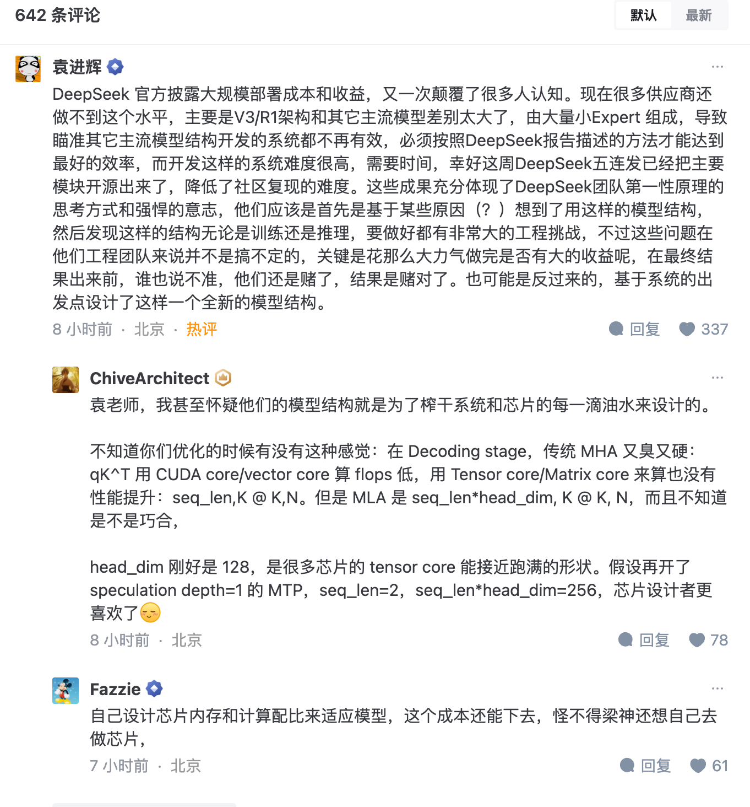
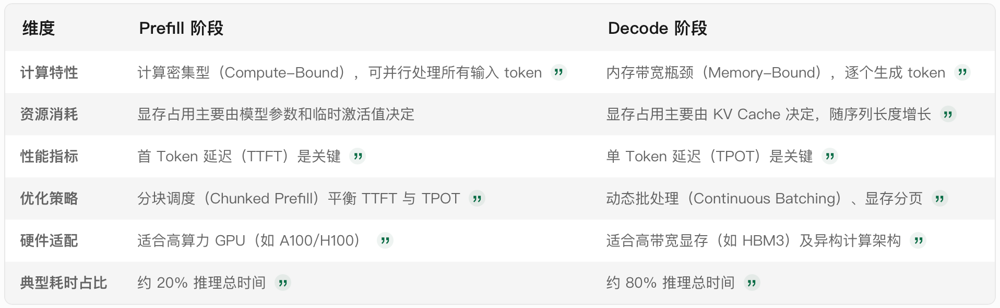

# 0302 - 【学习】DeepSeek-V3 / R1 推理系统概览 - 学习（没学会）

<callout emoji="writing_hand" background-color="light-orange" border-color="light-orange">
- https://zhuanlan.zhihu.com/p/27181462601
- 目标：能看懂大概的 DS 推理系统降本思路&想法（皮毛看懂了，不会被不懂的人忽悠了，希望），然后看看对产品判断有啥影响
  - **大部分都没看懂，感觉需要把 LLM 推理很细致地补一下课**
  - 对产品而言的 key take-away：
    - 推理成本仍然在飞速下降
    - 模型 & 推理系统是耦合的，要一起做
    - 小厂也可以在成本优势上干赢大厂
    - 更相信 AGI 了一些
</callout>

## 原文摘要
- [<text color="blue">DeepSeek-V3</text>](https%3A%2F%2Fzhida.zhihu.com%2Fsearch%3Fcontent_id%3D254458901%26content_type%3DArticle%26match_order%3D1%26q%3DDeepSeek-V3%26zhida_source%3Dentity) / [<text color="blue">R1 推理系统</text>](https%3A%2F%2Fzhida.zhihu.com%2Fsearch%3Fcontent_id%3D254458901%26content_type%3DArticle%26match_order%3D1%26q%3DR1%2B%25E6%258E%25A8%25E7%2590%2586%25E7%25B3%25BB%25E7%25BB%259F%26zhida_source%3Dentity)的优化目标是：更大的吞吐，更低的延迟。（纯技术指标）


## 看第一遍文章，啥都看不懂，先理解一下背景知识
### LLM 推理过程
主要分成两个大的主要阶段：
- Prefill 阶段：
  - prefill阶段将用户输入的文本（如"Write me a presentation..."）通过分词器（Tokenizer）转化为Token序列，并计算中间状态（如Attention机制中的Key和Value矩阵），这些状态会缓存在GPU显存中 。例如，输入"smart"和"smarter"会被分词为不同Token，并映射为Embedding向量矩阵 。
  - **输入Token数量直接影响prefill阶段的耗时和显存占用。**例如，输入1000个Token的prompt需要处理的矩阵规模远大于100个Token的情况，导致更长的计算时间和更高的显存需求 。
- Decode 阶段
  - 从 Prefill 生成的第一个 token 开始，以自回归方式逐个生成后续 token。每次生成新 token 时：
    - 输入依赖 ：需将当前 token 与之前所有生成的 token 结合作为输入。
    - KV Cache 缓存 ：通过缓存注意力层的 Key-Value 向量（即 KV Cache），避免重复计算历史 token 的中间状态


<quote-container>
具体细节可看：
```markdown {wrap}
大语言模型（LLM）的推理过程通常基于 **Transformer** 架构，核心是通过自注意力机制捕捉上下文依赖关系。以下是典型的推理步骤详解：

---

### **1. 输入预处理**
- **文本分词**：将输入文本（如句子）切分为单词或子词单元（Token），例如 `"The cat sat on the mat"` -> `["The", "cat", "sat", ...]`。
- **Tokenization**：将每个 Token 转换为唯一的整数 ID（如 WordPiece 或 SentencePiece），便于模型处理。
- **添加位置编码**：为每个 Token 添加位置信息（Position Embedding），使模型理解顺序关系。

---

### **2. 嵌入层（Embedding Layer）**
- **Token Embedding**：将 Token ID 映射为高维连续向量（如 512 维）。
- **位置编码叠加**：将位置编码与 Token 嵌合相加，保留顺序信息。
- **可选步骤**：添加段嵌入（Segment Embedding）或语言类型标记（如区分中英文）。

---

### **3. 自注意力机制（Self-Attention）**
- **计算 Query/Key/Value**：通过线性变换，从嵌入中提取三个向量。
  \[
  Q = XW_Q, \quad K = XW_K, \quad V = XW_V
  \]
- **注意力分数计算**：
  \[
  \text{Attention}(Q,K,V) = \text{softmax}(\frac{QK^T}{\sqrt{d}})V
  \]
- **Multi-Head Attention**：并行计算多个独立的注意力头（如 8 个头），捕捉不同维度的上下文关系。
- **残差连接+层归一化**：合并原始输入与注意力输出，保持梯度稳定。

---

### **4. Transformer 编码器层**
每个编码器层包含：
1. **自注意力**：捕捉左侧所有位置的依赖。
2. **前馈网络（FFN）**：
   - 第一层：全连接 + ReLU 激活。
   - 第二层：全连接 + 线性输出。
3. **残差连接+层归一化**：重复应用两次（自注意力和前馈后）。

---

### **5. 解码器部分（生成任务时）**
- **解码器的特殊设计**：
  - **掩码机制（Masking）**：防止自回归时看到未来位置（如生成时，第 `i` 步只能看到前 `i-1` 个 Token）。
  - **交叉注意力**：关注编码器的输出（如翻译任务中关注源语言）。
- **逐步生成文本**：
  1. 初始化解码输入（如起始符号 `<start>`）。
  2. 每一步预测下一个 Token：
     - 计算自注意力和交叉注意力。
     - 通过线性层生成 Logits。
     - 使用 Softmax 转换为概率分布。
     - 选择最高概率的 Token 或采样（如 Beam Search）。

---

### **6. 输出生成**
- **Logits 转换**：将最后一层的输出映射到词汇表大小的 Logits。
- **概率计算**：通过 Softmax 得到每个 Token 的概率。
- **文本生成策略**：
  - **Greedy Search**：始终选概率最高的 Token。
  - **Beam Search**：维护多个候选序列，平衡准确性与多样性。
  - **温度参数（Temperature）**：控制随机性（`temperature=1` 完全贪心，`>1` 增加多样性）。

---

### **关键优化技术**
1. **缓存机制**：复用已计算的中间结果（如 Transformer 的 Key/Value 缓存），加速长文本生成。
2. **MoE（Mixture of Experts）**：动态路由输入到不同的专家模型，提升效率。
3. **量化与剪枝**：减少模型参数量和计算量，适配移动端/边缘设备。

---

### **示例流程（翻译任务）**
1. 输入：`"How are you?"`
2. 分词 -> `[["How"], ["are"], ["you"], ["?"]]`
3. 嵌入 -> 向量序列 `V1, V2, V3, V4`
4. 编码器处理 -> 获取上下文表示 `C1, C2, C3, C4`
5. 解码器逐步生成：
   - 预测首个目标词（如 "Je"）。
   - 更新上下文，预测下一个词（如 "vais"）。
   - 最终输出：`"Comment ca va ?"`

---

### **注意事项**
- **计算资源**：大模型（如 GPT-3）需大量 GPU 内存，推理时可能需分块处理。
- **延迟优化**：使用 TensorRT 或 ONNX 加速推理。
- **安全与可控性**：添加内容过滤或引导词（Prompt Engineering），避免生成有害内容。

不同架构（如 BERT、GPT）的推理细节略有差异，但核心思想一致：**通过多层上下文建模，逐步生成或理解文本**。
```

</quote-container>

### TRT-LLM 的推理框架
请带着上面的知识看下面这篇文章：
https://blog.csdn.net/qq_27590277/article/details/143498338

## 看第二遍DS 的文章，稍微懂了一点，还是不太懂
### 专家并行（Expert Parallelism, EP）
- **动机**：模型每层 256 个专家中仅激活 8 个，高度稀疏性需极大 batchsize 提升效率。
- **部署**：
  - **Prefill 阶段**：32 节点部署，每卡分配 9 个路由专家 + 1 个共享专家。
  - **Decode 阶段**：18 节点部署，每卡 2 个路由专家 + 1 个共享专家。
- **优势**：分散专家到多 GPU，减少单卡计算负载，提升吞吐并降低延迟。
- **计算 - 通信重叠**：
  - **Prefill 阶段**：双 Batch 流水线，计算与通信交替执行，掩盖传输耗时。
  - **Decode 阶段**：拆分 Attention 为 5 个流水线阶段，实现高效重叠。
- **负载均衡**：
  - **Prefill/Decode 均衡**：确保各 GPU 的计算量（如 KVCache 占用）和通信量（Token 分发）均衡。
  - **专家负载均衡**：动态分配专家计算量，避免单 GPU 过载。
### 第一段
[<text color="blue">DeepSeek-V3</text>](https%3A%2F%2Fzhida.zhihu.com%2Fsearch%3Fcontent_id%3D254458901%26content_type%3DArticle%26match_order%3D1%26q%3DDeepSeek-V3%26zhida_source%3Dentity) / [<text color="blue">R1 推理系统</text>](https%3A%2F%2Fzhida.zhihu.com%2Fsearch%3Fcontent_id%3D254458901%26content_type%3DArticle%26match_order%3D1%26q%3DR1%2B%25E6%258E%25A8%25E7%2590%2586%25E7%25B3%25BB%25E7%25BB%259F%26zhida_source%3Dentity)的优化目标是：更大的吞吐，更低的延迟。
为了实现这两个目标，我们的方案是使用[<text color="blue">大规模跨节点专家并行</text>](https%3A%2F%2Fzhida.zhihu.com%2Fsearch%3Fcontent_id%3D254458901%26content_type%3DArticle%26match_order%3D1%26q%3D%25E5%25A4%25A7%25E8%25A7%2584%25E6%25A8%25A1%25E8%25B7%25A8%25E8%258A%2582%25E7%2582%25B9%25E4%25B8%2593%25E5%25AE%25B6%25E5%25B9%25B6%25E8%25A1%258C%26zhida_source%3Dentity)（Expert Parallelism / EP）。**首先 EP 使得 batch size 大大增加，从而提高 GPU 矩阵乘法的效率，提高吞吐。**其次 EP 使得专家分散在不同的 GPU 上，每个 GPU 只需要计算很少的专家（因此更少的访存需求），从而降低延迟。
但 EP 同时也增加了系统的复杂性。复杂性主要体现在两个方面：
1. EP 引入跨节点的传输。为了优化吞吐，需要设计合适的计算流程使得传输和计算可以同步进行。
1. EP 涉及多个节点，因此天然需要 [<text color="blue">Data Parallelism</text>](https%3A%2F%2Fzhida.zhihu.com%2Fsearch%3Fcontent_id%3D254458901%26content_type%3DArticle%26match_order%3D1%26q%3DData%2BParallelism%26zhida_source%3Dentity)（DP），不同的 DP 之间需要进行负载均衡。
因此，本文的主要内容是<text underline="true">如何使用 EP 增大 batch size，如何隐藏传输的耗时，如何进行负载均衡</text>。
#### 为什么 MOE 需要特别大的 Batchsize - 理解了部分
```plaintext {wrap}
高稀疏性模型（如基于MoE架构的模型）需要极大的batch size，主要原因在于其稀疏激活特性对计算资源利用效率和通信开销的优化需求。以下是具体分析：

### 1. **确保专家激活的充分性**
在高稀疏性模型中，每个输入样本仅激活少数专家（例如DeepSeek V3/R1模型中每层仅激活8个专家，总共有256个专家）。若batch size过小，每个专家可能分配到极少的样本甚至没有样本，导致：
- **计算资源浪费**：GPU无法充分利用矩阵运算的并行性，造成算力闲置。
- **负载不均衡**：部分专家可能因样本不足而无法有效更新权重，影响模型性能。

增大batch size可确保每个专家在每个批次中分配到足够样本，从而提高GPU矩阵计算的效率，同时避免专家间负载差异过大。

### 2. **降低通信与计算开销**
大规模稀疏模型（如跨节点专家并行架构）需要处理分布式计算中的通信瓶颈：
- **跨节点通信优化**：例如DeepSeek通过将专家分散到多个GPU节点，并采用双微批次（microbatches）交替计算与通信的策略，将通信时间隐藏在计算中。更大的batch size能更充分实现这种重叠，减少整体延迟。
- **减少通信频率**：较大的batch size意味着每单位时间内需要同步的数据量相对减少，从而降低通信频率和总带宽需求。

### 3. **提升矩阵运算效率**
GPU的矩阵计算单元（如Tensor Core）在高批量下能更高效地执行运算：
- **并行性增强**：例如，在预填充阶段（Prefilling），DeepSeek通过路由专家并行（EP32）和共享专家数据并行（DP32），每个GPU处理9个路由专家和1个共享专家。较大的batch size使得这些专家的计算任务更均匀，从而提升整体吞吐量。
- **内存访问优化**：批量数据在显存中的连续存储能减少随机访问开销，提高缓存命中率。

### 4. **稀疏性与经济性权衡**
高稀疏性模型（如UltraMem）通过极低的激活率（如每Token仅激活少量Value）降低访存需求，但需通过增大batch size弥补稀疏性带来的计算密度下降：
- **显存利用率**：例如UltraMem在推理时通过增大batch size，使访存效率接近稠密模型（Dense Model），从而在相同计算资源下实现更高的吞吐量。
- **成本效益**：DeepSeek的实践显示，增大batch size后，其在线服务的成本利润率达到545%，部分归因于批量处理带来的资源复用和延迟降低。

### 总结
高稀疏性模型依赖极大batch size的核心逻辑在于：**通过规模化样本处理平衡稀疏激活带来的计算碎片化，同时优化跨节点通信和GPU算力利用率**。这一设计在DeepSeek V3/R1和UltraMem等系统中已被验证能显著提升推理性能（如吞吐量提升2-6倍，成本降低83%）。
```


#### 为什么Batch Size 对 GPU 矩阵乘法效率有影响/提升？
```plaintext {wrap}
Batch size（批处理大小）对LLM推理效率的影响主要体现在吞吐量、延迟、显存占用和计算资源利用率之间的复杂权衡。以下是具体分析：

### 1. **吞吐量与延迟的权衡**
- **提升吞吐量**：增大batch size允许并行处理更多用户请求，提高单位时间内的token生成数量（Throughput）。例如，当多个请求合并为一个批次时，GPU的计算单元利用率提升，显存带宽压力相对降低，从而提升系统整体效率。
- **增加延迟**：过大的batch size会导致单个请求的等待时间（Latency）增加。例如，当多个请求被合并后，每个用户需要等待整个批次处理完成才能获得响应，尤其是首令牌时间（TTFT）可能显著上升，影响实时交互体验。

### 2. **显存瓶颈与KV缓存管理**
- **显存占用**：batch size增大时，每个请求的KV缓存（存储注意力机制中的键值对）占用显存线性增长。例如，LLaMA-7B模型在batch size=8、序列长度1024时，KV缓存可能占用超过6GB显存，导致显存不足而无法运行。
- **优化技术**：采用Paged Attention等显存管理技术，可将KV缓存分页存储，减少显存碎片化，从而支持更大的batch size。此外，UltraMem稀疏架构通过优化KV缓存的存储和计算分离，将访存成本降低83%，间接支持更大的batch size提升吞吐。

### 3. **计算资源利用率的阶段性差异**
- **Prefill阶段**：处理输入提示时计算密集，此时增大batch size可充分利用GPU计算能力，加速矩阵乘法（GEMM）操作。
- **Decoding阶段**：生成输出token时内存带宽受限，此时batch size增大可能导致计算资源未被充分利用。例如，当batch size超过GPU并行计算阈值时，推理时间可能从内存带宽瓶颈转为计算瓶颈，但实际收益递减。

### 4. **动态批处理与连续批处理**
- **动态调整**：连续批处理（Continuous Batching）技术允许不同请求的生成过程动态合并，避免因长序列请求阻塞整个批次，从而平衡吞吐和延迟。例如，vLLM和TRT-LLM通过此技术实现高吞吐的同时保持低延迟。
- **实际限制**：当batch size超过显存容量时，系统可能崩溃。因此，需根据硬件显存容量和模型参数规模动态调整batch size上限。

### 5. **应用场景的差异化需求**
- **实时交互场景**（如聊天机器人）：需优先保证低延迟（TTFT<1秒），通常选择较小的batch size（如1-4）。
- **离线批处理场景**（如文本生成）：可接受较高延迟以换取高吞吐，batch size可提升至数十甚至数百。

### 总结与优化建议
- **平衡策略**：通过实验确定最佳batch size阈值，例如在T4 GPU上，MLP模型的最佳batch size约为128，超过此值后延迟增长显著。
- **硬件适配**：高性能GPU（如A100/H100）支持更大的batch size，结合稀疏计算和量化技术（如FP8）可进一步提升效率。
- **框架选择**：采用TRT-LLM、vLLM等支持动态批处理和KV缓存优化的推理框架，最大化硬件利用率。

通过上述分析可见，batch size的选择需综合考虑硬件资源、模型规模、应用场景及优化技术的综合影响，而非单一追求高吞吐或低延迟。
```
