# 【思考】妙刷产品分析

<callout emoji="bulb" background-color="light-orange" border-color="light-orange">
前天和昨天和大家一起，就秒刷这个产品展开了一些讨论，本来想等到下周 WOKRSHOP 之后再来写一下这个产品分析，但是今天突然有了一些强烈的感受，觉得要是再不写下来，可能我的感受就溜走了。
全篇内容比较发散，没有 take away，workshop 之后可能会整理一下
</callout>

# 我眼中的妙刷是什么？
<callout emoji="soccer" background-color="light-orange" border-color="light-orange">
妙刷是我最近看到的，能够让我体会到**超预期的一个 AI 玩具。**
</callout>

- **最开始**，在魔法物品收集这个活动出来之前，我和我对象就已经看到过这个产品了（我对象每周需要做一个 AI 产品收集和调研，我是她的讨论搭子），**我们认为这是一个内核是 LORA 外壳花里胡哨的小玩具，不值一提，不如剪映/抖音特效一根毛**
- 在魔法物品收集这个功能出来之后，深度体验玩法、在用户群当内鬼、看完了刘炯的即刻动态、看到了下面这段话之后和产品相关的朋友圈之后，<text underline="true">***现在，我认为这是一个AI 理想主义产品经理做出来的取悦自己和用户的产品，非常有意思，非常屌。***</text>
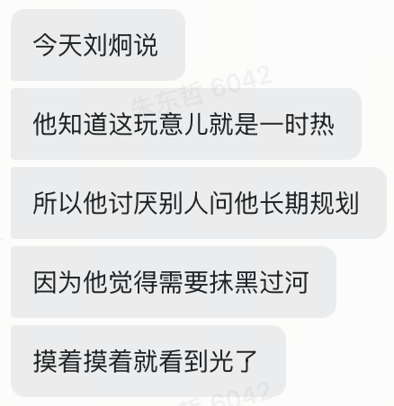

# 互联网上的刘炯是一个什么样的人？
### 简历
1. 他是当年做淘宝彩票后来被封掉的倒霉蛋
1. 他是加入锤子科技的理想主义者
1. 他是贝壳找房里的房产中介型产品经理
<grid cols="2">
  <column width="50">
    

    领英简历
  </column>
  <column width="50">
    

    贝壳时期的证件照
  </column>
</grid>

### 即刻 - 可以直接跳到下面产品分析
我把这个人的即刻翻了一遍，我感觉这个老哥，大概率是一个** TP **（这也是我们团队最多的性格分布）**老二次元人**，发散的思考，自由的表达。

我摘录一些表达，大家可以感受一下
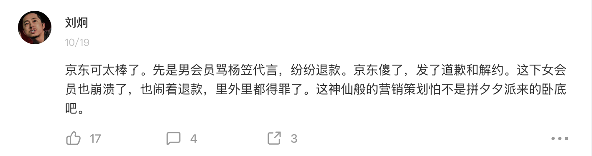

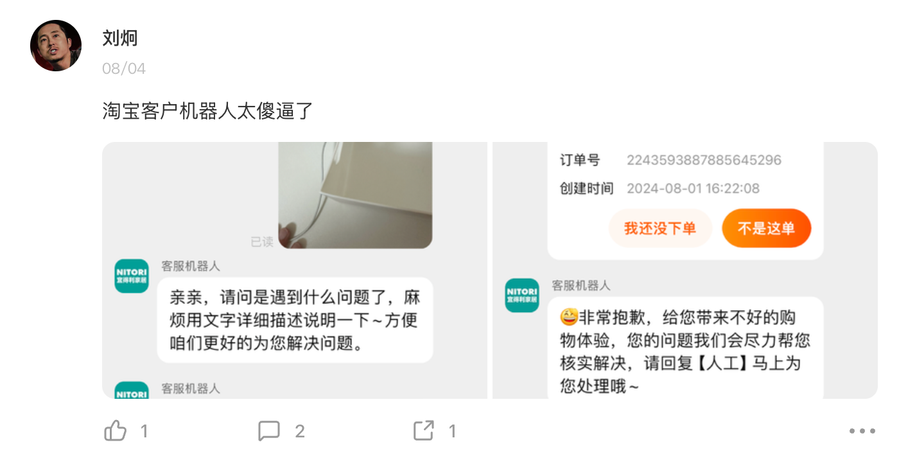

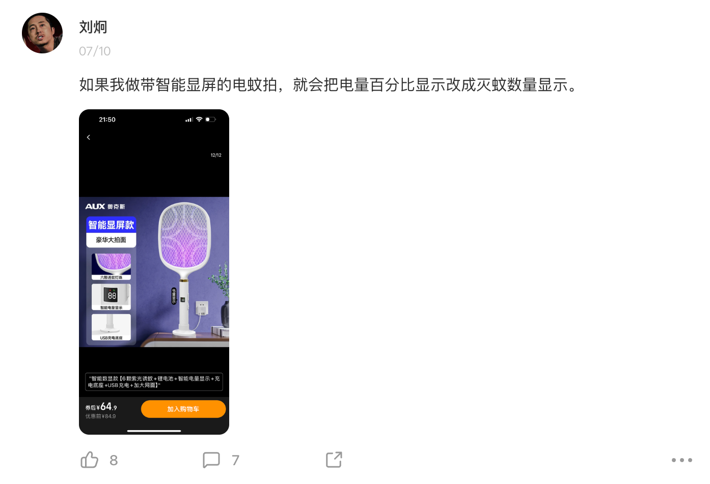

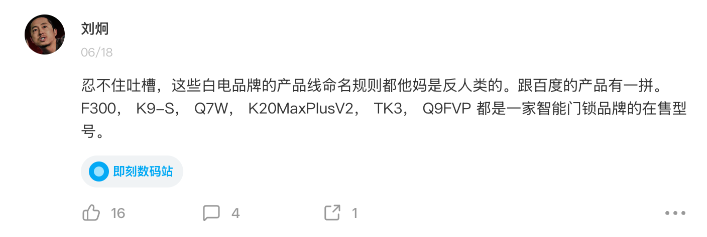

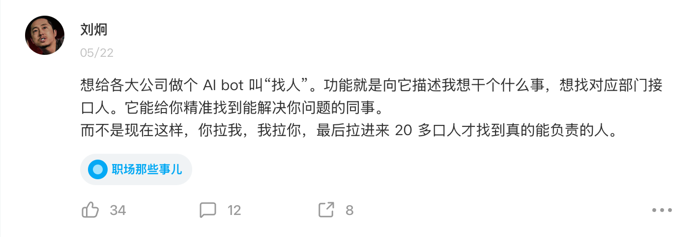

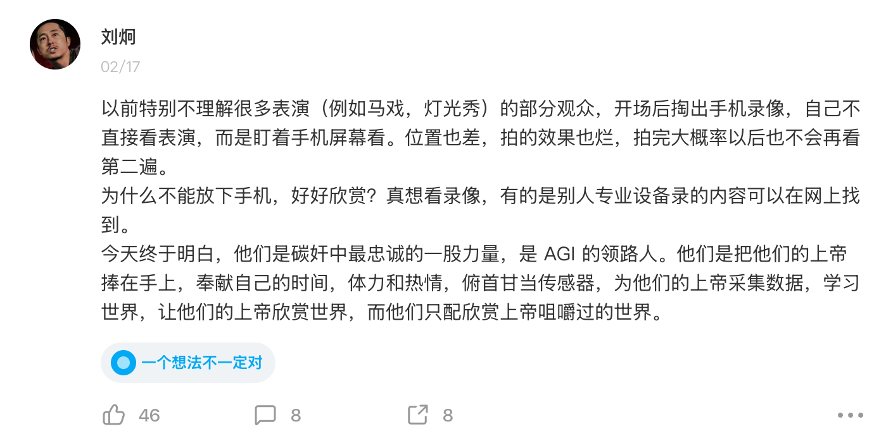

这是我一个偏好吧，我很喜欢去看每一个产品人的即刻，或者他的文档（在腾讯的时候），为啥他这么做这个产品、这个功能、这个细节，一切都是事出有因的。
希望大家在下面看产品的时候，可以代入一下刘炯的视角，感受一下他在产品设计上的想法和喜好的倾向。
# 定性的产品分析
*我默认大家都玩过、熟悉这个产品哈，不熟悉的话自己微信小程序玩一玩，就那么两三个页面，搞两下就有感觉了。*
## 一句话总结产品价值
<text bgcolor="red">**用 AI 荒诞的创造力给生活以真实的情绪价值。**</text>

当我通过即刻找到作者自己的表达的时候，我有一种很复杂的情绪。
当年小龙在产品公开课里说"漂流瓶是想让两个孤独的人在互联网上自然地相遇"、"我们想给用户提供的是情感价值"、"两个相聚千里的人，因为同时在做一个动作，彼此在微信里相遇了"。
产品在最开始被设计的时候，有很多细腻的、值得体会的地方，产品经理并不是一开始就瞄着 MAU 和数据看板做功能的，用户可以用的很开心、可以误解功能最开始的出发点，但是我们做产品的还是不忘初心吧，我们始终是需要一些细腻的人文的体验和体会来服务我们的用户的。
## 用户和我的体验是怎么样的？ - 感性的
### 用户有啥反馈？
- 屌，每一个人都能够从这个功能里体会到 **高质量、牛逼、屌、我写不出来**，我不列举了，大家自己应该能体会到
- 抽象，用户会用这个功能上传一些骚图、梗图、色图，再进行二次传播，这种传播既是图本身的趣味性，也是文案给他了二次传播的动力
<grid cols="2">
  <column width="50">
    

  </column>
  <column width="50">
    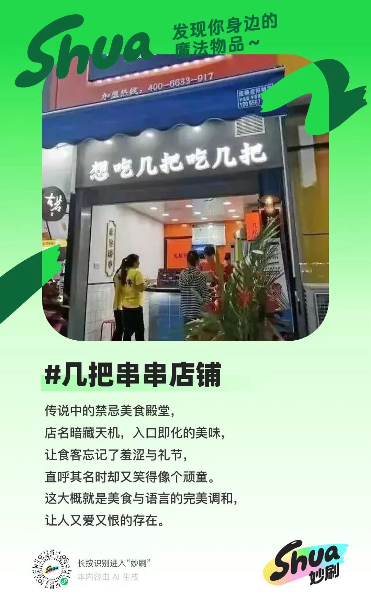

  </column>
</grid>

- 有趣，日常的无聊图片、加上中二、魂系的二次元文案，一种反差，我好像被 AI 理解了，但是他好像给我的生活带来了一些新的颜色。
<grid cols="2">
  <column width="50">
    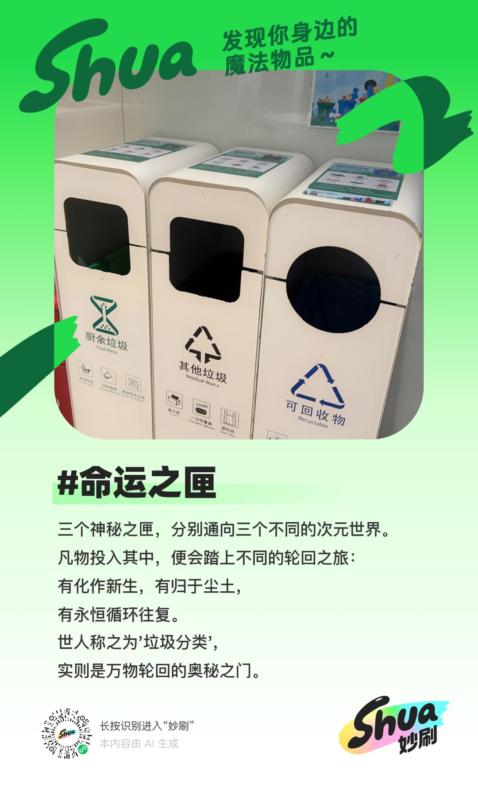

  </column>
  <column width="50">
    

  </column>
</grid>

就像是小时候在玩过家家，我拿着家里的烟灰缸，"这就是我们两个的家，我们要把它翻过来住在里面"，隔壁的小女孩"这是我们的冰屋，我们两个爱斯基摩人来钓鱼吧！"
长大了没有人会陪你过家家了，只有 AI会。

AI 用荒诞的方式在照顾你的情绪价值。
"我的人生已经浪费了，我前面的人生都是没有任何意义的。" - 付航
"不不不，你的人生非常有趣，至少在我看来" - 妙刷

<text bgcolor="orange">**你就说荒诞不荒诞！有没有情绪价值！**</text>

这个玩法是不是完美地实现了 刘炯自己的一句话总结？
### 我的一些其他感受 -- 看两个 case
**荒诞的背后，我感受到的是一种面向个体的解构带来的传播**，这种感受比较复杂，让我们一起看看这个 case；
我是同济的本，然后在疫情的时候，食堂出现了"乳头肉"，在一次全校的会议上，一个同学就投屏播放了右侧的 PPT，并且做成了非常多的红蓝梗图，在网络上进行传播
"妙刷"给我的结果是如何的：
- 第一个结果，客观信息的另类表达就不展开了，关键是在"世人只见其形，却不解其中玄机""心怀赤诚，方能参透其中真意"，这两句很完美的表达了整个事件。
  - 人们看到这个形状，不知道是什么意思，但是如果他了解当年的事件（心怀赤诚的第一种解释），就能够知道真正的含义，第二种解释是 心怀赤诚的人，代表比较左的人，关注疫情和学生的人，就算不是同济的可能也会知道事情的全貌
- 第二个结果，"越想摆脱越是沉沦"（像不像防疫后期的 CN），"临终前的自嘲，困扰众生的诅咒" 像不像一个学生用尽全力的呐喊，最终成了可以记在互联网史书上对同济官僚主义的诅咒
<grid cols="2">
  <column width="50">
    

  </column>
  <column width="50">
    

  </column>
</grid>

家人们可能觉得我有一些过度解读，但是我就是会有这样的感受，一种AI 好像懂这张图背后的故事、情绪和我的感受。（有点像巴纳姆效应，但是我感觉可能是训练数据的原因确实包含了非常多互联网的内容）
我生成出来了这两个结果之后，立马发到了同学群里，造成了二次传播和试用；

**给我的启发是一个好的AI玩法是： 好奇心、超预期的质量、易于传播、****输入的普适性****？；**
- 好奇心，在看到其他用户的 case 之后，我就想试试，有意义
- 超预期，质量真屌，我再试试其他的看看
- 易于传播，这个好玩，我发个 pyq，发个群，发到社区
- 输入简单，上传图片，easy！
## 一些产品上的亮点和小巧思
### 玩法页面 - 主页面
主页面做的非常有意思和风格，这里至少有几个优点：
1. 整体观感上是轻松、先进、好看、吸引人的，
  1. 设计上感觉像**芭比娃娃的盒子，**非常的玩具包装和花哨；
  1. 文案上"物品搜集启动！"好玩不？ 就像"开始游戏"一样的
  1. Shua！Shua！ 中二不？太二次元了
1. 展示了明确的预期，大图和小图两个既展示了成品结果，又给了一些空间给用户探索，这里我觉得是非常重要的，**因为 AI 结果具有随机性，所以理论上应该在结果分布上多给用户展示**，来让用户更好的了解；
1. 败笔是这个页面居然可以播放声音， 我的耳机会自动连上手机，我理解这里是一个自动轮播，但是为啥放声音
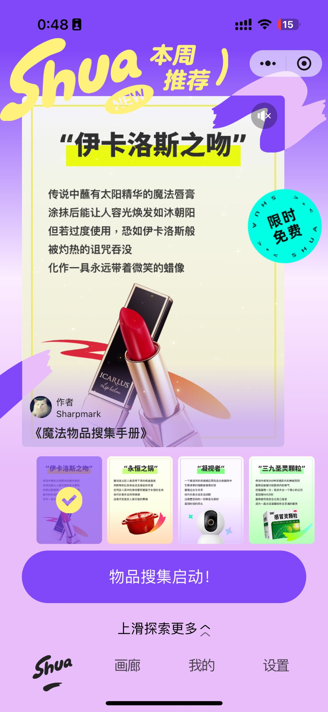

### 画廊页面
- 外头的双列瀑布流就不聊了，就那样吧，谁来做可能都差不多。
- 里头的展示页面，有几个启发：
  - 玩具要传播，就在结果上弄的很有标识，花里胡哨的，一眼就知道是从你这来的
  - 每个玩具/玩法，都是独立小产品，都得弄不一样的分享页面 or 包装
- 这里大家可以想一想，如果这个页面是一个prompt广场，你会感到多么的尬，prompt 广场真不能是玩具性质，就是效率工具。
- 买玩具 = 我付钱，我就发挥自己的想象力开始可以玩，不需要研究。
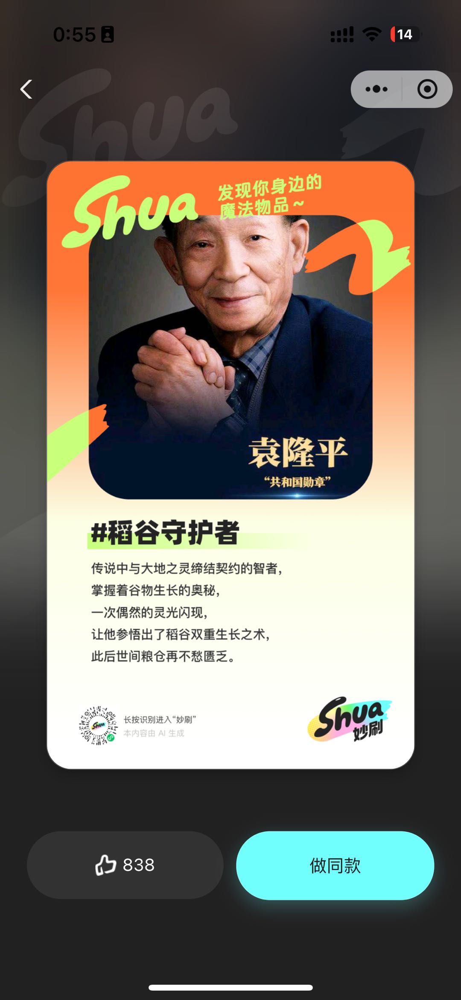

### 我的页面
结构比较简单，双列方格看起来比较精致，也和广场有一些区分，其它没啥感觉
# 顺手画一下技术实现猜想
我思考了很久，我觉得一个 2C 功能会兼顾效果和成本，所以我认为他的输出一定是基于一个结构化的中间产物做改写的，不可能是 VLM 一波流；
可能的中间产物包括：
- 详细的画面描述 （Prompt：请你尽可能详细的描述画面）
- OCR 理论上用一个 VLM 就可以同时做了，但是为了准确性，也可能单独做
- 是否需要调用搜索，大概率不用，但是需要训练数据里有很多梗的内容
<whiteboard token="OdEawnexKheeOUbUuIBchDnGnVd"/>

微调LLM的过程
- 猜想一：构造宫崎英高风格的 QA 对，可能几百条，然后直接就完事儿
- 猜想二：其实也可以直接用 4o 微调，构造画面和结果的对照，也可以直接做完事儿
（感兴趣的话我们可以动手验证一下，我个人觉得第一个会更实际一些，在 LLM 输出的时候，LLM 的空间会更大一些，因为 LLM 只需要微调文案的风格和格式，不强求和画面产生联系，文生文这个任务理论上也比直接图生文简单，图生 caption 的这个任务也已经比较成熟了，成本上其实也差不多）
### 其他的碎碎念：
不要妄自菲薄，我们目前就是锤子，小朋友看到玩具店里的玩具会吵着要买，但是没人会可以逛五金店，工具就是有工具的命运。
我发现我自己做完视频之后，我也会想要把 AI 配旁白的锚点删掉，有一种打工人想要在人前保持体面的感受，"我自己剪的我牛逼吧！""虽然质量一般，但是是我剪的哟"，带上 AI 反而有点难受；去水印付费一定是个好的商业化来源

###
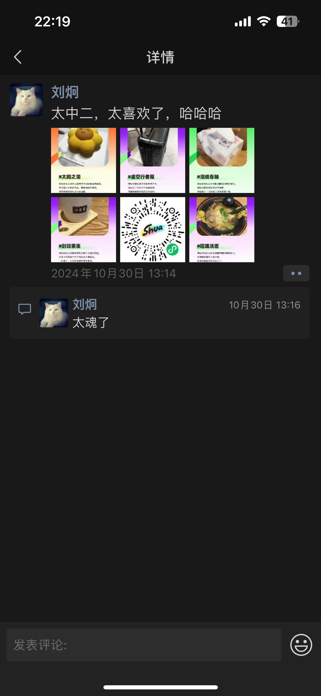

