# Opusclip - clipanyting 分析

<callout emoji="gift" background-color="light-orange" border-color="light-orange">
Key Takeaway：
1. ClipAnything 利用了 GPT4o，对之前的场景进行了补充，能够完成**任意带口播的成品长视频剪短**
1. ClipAnything 带来了新的 Prompt 跟随能力、画面/音频理解能力和一定的编排能力
1. ClipAnything 未来可能分阶段面向
  1. 不带口播的成品长视频转短
  1. 多个长视频转短
1. ClipAnything 使用了多种识别能力结合 GPT4o 构造了一个**模块化链路**来实现所有功能
1. 有趣的思路是：
  - ClipAnything 对场景信息挖掘并充分利用先验信息
  - 通过给片段打 Hashtag 的方式来完成编排和"模板"
  - 通过有趣的产品交互，获取数据，训练 Reward Model
</callout>

# 从 BasicClip 到 ClipAnyting
## 产品形态
产品形态上的**差别不大**，整体链路没有改变，主要区别主要有：
- 用户输入，从只能输入关键字，到能够输入完整的 Prompt
- 类别选择，把输入视频的类别选择突出，优先级变高
<grid cols="2">
  <column width="50">
    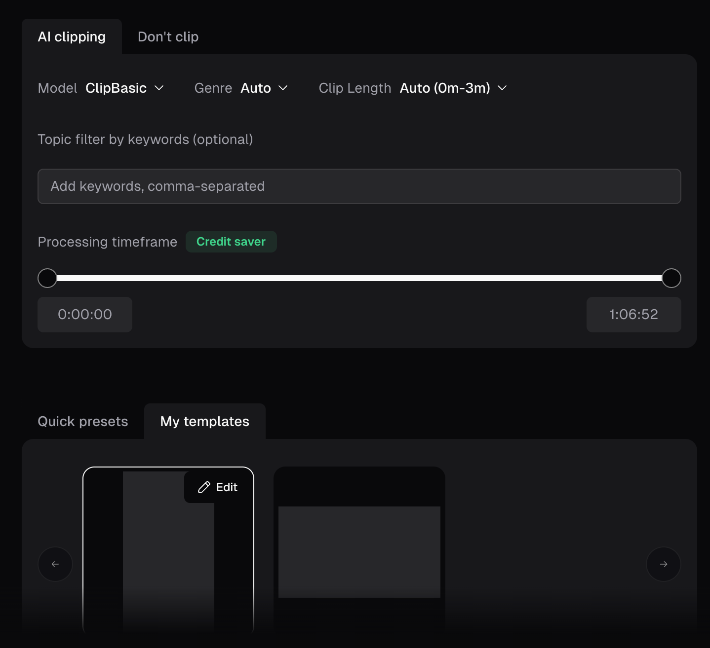

  </column>
  <column width="50">
    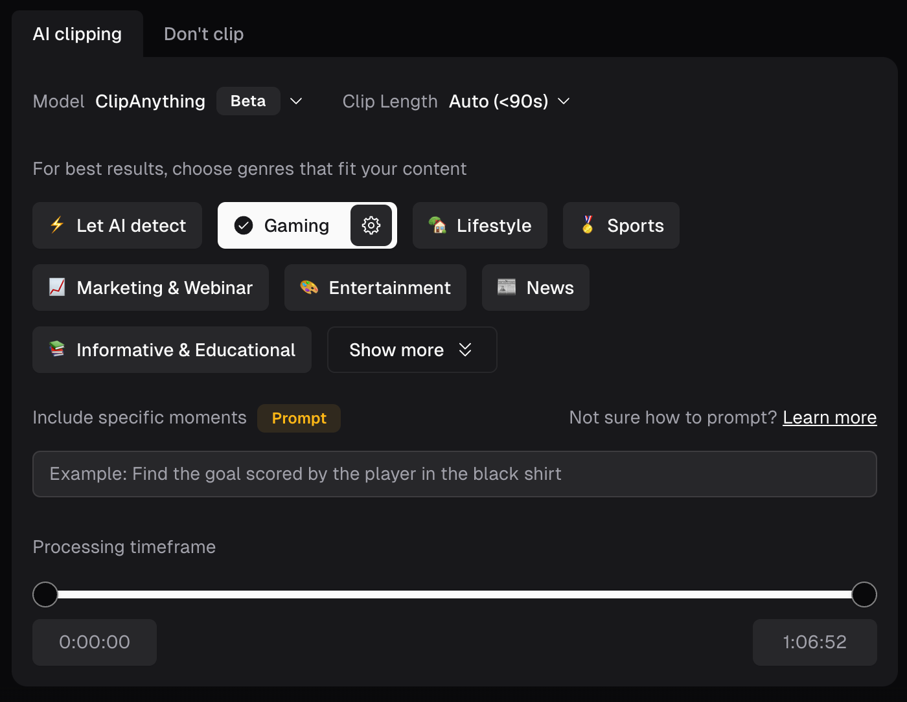

  </column>
</grid>

## 能力进化
<!-- Unsupported block type: 999 -->
官方文档详细的列举了很多，异同点总结如下：
- 更**强大的多模态理解能力**，并基于这个能力演化出**更自由的 Prompt 支持**
- 使用了多模态大模型，支持了除了画面描述外更深层的情绪分析以及跨场景的逻辑推理
- 结合跨场景能力，能够套用叙事模板以及结构

<lark-table rows="8" cols="3" column-widths="122,356,533">

  <lark-tr>
    <lark-td>
      （黄底能力会在 showcase 中展开）
    </lark-td>
    <lark-td>
      ClipAnything
    </lark-td>
    <lark-td>
      ClipBasic
    </lark-td>
  </lark-tr>
  <lark-tr>
    <lark-td>
      支持的视频类别
    </lark-td>
    <lark-td>
      支持所有视频
    </lark-td>
    <lark-td>
      仅支持口播视频
    </lark-td>
  </lark-tr>
  <lark-tr>
    <lark-td>
      <text bgcolor="light-yellow">Prompt</text>
      [Prompt 手册](https%3A%2F%2Fhelp.opus.pro%2Fdocs%2Farticle%2Fclip-anything-prompt-manual)
    </lark-td>
    <lark-td>
      用户能够**使用 Prompt 查找任何场景**、动作、人物、事件、情感时刻、病毒式主题等等
    </lark-td>
    <lark-td>
      用户只能使用视频提到的关键点来写 Prompt（实际上是）
    </lark-td>
  </lark-tr>
  <lark-tr>
    <lark-td>
      <text bgcolor="light-yellow">视觉理解</text>
    </lark-td>
    <lark-td>
      能够理解视频中的所有内容
    </lark-td>
    <lark-td>
      只能**识别说话人的位置**
    </lark-td>
  </lark-tr>
  <lark-tr>
    <lark-td>
      <text bgcolor="light-yellow">音频理解</text>
    </lark-td>
    <lark-td>
      能够理解**视频中的所有声音**，包括人说话声、笑声欢呼、环境声（鸟叫、玻璃破碎、汽车喇叭）以及音乐等
    </lark-td>
    <lark-td>
      只能**理解 ASR 内容**
    </lark-td>
  </lark-tr>
  <lark-tr>
    <lark-td>
      <text bgcolor="light-yellow">情感分析</text>
    </lark-td>
    <lark-td>
      有
    </lark-td>
    <lark-td>
      **无**
    </lark-td>
  </lark-tr>
  <lark-tr>
    <lark-td>
      <text bgcolor="light-yellow">叙述（片段剪辑模板）</text>
    </lark-td>
    <lark-td>
      根据视频类型能够将**最适合的故事线或结构化**表达应用到剪辑中，目前有以下几类：
      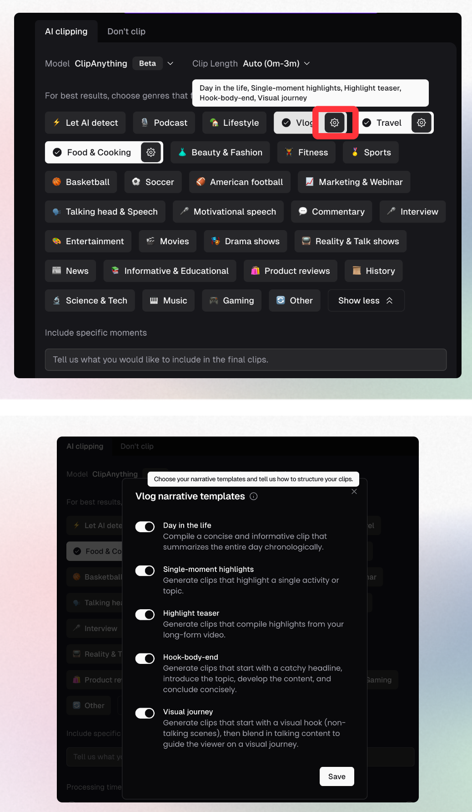
    </lark-td>
    <lark-td>
      **无**
    </lark-td>
  </lark-tr>
  <lark-tr>
    <lark-td>
      推理
    </lark-td>
    <lark-td>
      能够了解场景内容并进行跨场景分析
    </lark-td>
    <lark-td>
      **无**
    </lark-td>
  </lark-tr>
</lark-table>

## 场景变化
ClipAnything 没有改变自己原本基于"长改短"的使用场景，帮助两类用户从长视频中获取适合短视频平台的传播价值片段：
<quote-container>
- 节选长视频的精彩片段，简单编辑处理之后发布高光片段，例如影视、综艺、博客搬运类二创视频，或者是营销卖点视频的批量制作
- 把长视频内容主题顺序分段，每段做简单二创后，发布多个短视频分段合计，将本身的长视频内容简单处理后发布在短视频平台上
- 功能没有变化！ 但是ClipAnything 帮助用户拓展了更多的场景，具体如下：
</quote-container>

<grid cols="2">
  <column width="50">
    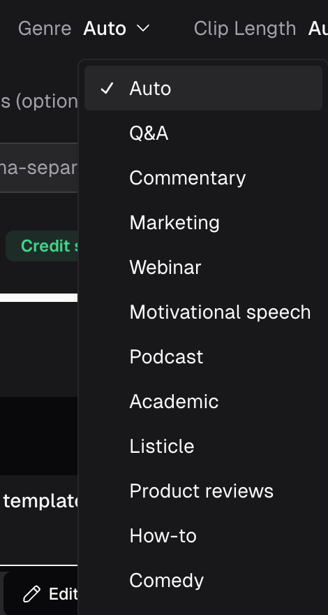

    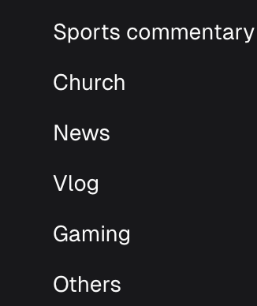

    Basic Clip
  </column>
  <column width="50">
    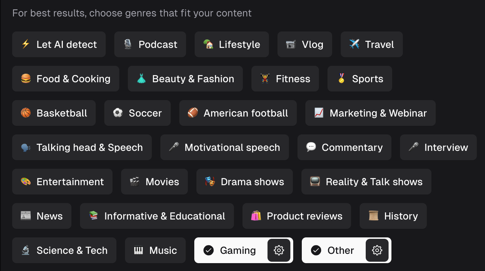

    Clip Anything
  </column>
</grid>

### 新增类别（Clipanything 最新版本中有，但 Opusclip Basic 版本没有）：
主要新增**运动、娱乐、科技、时尚**四个大类，我最直观的感觉，<text underline="true">*是他们基于能力分类测了下垂类，然后把重点垂类+效果好的垂类放在了类别选择中。*</text>
1. Let AI detect
1. **Lifestyle**
1. **Travel**
1. **Food & Cooking**
1. **Beauty & Fashion**
1. **Fitness**
1. **Basketball**
1. **Soccer**
1. **American football**
1. **Talking head & Speech**
1. **Interview**
1. **Entertainment**
1. **Movies**
1. **Drama shows**
1. **Reality & Talk shows**
1. **Science & Tech**
1. **Music**
### 变动或合并类别：
1. **Marketing & Webinar**（新版本中合并了 Opusclip 的 Marketing 和 Webinar）
### 相同类别（两个版本都支持）：
1. Podcast
1. Vlog
1. Motivational speech
1. Commentary
1. Sports
1. News
1. Informative & Educational
1. Product reviews
1. Gaming
1. Other
## ShowCases
<quote-container>
 我的账号密码： 17601286042@163.com Zdz990216 <text bgcolor="red">**Showcase 必须登录账号才能查看**</text>
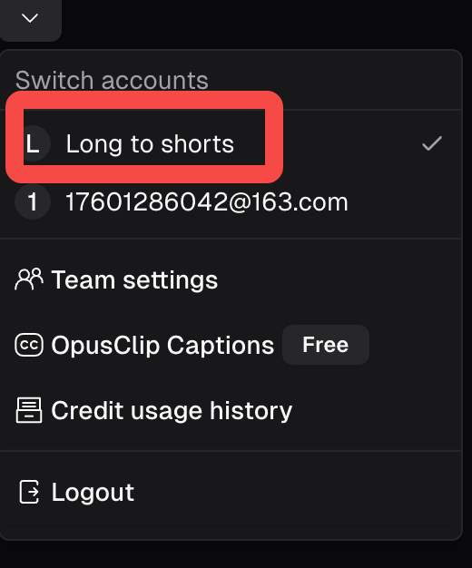

</quote-container>

<quote-container>
感谢多轨道的 hommie
</quote-container>

直观上，BasicClip 只能对 ASR 生效，而 ClipAnyting 对多模态信息生效从而产生了更多场景的知识；让我们基于场景分类和 ClipAnything 新增能力出发，看看 case 并且看看他们能力有哪些亮点。（只做**定性判断**）
### 分能力看

<lark-table rows="6" cols="3" column-widths="135,489,231">

  <lark-tr>
    <lark-td>
      **测试目的**
    </lark-td>
    <lark-td>
      **结果 & 链接**
    </lark-td>
    <lark-td>
      **备注**
    </lark-td>
  </lark-tr>
  <lark-tr>
    <lark-td>
      **测试情绪能力**
    </lark-td>
    <lark-td>
      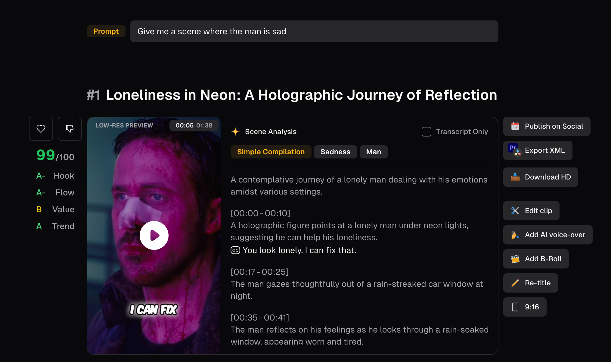
      <text underline="true">https://clip.opus.pro/clip/Q1082309FgCn</text>
      <text underline="true">*原视频是 4 分钟的电影预告片，Prompt：给我男人伤心的片段*</text>
    </lark-td>
    <lark-td>
      OpusClip 能够识别男人 Sadness 的情绪画面，并且把前后的画面拼在一起做了一个简单的编排（**Simple Compilation**）
      1. 能够识别情绪
      1. 识别片段并组织，它不仅仅是给你符合 Prompt 的片段，还会简单组织一下（这是一个产品上的点）
    </lark-td>
  </lark-tr>
  <lark-tr>
    <lark-td>
      **测试视觉理解能力**
    </lark-td>
    <lark-td>
      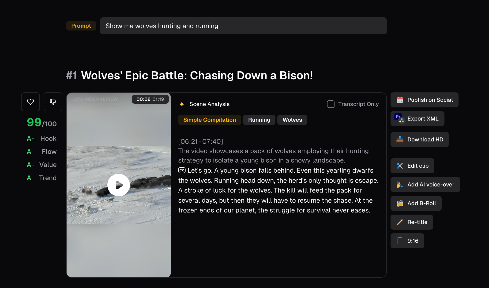
      <text underline="true">https://clip.opus.pro/clip/Q108230825m4</text>
      <text underline="true">*原视频是 32 分钟的野生动物纪录片，Prompt：给我狼在打猎和奔跑*</text>
    </lark-td>
    <lark-td>
      - **具有视觉理解能力：**精准找到了对应的片段
    </lark-td>
  </lark-tr>
  <lark-tr>
    <lark-td>
      **测试音频理解能力**
    </lark-td>
    <lark-td>
      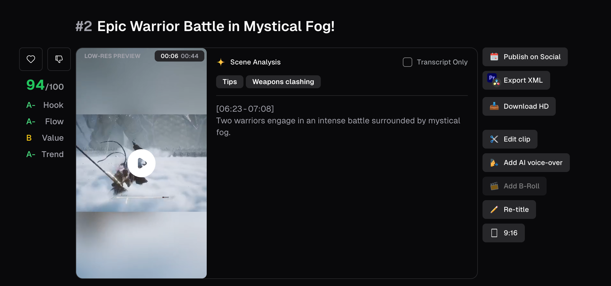
      <text underline="true">*https://clip.opus.pro/clip/Q1091214hvHY*</text>
      <text underline="true">*原视频是黑神话悟空前 14 分钟的演出，Prompt：Find the sound of weapons clashing*</text>
    </lark-td>
    <lark-td>
      - 找到了兵器交接碰撞的片段。
    </lark-td>
  </lark-tr>
  <lark-tr>
    <lark-td>
      **测试推理能力**
    </lark-td>
    <lark-td>
      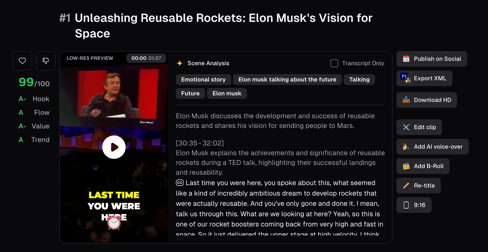
      <text underline="true">*https://clip.opus.pro/clip/Q1082809qIkK*</text>
      <text underline="true">*原视频是40 分钟马斯克的访谈节目，Prompt：找到马斯克在讨论未来的片段*</text>
    </lark-td>
    <lark-td>
      - 具有一定的推理能力，但是"推理能力"这个概念非常 tricky，理论上对画面有充分的认识和理解，就能够利用 LLM 进行推理
    </lark-td>
  </lark-tr>
  <lark-tr>
    <lark-td>
      **场景识别**
    </lark-td>
    <lark-td>
      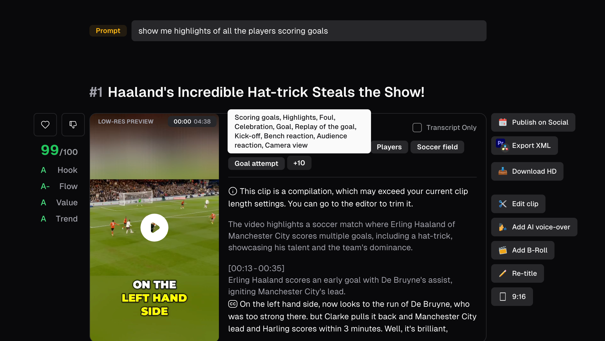
      https://clip.opus.pro/clip/Q1082106sEjS
    </lark-td>
    <lark-td>
      - 看 Case 的时候发现他们会对场景打很丰富的 tag
    </lark-td>
  </lark-tr>
</lark-table>

### 分场景看

<lark-table rows="5" cols="3" column-widths="135,489,196">

  <lark-tr>
    <lark-td>
      测试场景
    </lark-td>
    <lark-td>
      结果
    </lark-td>
    <lark-td>
      备注
    </lark-td>
  </lark-tr>
  <lark-tr>
    <lark-td>
      LifeStyle
      **生活类**
    </lark-td>
    <lark-td>
      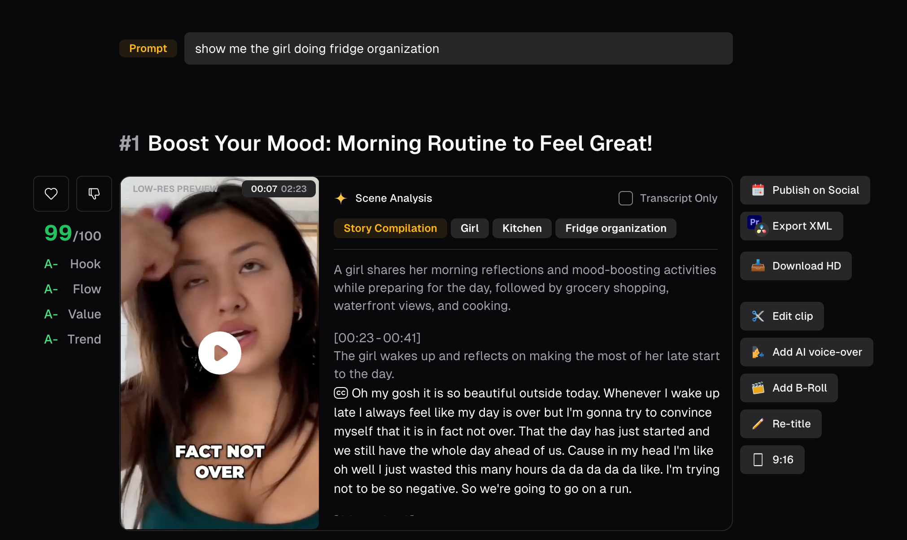
      <text underline="true">*https://clip.opus.pro/clip/Q1090903Rj8D*</text>
      <text underline="true">*原视频是 16 分钟的 Vlog，Prompt：show me the girl doing fridge organization*</text>
    </lark-td>
    <lark-td>
      **做的很好，很符合我的预期！**
      - 整个视频是 16 分钟的 VLog，一个欧美人的一天
      - Prompt 响应不错，**实际上利用 Prompt 对素材进行了取舍**
      - 取舍之后的视频仍然保持了非常不错的逻辑性
    </lark-td>
  </lark-tr>
  <lark-tr>
    <lark-td>
      Basketball
      **体育类**
    </lark-td>
    <lark-td>
      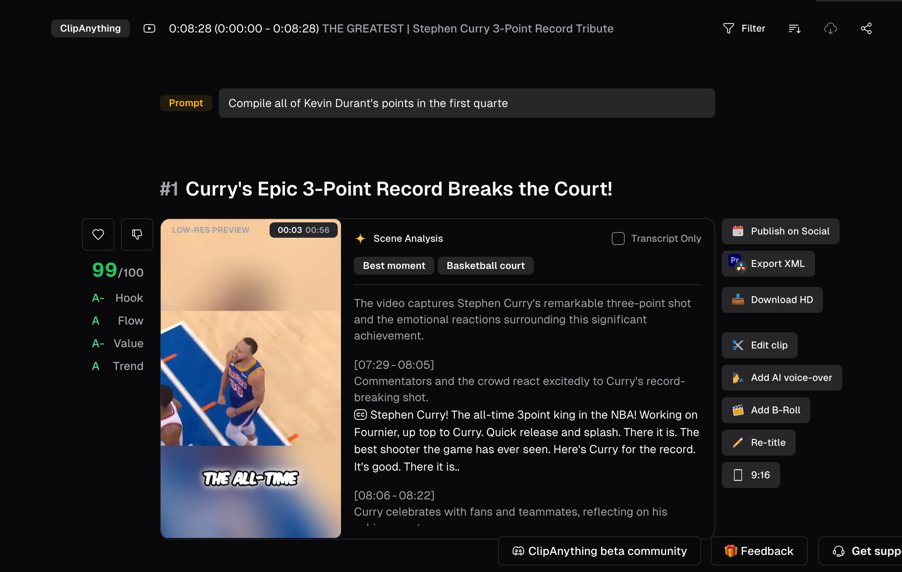
      <text underline="true">*https://clip.opus.pro/clip/Q108210903Oo*</text>
      <text underline="true">*原视频是 8 分钟的库里集锦，Prompt 是：Compile all of Kevin Durant's points in the first quarte*</text>
    </lark-td>
    <lark-td>
      - 非常不错
      - 画面首先就理解了什么是三分球，这个标题很不错
      - 整个视频非常的完整，连贯，长改短是好处效果啊，成片剪成片
      - 不理解 Prompt 里的第一节是什么概念
    </lark-td>
  </lark-tr>
  <lark-tr>
    <lark-td>
      Basketball
      **体育类**
    </lark-td>
    <lark-td>
      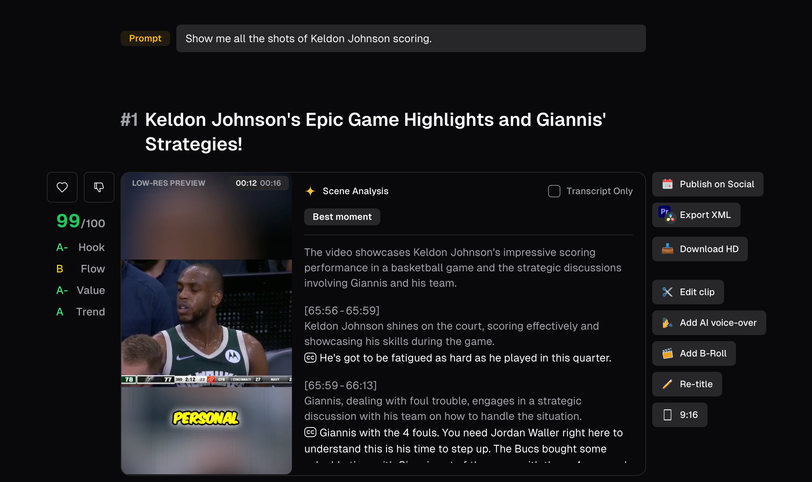
      <text underline="true">*https://clip.opus.pro/clip/Q1082702e7Ea*</text>
      <text underline="true">*原视频长 1h38min，Prompt：Show me all the shots of Keldon Johnson scoring.*</text>
    </lark-td>
    <lark-td>
      - Badcase
      - Prompt 明说需要组合所有的得分，但是没有实现
    </lark-td>
  </lark-tr>
  <lark-tr>
    <lark-td>
    </lark-td>
    <lark-td>
    </lark-td>
    <lark-td>
    </lark-td>
  </lark-tr>
</lark-table>

## 总结一下：
- BasicClip 和 ClipAnything 都在做同一件事情：<text underline="true">***从长视频中挖掘短视频价值***</text>
- 模型能力带来的是对场景的扩展
  - 前：只能做有限的口播场景，访谈、脱口秀、博客、解说等，做这个场景我能想到有几个原因
    - 这类长素材非常长，导致长转短的成本很高，用户非常痛
    - 这类长素材价值大，其中指的挖掘的价值非常多，稍微挖出来一些就能够达到用户想要的传播诉求
    - 这类素材好做，利用 ASR 和传统的 NLP技术也能够实现相关的产品需求
  - 后：能够做所有的口播场景（是的，他们仍然只能做口播场景，上传无人声的视频会失败报错），他们做这个事情也是可以想象的
    - GPT4o 能够帮助他们在之前的场景上做的更好
    - 长转短场景上有非常多的用户诉求之前的能力无法满足他们，在已经给用户植入长转短心智之后，用户会很自然地表达"我这个视频为啥不能长转短？"
- 下一步场景的变化
  - 已经能够看到的初步未来：支持不含口播的视频的长剪短，这一点非常自然，目前 Opus 产品功能上已经会给出片段的 caption 了，只要能够支持 整段视频ASR为空，就能够<text underline="true">***支持所有成品视频的长剪短***</text>
  - 再进一步，也是非常自然，成品素材做完了，下一步就是对**用户手里的素材做成片**，目前产品功能只支持上传一个素材，只要他们支持上传多个素材给出片段并组合成片，<text underline="true">***就完成了从编排出发的成片链路***</text>
  - 想完了自然的链条，再想想不那么自然的可能的几个未来，他们的前提思考是"成品长视频有价值""短视频有需求""长视频缩短有成本"，我们进一步想想
    - 还有哪些视频有价值：
      - 视频已经自然地做完了，还有哪里有素材呢？
      - 无画面博客
      - 文案或者小说
    - 还有哪个场景有需求：
      - 博客和小说这种没有画面的高价值内容有配画面的诉求
    - 基于上面几步，哪里还有成本痛点？ - 哪里都痛
    - 所以 他们也可能利用手里的 B-roll 匹配能力，去做不含画面的素材成片，进一步拓展自己的商业化范围。
# ClipAnything 可能的技术实现是怎么样的？
## 原子能力
我们可以假定 OpusClip 拥有下列原子能力，然后来想像他们是怎么完成上述产品功能的
- GPT-4o
- 基础的图像识别能力
- ASR 能力
个人猜测 OpusClip 的实现方式：
<whiteboard token="Qqa6wpX2dh4yfSbLAowc6lJwnTf"/>

这里有几个问题：
- 为什么我认为他们不是用 clip 做的片段选择：
  - Clip 基本没有响应 Prompt 的能力，Clip 基本没有语义，或者基本没有问答的语义，OpusClip 的基础版本可能用的 Clip，因为他们是让用户输入关键词进行片段召回，但是现在的版本是可以用长段的文案进行的
  - Clip 无法推理和组织能力
- 我觉得他们哪里做的很有意思
  - 首先ClipAnything 对场景信息的挖掘让我很亮眼，他能够知道库里投的球是三分球，我认为他是携带着（画面，画面识别信息，全局ASR +画面对应 ASR）喂给 GPT，然后让 GPT 生成更符合视频的 Caption，等于是他有一个利用先验知识的过程。（V2T 就没办法利用先验信息）
  - 给片段打 Hashtag 的细节很不错，为啥有 Hashtag，是为了响应用户对视频拼接组织的要求，目前来看他们是做了很多文案结构的模板，再根据 hashtag 把片段填回去，来组织片段。这个很符合他们的产品想法，成品长视频一定是结构化的，每一个片段一定可以通过一个抽象来表征在视频结构上的这一维度。一个在能力受限的情况下做的 trick
  - 给结果进行打分，在他们的结果页，会根据四个维度来对生成的短视频片段进行打分，这里不仅仅是对用户采纳率的提升，同时也更好的帮助他们对生成结果进行数据回收，逻辑是，他们没有训底模的能力，但是我相信他们可以利用这些数据训一个** reward model**，也是取舍的一种结果。
## 未来他们可能会怎么做？
- 他们会训模型吗？
  - 从数据上看，他们有能力训，他们能够获取**（长视频，Prompt，短视频）**的三元组，并且有用户的采纳信息，用户帮他们完成了 RLHF 的步骤，如上所说他们可能已经有了** reward model**
  - 如果我是他们 CEO，并且手里有钱，那么训练很有可能已经开始了
- 如果不训练模型还有什么低成本的提升现有效果方案吗？
  - GPT 4o 微调，或者等 Starberry/GPT5，务实的来说，可能短期等 OpenAI 换个模型就能够得到更好的结果
  - 对画面进行更多的识别任务，除了主体、动作、情绪、ASR 之外，他们还可以识别背景、光照等等不那么重要的边缘信息，这个任务的问题是 ROI 不高，并且可能导致 GPT4o 输入的 token 不够，但是等一个更强的 openai 模型可能会让这些边缘信息发挥作用
- 面向未来的说，OpusClip 可能做哪些动作？
  - 降低对 ASR 的依赖，这是为了对无声成品视频进行处理，从能力上来说可能有几个措施
    - 全局 ASR 变成，让 GPT 构想一个故事，带着视频摘要去对每个片段进行 caption，这样也会让片段 caption
    - 利用更多的先验信息，比如标题或者作者信息，或者在成片之后找用户寻求帮助，让用户补充关键信息
  - 为了能够对用户素材进行处理，
    - 积累更多的文案模板以及视频编排模板，用户的长尾素材非常的多，OpusClip 目前每个类别只能选择几个类似模板的选项，总的来说也就不到一百种，太少了
    - 增加去重能力，是的现在 ClipAnything 并不能够进行去重，有了去重之后才能够对用户素材进行筛选
    - 基础的排序，ClipAnything 目前的排序能力实际上是通过 Hashtag 组织成片结构来完成的，他们可能会加上，也可能不加。
总结一下，产品经理要用于下判断，如果我是老板，为了活着&搞钱，我会这么做
- 拿着 ClipAnything 的结果和用户增长去融钱，融到了就开始训模型
- 时刻关注 OpenAI，如果他们发布了，那就更新一下自己的模型名称，比如 ClipAnything Pro，然后融钱训模型
- 降低 ASR 的依赖、补充模板、增加去重和排序，面向 C 端进行推广和增长，拿到增长数据之后，融钱训模型
- 融资失败了，增加更多的商业化功能，比如包装模板页面在做细节一些，让用户可以使用画中画或者贴纸，又或者能够更好地支持团队协作，赚钱
- <text underline="true">***如果没有端到端模型，目前的模块化链路怎么走呢？还能组织出更多的能力吗？大众用户手里的垃圾素材能够用现在链路改吧改吧做出有消费价值的视频吗？***</text>
  - 如果非中场景真的如调研/文章所说，创作者本来都有相当一部分是用 TikTok 录视频，也不剪辑的话，可能真能成
  - 如果非中场景大家又非常说话，很有 personality 和 expression 的能力和欲望，这两点合在一起，OpusClip 可能能够成为非中场景的创作利器。
  - 如果没有端到端的能力，他最终该怎么提升自己的成品效果呢？
    - 更多的模板，包装和组织结构
    - 其他的链路好像都没法动呀，怎么整呢？

---

# 以下不用看
从产品上看，opusclip 的 clipanything，依然是原有产品路线的能力扩充，从只能通过 asr 进行 clip， 进化到利用 GPT-4o使用画面进行信息挖掘之后在召回片段。
覆盖的人群是，长转短，二创，这次更新 是为了满足什么类型内容的创作，推测以后还可能会做什么样的能力，或者推测他们的产品思路（比如模型驱动也是一种思路）
具体case：（说明下满足哪些创作）

从模型实现上看，clipanything 主要是结合 gpt-4o 的多模态能力，把画面进行切片，然后能按用户的 prompt 召回相关的画面，以满足 xxx 的诉求，为什么要这么设计，用户是怎么使用的
猜测实现逻辑如下图：

随手写的：
OpusClip 如果想要做大，目标是成为一家降低用户创作成本的明星公司，有可能吗？ 很难，真的很难，用户对他的心智和预期已经定死了，长转短的快捷工具，他离创意创作还缺一万个模板（比如Gemma），他离严肃创作还差一整个多轨道。
长视频的价值来自一个完整的创意团队利用成熟的创作工具，短视频的价值又是分发和推荐利用的人的注意力机制，OpusClip 敏锐地在长转短的浪潮中蹭上了一点风。
他创业之初可能想着也只是通过自己对 TikTok以及非中内容生态的认知，做一个 SAAS 工具，利用美国更好的融资环境和付费意识赚一波钱，把公司一卖就财富自由了。

## ClipAnything 是怎么宣传的？
## 官方文档
<!-- Unsupported block type: 999 -->
官方宣传文档展示了一个 Slogan 和三个亮点
- Slogan：ClipAnything 是有史以来第一个多模式 AI 剪辑，可让您使用视觉、音频和情感线索剪辑任何视频中的任何时刻，包括几乎没有对话的视频。
- 亮点一：Analyze everything in a video，使用最先进的视频理解技术，通过视觉、音频和情感线索**分析每一帧**，**识别对象、场景、动作、声音、情感、文本**等。然后**根据每个场景的传播潜力对其进行评级**。

- 亮点二：Clip any video with customized prompts，能够使用 Prompt 来选择片段，下文会详细展开 Prompt 怎么写。
- 亮点三（Alpha）：智能转比例，Reframe Anything 都能识别关键对象和动作，跨帧跟踪它们，并将您的剪辑无缝地重新构建为 9:16, 1: 1，以及电影 16:9。
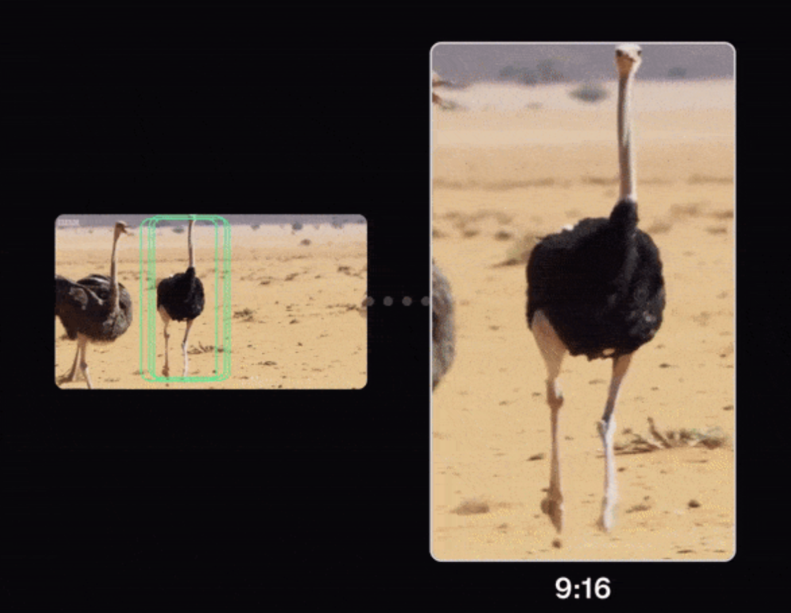

官方宣传中最大的亮点是，**能够通过多模态能力识别画面中的主体、动作、情绪、声音和场景，并通过用户的 Prompt 进行召回。**
##
##

**官方文档**
https://help.opus.pro/docs/article/how-to-use-clipanything
https://help.opus.pro/docs/article/clip-anything-prompt-manual
https://help.opus.pro/docs/article/clipanything-qa
