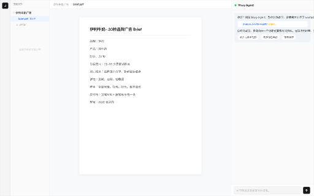
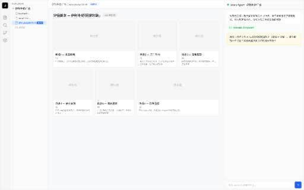
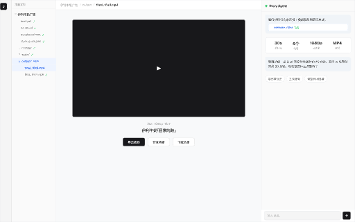

# Creative CoWork — 侧边栏设计方案

> 设计决策文档 | 2025-02-25
>
> 设计源文件：`/Users/dongzhe/Downloads/untitled.pen`

---

## 一、问题定位

### 当前设计的矛盾

V4 布局采用了 VS Code 风格的 file tree 侧边栏（180px 宽）。这个设计存在根本性问题：

1. **创作素材不是代码** — `scene_01.png` 这个文件名几乎没有信息量，创作者需要看到画面才知道内容
2. **认知负荷高** — 导演/创作者不习惯在纯文本列表里找素材
3. **上下文丢失** — 文件树只能告诉你"有什么文件"，无法呈现"项目进展"或"素材关联"
4. **空间浪费** — 180px 的常驻侧边栏在大多数操作中不需要，但一直占位


### 核心诉求

- 保持 **通用性** — 适用于任何创作项目，不绑定特定流程
- 提升 **信息密度** — 让文件类型自己说话（图片显示图片，音频显示波形）
- 减少 **空间占用** — 不需要时不占位

---

## 二、探索过程

### 排除的方案

我们探索了三个替代方向，均被否决：

| 方案 | 思路 | 否决原因 |
|------|------|----------|
| A. 自适应侧边栏 | 根据创作阶段切换侧边栏视图 | 太 SOP，不通用 |
| B. 素材架 Asset Shelf | 用类型筛选 + 视觉预览替代目录 | 太 SOP，不通用 |
| C. 最小化 + Agent 导航 | 去掉侧边栏，文件导航全靠对话 | 过于激进，增加对话成本 |

**关键教训**：不应该替换 file tree 的结构，应该增强它的表现力。

---

## 三、最终方案：Tab 切换 + 增强型 File Tree

### 核心设计

**用 Tab 切换替代常驻侧边栏。** 文件浏览和工作区共享同一空间，通过顶部 Tab 切换。

布局结构：

```
Rail (48px) + Main Content (1012px) + Agent Panel (380px) = 1440px
```

- **无常驻侧边栏** — 工作区比原来宽 22%（1012px vs 832px）
- **两个 Tab**：「文件」和「工作区」
- 切换成本极低，心智模型简单

### 「文件」Tab — 全宽浏览项目文件

切到「文件」Tab 时，整个 1012px 主区域变成文件浏览器：

- **左侧**：增强型文件树（280px）
- **右侧**：选中文件的预览面板（~700px）


文件树增强点：
- 图片文件旁显示 **内联缩略图**（40×26px）
- 音频文件显示 **波形条**（绿色=完成，橙色=生成中）
- 状态用 **彩色圆点** 统一表示（绿/橙/灰）
- 文件夹用 **lucide 图标**，不用 emoji

预览面板：
- 图片显示大图 + 元信息（尺寸、大小、生成时间）
- 音频可显示波形 + 播放控件
- 文档显示内容摘要

### 「工作区」Tab — 回到内容编辑

切到「工作区」Tab 时，显示正常的工作内容（分镜编辑器、脚本编辑器等）：

- 完整 1012px 宽度用于内容
- 顶部面包屑 + GENUI 标识
- 分镜使用非对称 Bento 布局（大卡+小卡交替）


### File Tree 增强对比


| 维度 | Before | After |
|------|--------|-------|
| 图片文件 | `□ scene_01.png ✓` | [缩略图] scene_01.png ●(绿) |
| 音频文件 | `· voiceover.mp3 ✓` | [波形条] voiceover.mp3 ●(绿) |
| 文档文件 | `· brief.pdf ✓` | (file icon) brief.pdf ●(绿) |
| 状态表示 | 文字（"✓"/"生成中"/"待生成"） | 彩色圆点（绿/橙/灰） |
| 信息密度 | 只有文件名 | 文件名 + 视觉预览 + 状态 |

### 增强型文件树完整布局


---

## 四、设计规范

基于 `design-taste-frontend` Skill 的审查，全局应用以下规范：

### 字体
- **主字体**：Geist（替代 Inter，Inter 已被 BANNED）
- **标题 letter-spacing**：-0.3px
- **副标题 letter-spacing**：-0.2px

### 颜色
- **Off-black**：#18181b（替代纯黑 #111111/#000000）
- **主强调色**：#2563eb（蓝色，仅此一个强调色）
- **功能色**：#22c55e（成功）、#f59e0b（进行中）、#e5e7eb（待处理）
- **描边**：#e5e7eb（统一暖灰）

### 布局
- **圆角**：6px（替代 8px）
- **场景网格**：非对称 Bento（388+186+186 / 186+186+388），禁止三等分
- **无 emoji**：全部替换为 lucide 图标或文本符号

---

## 五、关键优势

1. **零空间浪费** — 不需要文件树时，工作区获得全部空间
2. **全宽预览** — 文件浏览时有 700px 预览区，可以真正看到素材内容
3. **切换成本极低** — 一次点击切换，直觉操作
4. **完全通用** — 跟项目类型无关，任何创作项目都适用
5. **信息密度翻倍** — 缩略图 + 波形 + 状态圆点，文件类型自己说话

---

## 六、用户故事状态

6 个用户故事状态展示了完整的广告短片创作流程：

### S1 — 新项目·分析 Brief


### S2 — 脚本创作


### S3 — 分镜设计


### S4 — 视觉生成


### S5 — 音频制作


### S6 — 合成交付


---

## 七、完整设计源文件索引

| 帧名 | Node ID | 说明 |
|------|---------|------|
| V4 — 自适应协作布局 | `f6xsO` | 主布局（已更新设计规范） |
| S1 — 新项目·分析 Brief | `5HFNY` | 用户故事状态 1 |
| S2 — 脚本创作 | `unxMx` | 用户故事状态 2 |
| S3 — 分镜设计 | `bxgZK` | 用户故事状态 3 |
| S4 — 视觉生成 | `sk6Oa` | 用户故事状态 4 |
| S5 — 音频制作 | `bcMj4` | 用户故事状态 5 |
| S6 — 合成交付 | `lKdEy` | 用户故事状态 6 |
| FileTree 对比 | `ZKnkx` | Before vs After 对比 |
| Tab·文件浏览 | `taW8v` | Tab 方案 — 文件 Tab 激活 |
| Tab·工作区 | `BWMeD` | Tab 方案 — 工作区 Tab 激活 |
| 增强型 File Tree | `ELBVL` | 增强型文件树完整布局 |
