# Creative CoWork — 设计方案

> 设计决策文档 | 2025-02-25 ~ 2026-02-26
>
> 设计源文件：`/Users/dongzhe/Downloads/untitled.pen`

---

## 一、V6 — 绿色创意工作台（最终方案）

V6 是当前的最终设计方案，以 **绿色主题** 为核心视觉语言，实现了完整的创作工作台体验。

### 设计语言

- **主色调**：橄榄绿/森林绿 — 传达自然、创意、专业感
- **导航**：顶部 Tab 栏（脚本、分镜、输出、Faceswap、Agent、Upscale）
- **布局**：左侧内容区 + 右侧 Agent/Story Agent 面板
- **品牌标识**：左上角项目名称（如「伊利牛奶广告」）

### 脚本 + 分镜一体视图

V6 的核心创新：**脚本和分镜在同一视图中并排展示**。

左侧是完整的分场景脚本（Scene 1~4），每个场景包含：
- 场景标题和时长
- 详细的画面描述文案

右侧是对应场景的 **AI 生成分镜图**，每个场景 2 张参考图。

右侧面板是 **Story Agent**，可以针对具体场景提问和修改（如"帮我把 Scene 2 '工厂内部' 改一下..."）。

示例项目：伊利牛奶「回家的路」广告 — 4 个场景（牧场清晨、工厂内部、回家路上、夜市温暖）。

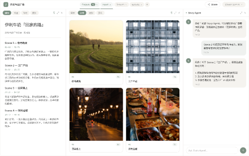

### 分镜网格视图

切换到「分镜」Tab 后，以网格形式展示所有分镜帧：

- 已生成的场景显示 AI 图片缩略图
- 未生成的场景显示占位符和「生成视觉」按钮
- 顶部显示进度统计（6 scenes, 4 已完成）
- 支持拖拽排序和批量操作


### 输出与交付

切换到「Outputs」Tab，展示最终合成的视频文件：

- 视频缩略图 + 播放按钮
- 文件信息（时长、分辨率、大小）
- 右侧 Agent 提供 Session 总结和后续操作建议
- 支持 Share 分享功能

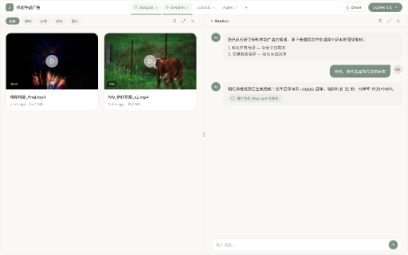

### Tab 布局与交互规则

V6 制定了详细的 Tab 层级与交互规范：

- **Tab 层级结构**：顶层 Tab 切换内容视图
- **布局与导航**：Outputs 默认激活 File Tab；切换内容区对应不同展示模式；双击 Outputs 打开详情
- **布局策略**：File Tab 分三区；Tab 之间平滑过渡，保持 Agent 面板上下文
- **布局间距**：Outputs = 内容区 + Session 面板；脚本 = 文稿 + 分镜图；Agent 面板固定宽度

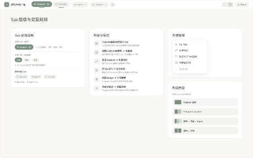

---

## 二、竞品分析

我们分析了 5 个主要竞品的设计语言，提炼出对 Creative CoWork 的设计启示。

### Runway — AI 视频生成·创意优先

- **风格**：电影级深色界面，极简导航，大留白
- **特点**：自定义字体 ABC Normal，渐变叠加+模糊效果
- **定位**：专业创意者的电影工具。深色系+大留白传达高端感，但学习门槛偏高

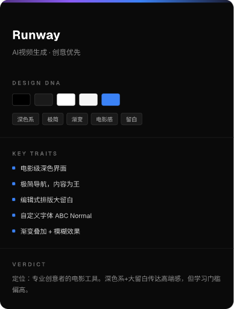

### Pika — AI 视频生成·趣味极简

- **风格**：暗色高对比度，非对称模块化构图
- **特点**：自定义字体 Telka + Space Mono，"Reality is optional" 品牌态度
- **定位**：年轻创作者的趣味 AI 工具。克制设计+创意文案建立独特品牌感，但功能深度偏浅

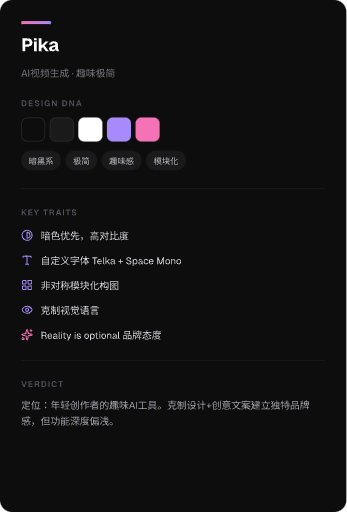

### Descript — AI 视频剪辑·文档化体验

- **风格**：深色酒红+中性色系统
- **特点**：自定义字体 Gamuth Display，文档隐喻的编辑体验，功能卡片+悬浮动效
- **定位**：内容创作者的专业编辑器。文档化思路让视频编辑像写文档般简单

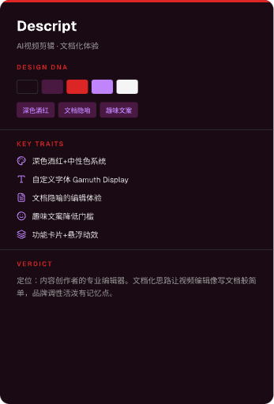

### CapCut / 剪映 — 视频剪辑·大众化 AI 创作

- **风格**：亮色系，白色底+青色强调色，干净明亮
- **特点**：Inter 字体，超大圆角 12-120px，移动端优先
- **定位**：大众创作者的全链剪辑工具。亲和力极强，低门槛引导流程，但专业深度和品牌辨识性偏弱

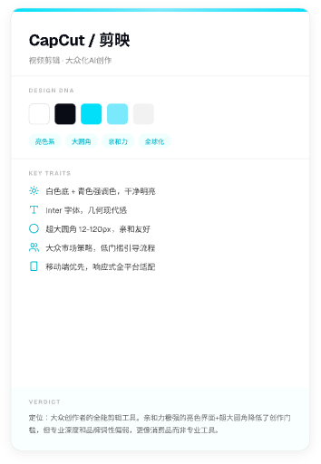

### HeyGen — AI 数字人视频·企业级

- **风格**：青+粉+绿三色渐变系统，科技活力
- **特点**：TT Norms Pro + ABC Solar 双字体，数字人 Avatar 为核心视觉锚点
- **定位**：企业视频自动化平台。多彩渐变+数字人视觉锤击产品辨识度极高，但界面偏向开发者/企业买家

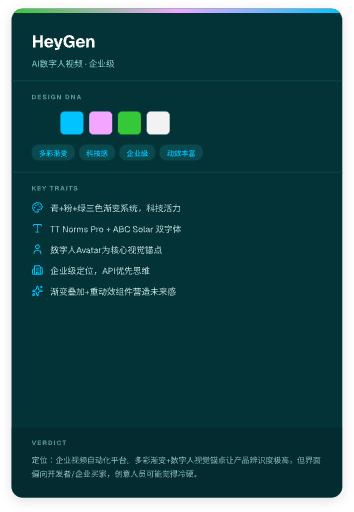

### 竞品总结与设计启示

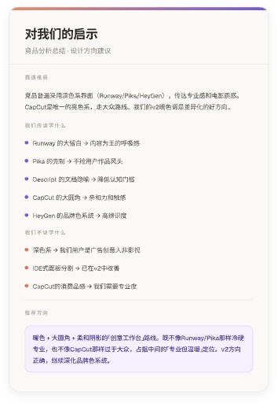

**我们应该学什么：**
- Runway 的大留白 → 内容为王的呼吸感
- Pika 的克制 → 干掉用户作品风头
- Descript 的文档隐喻 → 降低认知门槛
- CapCut 的大圆角 → 亲和力和触感
- HeyGen 的品牌色系统 → 高辨识度

**我们不该学什么：**
- 深色系 → 我们的用户是广告创意人非影视
- IDE 式面板分割 → 已在 V4 中反省
- CapCut 的消费品感 → 我们需要专业度

**推荐方向：** 暖色 + 大圆角 + 柔和圆形的「创意工作台」质感。既不像 Runway/Pika 那样冷硬专业，也不像 CapCut 那样过于大众。V6 的绿色主题正是这个方向的落地。

---

## 三、设计复审标注

基于设计审查，标注了当前设计中待优化的问题：

### 空状态页面问题

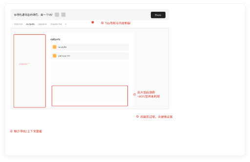

- Tab 导航与内容脱节
- 巨大空白浪费，缺少引导
- 内容区过于空旷，未使用空状态

### 详情页面问题

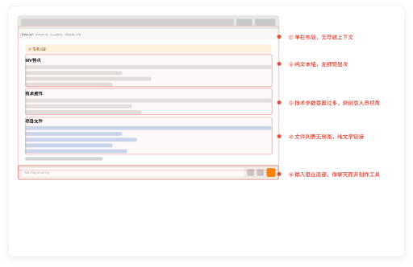

- 单栏布局，无层级上下文
- 纯文本域，无视觉层次
- 技术参数数量过多，非创意人员视角
- 文件列表无预览，纯文字体验
- 输入框在底部，像聊天而非创作工具

---

## 四、设计规范

### 字体
- **主字体**：Geist（替代 Inter，Inter 已被 BANNED）
- **标题 letter-spacing**：-0.3px
- **副标题 letter-spacing**：-0.2px

### 颜色
- **V6 主色调**：橄榄绿/森林绿（标题栏、按钮、强调元素）
- **Off-black**：#18181b（替代纯黑 #111111/#000000）
- **功能色**：#22c55e（成功）、#f59e0b（进行中）、#e5e7eb（待处理）
- **描边**：#e5e7eb（统一暖灰）

### 布局
- **圆角**：6px（替代 8px）
- **场景网格**：非对称 Bento（大卡+小卡交替），禁止三等分
- **无 emoji**：全部替换为 lucide 图标或文本符号

---

## 五、设计源文件索引

### V6 — 绿色创意工作台（最终方案）

| 帧名 | Node ID | 说明 |
|------|---------|------|
| 脚本+分镜一体 | `kCNCG` | 左脚本右分镜图 + Story Agent |
| 分镜网格 | `aFyaB` | 分镜帧网格视图 |
| 输出视频 | `dI2ya` | 最终合成视频 + Session 总结 |
| Tab 交互规则 | `M0uIn` | Tab 布局与导航规范 |

### 竞品分析

| 帧名 | Node ID | 说明 |
|------|---------|------|
| Runway | `ZFbMl` | AI 视频生成·创意优先 |
| Pika | `Tlh9l` | AI 视频生成·趣味极简 |
| Descript | `yPd5Q` | AI 视频剪辑·文档化体验 |
| CapCut / 剪映 | `ZPc4Z` | 视频剪辑·大众化 AI 创作 |
| HeyGen | `LO73j` | AI 数字人视频·企业级 |
| 竞品总结 | `q5UWf` | 设计方向建议 |

### 设计复审标注

| 帧名 | Node ID | 说明 |
|------|---------|------|
| 空状态页面 | `8qsGt` | 空状态设计问题标注 |
| 详情页面 | `OXx6S` | 详情页设计问题标注 |

---

## 附录：历史版本

<details>
<summary>V4 — 自适应协作布局</summary>

### 问题定位

V4 布局采用了 VS Code 风格的 file tree 侧边栏（180px 宽）。这个设计存在根本性问题：

1. **创作素材不是代码** — `scene_01.png` 这个文件名几乎没有信息量，创作者需要看到画面才知道内容
2. **认知负荷高** — 导演/创作者不习惯在纯文本列表里找素材
3. **上下文丢失** — 文件树只能告诉你"有什么文件"，无法呈现"项目进展"或"素材关联"
4. **空间浪费** — 180px 的常驻侧边栏在大多数操作中不需要，但一直占位


### 排除的方案

| 方案 | 思路 | 否决原因 |
|------|------|----------|
| A. 自适应侧边栏 | 根据创作阶段切换侧边栏视图 | 太 SOP，不通用 |
| B. 素材架 Asset Shelf | 用类型筛选 + 视觉预览替代目录 | 太 SOP，不通用 |
| C. 最小化 + Agent 导航 | 去掉侧边栏，文件导航全靠对话 | 过于激进，增加对话成本 |

**关键教训**：不应该替换 file tree 的结构，应该增强它的表现力。

### Tab 切换 + 增强型 File Tree

**用 Tab 切换替代常驻侧边栏。** 文件浏览和工作区共享同一空间，通过顶部 Tab 切换。

```
Rail (48px) + Main Content (1012px) + Agent Panel (380px) = 1440px
```


### V4 用户故事状态

#### S1 — 新项目·分析 Brief
Agent 接收用户上传的 Brief 文档，自动解析项目需求。


#### S2 — 脚本创作
Agent 生成广告脚本草稿，用户可在编辑器中修改。


#### S3 — 分镜设计
将脚本拆分为场景，生成分镜描述和构图建议。


#### S4 — 视觉生成
AI 图像生成模型为每个分镜场景生成视觉素材。


#### S5 — 音频制作
生成配音和背景音乐，音频文件显示波形预览。


#### S6 — 合成交付
合成最终视频，提供导出和分享。


#### 源文件索引

| 帧名 | Node ID | 说明 |
|------|---------|------|
| V4 主布局 | `f6xsO` | 三栏布局（Rail + 内容 + Agent） |
| S1 分析 Brief | `5HFNY` | 用户故事状态 1 |
| S2 脚本创作 | `unxMx` | 用户故事状态 2 |
| S3 分镜设计 | `bxgZK` | 用户故事状态 3 |
| S4 视觉生成 | `sk6Oa` | 用户故事状态 4 |
| S5 音频制作 | `bcMj4` | 用户故事状态 5 |
| S6 合成交付 | `lKdEy` | 用户故事状态 6 |
| FileTree 对比 | `ZKnkx` | Before vs After 文件树增强 |
| Tab·文件浏览 | `taW8v` | Tab 方案 — 文件 Tab |
| Tab·工作区 | `BWMeD` | Tab 方案 — 工作区 Tab |
| 增强型 File Tree | `ELBVL` | 增强型文件树完整布局 |

</details>

<details>
<summary>V5 — 进度状态探索</summary>

V5 在 V4 基础上探索了两个方向：**浅色进度流程** 和 **蓝白分镜布局**。

### 浅色进度流程

采用极简白色背景，通过步骤高亮展示创作进度。


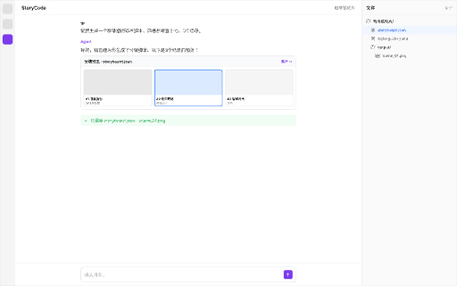


### 蓝白分镜布局

蓝色强调色 + 白色背景，非对称 Bento 网格 + Agent 面板。

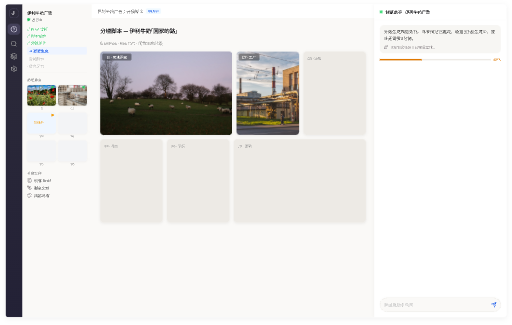

#### 源文件索引

| 帧名 | Node ID | 说明 |
|------|---------|------|
| 项目初始化 | `oV2bI` | 浅色进度流程 — 创建项目 |
| 脚本与分镜 | `XGC4T` | 浅色进度流程 — 脚本阶段 |
| 视觉生成高亮 | `locj7` | 浅色进度流程 — 生成中状态 |
| 蓝白分镜 | `wDAag` | 蓝色主题 Bento 分镜网格 |

</details>
